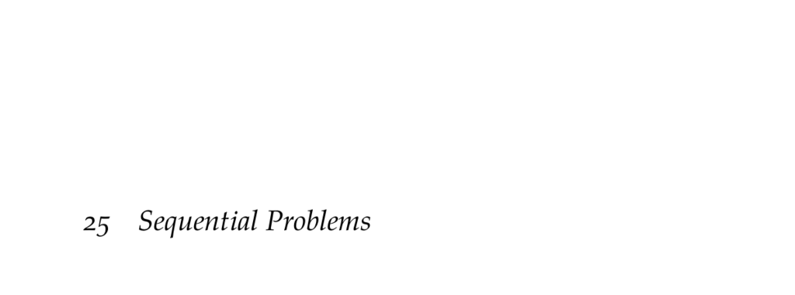

- **25 Sequential Problems**
  - **25.1 Markov Games**
    - Markov games extend simple games by introducing a shared state space with transitions depending on joint actions.
    - Each agent has its own reward function dependent on the joint state and action.
    - Policies in Markov games are stationary and state-dependent distributions over joint actions.
    - Utility computation involves discounted infinite horizon and can be solved exactly using policy evaluation.
    - For further reference, see L. S. Shapley’s 1953 paper [“Stochastic Games”](https://www.pnas.org/doi/10.1073/pnas.39.10.1095).
  - **25.2 Response Models**
    - Best response policies maximize expected utility given fixed policies of other agents and reduce to solving an MDP.
    - Softmax response policies assign stochastic replies based on a softmax over action values with precision parameter λ.
    - Both response models incorporate the state transition model in Markov games.
    - Algorithms provided detail exact computations and implementation strategies for best and softmax responses.
    - M. L. Littman's work introduces Markov games in multiagent reinforcement learning contexts ([ICML 1994](https://dl.acm.org/doi/10.5555/2976456.2976478)).
  - **25.3 Nash Equilibrium**
    - Nash equilibria in Markov games generalize the concept from simple games and involve no agent having incentive to deviate.
    - Every finite Markov game with discounted infinite horizon has at least one stationary Nash equilibrium.
    - Computing Nash equilibria involves nonlinear optimization minimizing lookahead utility deviations with valid policy constraints.
    - The nonlinear program formulation is shown explicitly, enabling algorithmic solution.
    - A. M. Fink’s 1964 article discusses stationary equilibria in stochastic games ([Journal of Science](https://ci.nii.ac.jp/naid/10005725291/)).
  - **25.4 Opponent Modeling**
    - Opponent modeling extends fictitious play to Markov games by maintaining maximum likelihood models of others’ state-dependent policies.
    - Policies update counts of other agents’ actions per state to estimate stochastic policies.
    - Utilities require complex computation due to state transitions and are updated via asynchronous or approximate value iteration.
    - An example predator-prey domain illustrates emergent behaviors learned through opponent modeling.
    - See W. Uther and M. Veloso’s work on adversarial reinforcement learning for detailed methodology ([CMU Tech Report 1997](https://www.cs.cmu.edu/afs/cs.cmu.edu/user/mveloso/public/papers/CMU-CS-03-107.pdf)).
  - **25.5 Nash Q-Learning**
    - Nash Q-learning adapts Q-learning to multiagent Markov games by maintaining joint action value functions updated through observed transitions.
    - It solves simple games constructed from Q-values at successor states to compute Nash equilibria for policy updates.
    - Uses an e-greedy exploration strategy proportional to state-action visitation counts.
    - The Q-values are updated with learning rates inversely proportional to the square root of visitation counts.
    - J. Hu and M. Wellman provide foundational work on Nash Q-learning ([Journal of Machine Learning Research 2003](http://www.jmlr.org/papers/volume4/hu03a/hu03a.pdf)).
  - **25.6 Summary**
    - Markov games generalize MDPs and simple games to multiagent sequential settings.
    - Nash equilibria involve joint policies considering all agents’ actions and states.
    - Opponent modeling leverages known transition functions for learning policies based on observed actions.
    - Nash Q-learning integrates Q-learning with equilibrium computation to learn multiagent policies.
  - **25.7 Exercises**
    - Exercises cover formal relations between Markov games, MDPs, and simple games.
    - They explore the existence and necessity of stochastic policies for best responses and equilibria.
    - Discussion of policy categories includes behavioral, non-stationary, and stationary Markov policies.
    - Approaches for utility computation in opponent modeling are compared with trade-offs in efficiency and completeness.
    - These exercises deepen understanding of multiagent sequential decision-making principles.
