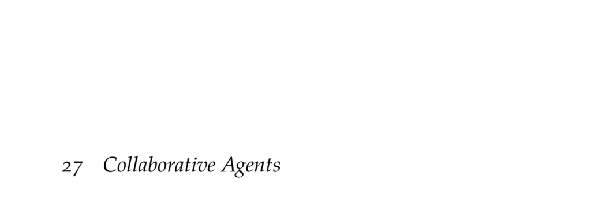

- **27 Collaborative Agents**
  - **27.1 Decentralized Partially Observable Markov Decision Processes**
    - Dec-POMDPs model multiple agents sharing a single objective and acting independently under partial observability.  
    - Agents select local actions based on individual observation histories while aiming to maximize a shared expected reward.  
    - The predator-prey problem exemplifies a Dec-POMDP with collaborative predators and a randomly moving prey.  
    - Policies are often represented as conditional plans or controllers due to challenges in belief state maintenance.  
    - See [Bernstein et al. (2002)](https://doi.org/10.1287/moor.27.4.819.295) for foundational complexity analysis.  
  - **27.2 Subclasses**
    - Dec-POMDP subclasses vary by agent count, observability, and communication abilities, influencing computational complexity.  
    - Joint full observability means combined agent observations uniquely identify the state, defining Dec-MDPs.  
    - Factored Dec-POMDPs decompose the state into agent-specific and environment components.  
    - Independence properties such as transition, observation, and reward independence affect complexity (P-complete to NEXP-complete).  
    - ND-POMDPs use coordination hypergraphs to model structured reward decomposition with transition and observation independence.  
    - MMDPs and MPOMDPs assume free communication enabling collective belief states, solvable via single-agent MDP/POMDP methods.  
  - **27.3 Dynamic Programming**
    - Dynamic programming iteratively computes the optimal joint policy by applying the Bellman equation and pruning dominated policies.  
    - Dec-POMDP dynamic programming reuses POMG algorithms with a shared reward function for all agents.  
    - The approach is exact but has exponential complexity in policy space.  
  - **27.4 Iterated Best Response**
    - Iterated best response updates one agent’s policy at a time assuming fixed policies for others, converging to a joint equilibrium.  
    - The method is fast and exploits the shared reward to often require few iterations.  
    - It only finds one Nash equilibrium, which may not be globally optimal.  
  - **27.5 Heuristic Search**
    - Heuristic search restricts policy exploration by maintaining a fixed number of joint policies per iteration, controlling exponential growth.  
    - The heuristic guides expansion toward high-utility policies using estimated beliefs obtained via simulation and random actions.  
    - Example 27.2 demonstrates policy evolution and belief updates in a collaborative predator-prey domain.  
    - Alternatives include memory-bounded dynamic programming and multiagent A* search.  
  - **27.6 Nonlinear Programming**
    - Nonlinear programming formulates the Dec-POMDP joint controller optimization with fixed controller size using variables for action and transition probabilities.  
    - The optimization maximizes expected utility given an initial belief and enforces stochastic policy constraints.  
    - This generalizes single-agent POMDP nonlinear program solutions to the multiagent collaborative context.  
    - See Amato et al. (2010) for detailed methods on fixed-size stochastic controllers.  
  - **27.7 Summary**
    - Dec-POMDPs model fully cooperative multiagent systems with local observations and shared rewards.  
    - Policies employ conditional plans or controllers due to infeasibility of belief state tracking.  
    - Subclasses vary widely in computational complexity based on observability and independence assumptions.  
    - Solution methods include exact dynamic programming, approximate iterated best response, heuristic search, and nonlinear programming.  
  - **27.8 Exercises**
    - Exercise 27.1 highlights Dec-POMDPs' practical use in robotics due to full cooperation and local observations.  
    - Exercise 27.2 clarifies that Dec-MDP's joint full observability during planning differs from agents knowing the state individually at execution.  
    - Exercise 27.3 proves that Dec-MDPs with full transition, observation, and reward independence can be decomposed into single-agent MDPs solved independently.  
    - Exercise 27.4 discusses using MMDP or MPOMDP solutions as heuristics for guiding Dec-POMDP search by assuming free communication during planning.  
    - Exercise 27.5 details computing a best response controller via nonlinear programming while fixing other agents’ policies, applicable in iterated best response methods.
