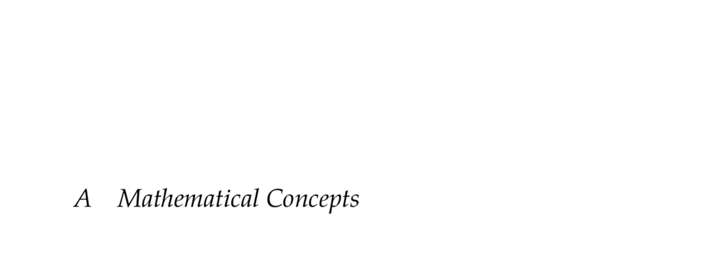

- **A.1 Measure Spaces**
  - A sigma-algebra over a set Ω is a collection of subsets closed under complementation and countable unions.
  - A measure space consists of a set Ω, a sigma-algebra Σ, and a measure µ that is non-negative, zero on the empty set, and countably additive on disjoint sets.
  - Measurable sets are elements of the sigma-algebra.
  - Further reading: [Measure Theory - Wikipedia](https://en.wikipedia.org/wiki/Measure_theory)

- **A.2 Probability Spaces**
  - A probability space is a measure space with total measure µ(Ω) = 1.
  - Ω is the sample space, Σ the event space, and µ or P denotes the probability measure.
  - The Kolmogorov axioms include non-negativity, countable additivity, and normalization to 1.
  - Further reading: [Probability Space - Wikipedia](https://en.wikipedia.org/wiki/Probability_space)

- **A.3 Metric Spaces**
  - A metric space is a set equipped with a metric d satisfying identity, symmetry, and the triangle inequality.
  - The distance metric maps pairs of elements to non-negative real numbers.
  - Metrics enable formal notions of distance and convergence.
  - Further reading: [Metric Space - Wikipedia](https://en.wikipedia.org/wiki/Metric_space)

- **A.4 Normed Vector Spaces**
  - A normed vector space comprises a vector space and a norm mapping vectors to non-negative reals satisfying identity, homogeneity, and the triangle inequality.
  - Lp norms are parameterized by p ≥ 1, including special cases L1, L2, and L∞ norms.
  - Norms induce metrics by defining distance as the norm of vector differences.
  - Further reading: [Normed Vector Space - Wikipedia](https://en.wikipedia.org/wiki/Normed_vector_space)

- **A.5 Positive Definiteness**
  - A symmetric matrix A is positive definite if xᵗAx > 0 for all nonzero vectors x.
  - It is positive semidefinite if xᵗAx ≥ 0 for all x.
  - Positive definiteness characterizes curvature and stability properties.
  - Further reading: [Positive-definite matrix - Wikipedia](https://en.wikipedia.org/wiki/Positive-definite_matrix)

- **A.6 Convexity**
  - A convex set contains all convex combinations αx + (1 − α)y for α ∈ [0,1] and x,y in the set.
  - A convex function satisfies f(αx + (1−α)y) ≤ αf(x) + (1−α)f(y) over a convex domain.
  - Strict convexity implies the inequality is strict for α ∈ (0,1).
  - Convex functions can have unique or multiple minima.
  - Further reading: [Convex Function - Wikipedia](https://en.wikipedia.org/wiki/Convex_function)

- **A.7 Information Content**
  - Information content of observing x in a discrete distribution is I(x) = −log P(x).
  - Uses natural logarithms for units called nats or base-2 logarithms for bits.
  - It quantifies the bits needed for optimal encoding under the distribution.
  - Further reading: [Information Content - Wikipedia](https://en.wikipedia.org/wiki/Information_content)

- **A.8 Entropy**
  - Entropy is the expected information content of a discrete variable: H(X) = −∑ P(x) log P(x).
  - Differential entropy extends this concept to continuous distributions.
  - It measures uncertainty or randomness in a variable.
  - Further reading: [Entropy (Information Theory) - Wikipedia](https://en.wikipedia.org/wiki/Entropy_(information_theory))

- **A.9 Cross Entropy**
  - Cross entropy of distribution P relative to Q is H(P,Q) = −∑ P(x) log Q(x) for discrete case.
  - Measures expected coding length using Q when the true distribution is P.
  - Also defined for continuous densities p and q as integrals.
  - Further reading: [Cross Entropy - Wikipedia](https://en.wikipedia.org/wiki/Cross_entropy)

- **A.10 Relative Entropy**
  - Relative entropy or KL divergence measures dissimilarity: DKL(P||Q) = ∑ P(x) log (P(x)/Q(x)).
  - Defined only if the support of P is a subset of Q’s support.
  - It is asymmetric and non-negative.
  - Further reading: [Kullback-Leibler Divergence - Wikipedia](https://en.wikipedia.org/wiki/Kullback%E2%80%93Leibler_divergence)

- **A.11 Gradient Ascent**
  - Gradient ascent iteratively updates x ← x + α∇f(x) to maximize differentiable f.
  - Step factor α affects convergence speed and stability; may decay over iterations by factor γ.
  - Guarantees only local maxima, not global maxima.
  - Further reading: [Gradient Ascent - Wikipedia](https://en.wikipedia.org/wiki/Gradient_ascent)

- **A.12 Taylor Expansion**
  - Taylor expansion expresses a function as an infinite sum of derivatives at a point: f(x) = ∑ (fⁿ(a)/n!)(x−a)ⁿ.
  - First order (linear) and second order (quadratic) approximations are commonly used.
  - Generalizes to multiple dimensions with gradients and Hessians.
  - Further reading: [Taylor Series - Wikipedia](https://en.wikipedia.org/wiki/Taylor_series)

- **A.13 Monte Carlo Estimation**
  - Monte Carlo estimation approximates expectations by averaging function values over samples drawn from the distribution.
  - The estimate’s variance is Var(f(x))/n for n samples.
  - Used when analytic integration is infeasible.
  - Further reading: [Monte Carlo Method - Wikipedia](https://en.wikipedia.org/wiki/Monte_Carlo_method)

- **A.14 Importance Sampling**
  - Importance sampling estimates expectations under distribution p using samples from q by weighting with p(x)/q(x).
  - Useful when sampling from p directly is difficult.
  - Accuracy depends on closeness of q to p’s support.
  - Further reading: [Importance Sampling - Wikipedia](https://en.wikipedia.org/wiki/Importance_sampling)

- **A.15 Contraction Mappings**
  - A contraction mapping f in a metric space satisfies d(f(x), f(y)) ≤ α d(x,y) with α ∈ [0,1).
  - Banach fixed-point theorem guarantees a unique fixed point and convergence by iteration.
  - Contractive properties are used in convergence proofs e.g., for Bellman operators.
  - Example function on ℝ² illustrates contraction towards a fixed point.
  - Further reading: [Banach Fixed-Point Theorem - Wikipedia](https://en.wikipedia.org/wiki/Banach_fixed-point_theorem)
