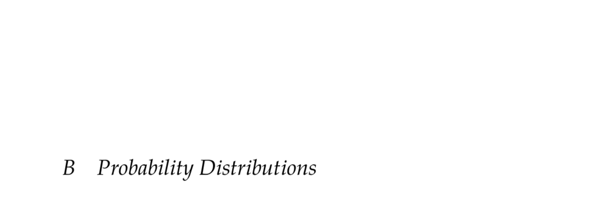

- **Probability Distributions Overview**
  - The appendix summarizes various probability distributions relevant to the book's topics.
  - Distributions use either probability mass functions or probability density functions.
  - Parameters governing each distribution are provided alongside their functional forms.
  - Both univariate and multivariate distributions are included.
  - Distributions are implemented in the Julia package [Distributions.jl](https://arxiv.org/abs/1907.08611).

- **Uniform Distribution**
  - Defined over an interval (a, b) with constant probability density p(x) = 1/(b - a).
  - Parameters include lower bound (a) and upper bound (b).
  - Examples illustrate how different a and b values affect distribution shape.
  - Uniform distribution is univariate and defined for x ∈ (a, b).

- **Gaussian Distribution (Univariate)**
  - Also known as the normal distribution N(μ, σ²), with mean μ and variance σ².
  - Probability density function is p(x) = (1/σ) φ((x-μ)/σ), where φ is standard normal pdf.
  - Applicable over all real numbers x ∈ ℝ.
  - Examples demonstrate effects of varying mean and standard deviation on the distribution shape.

- **Beta Distribution**
  - Defined on the interval (0,1) with shape parameters α > 0 and β > 0.
  - Probability density function p(x) = [Γ(α + β) / (Γ(α) Γ(β))] x^(α-1) (1-x)^(β-1).
  - Controls distribution shape and is flexible for modeling probabilities and proportions.
  - Example plots show different shapes affected by parameter choices.

- **Gaussian Distribution (Multivariate)**
  - Defined over ℝ^n with mean vector μ and covariance matrix Σ.
  - Probability density function involves determinant and inverse of covariance matrix.
  - Parameters μ and Σ govern center and spread of the distribution in multiple dimensions.
  - Examples illustrate different mean vectors and covariance matrices affecting shape.

- **Dirichlet Distribution**
  - Multivariate distribution over vectors x with components in (0,1) that sum to 1.
  - Parameterized by concentration vector α with positive entries.
  - Probability density function involves product of x_i raised to α_i -1 terms normalized by Gamma functions.
  - Shapes influenced by values in α vector; examples demonstrate different concentration parameters.
  - Useful in modeling proportions across multiple categories.
