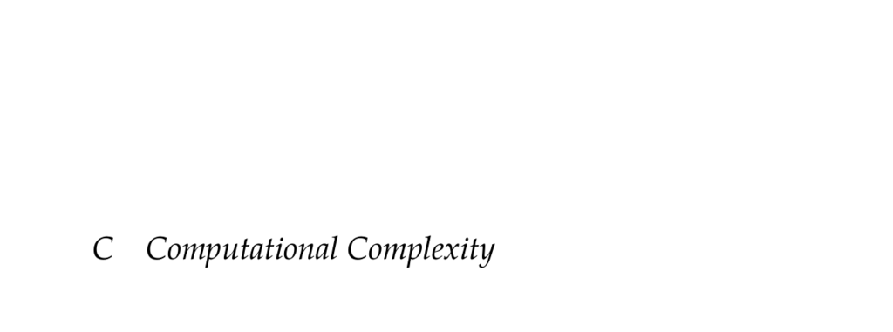

- **C Computational Complexity**
  - **C.1 Asymptotic Notation**
    - Asymptotic notation measures the growth rate of functions as their argument approaches a limit, often infinity.
    - The notation uses big-Oh (O) to give an upper bound on function growth, e.g., f(x) = O(g(x)) means |f(x)| ≤ c|g(x)| near the limit.
    - The order of growth focuses on the fastest-growing term in a linear combination of terms.
    - See [Computational Complexity: A Conceptual Perspective](https://doi.org/10.1017/CBO9780511811055) for rigorous treatment including Turing machines.
  - **C.2 Time Complexity Classes**
    - Time complexity classes categorize problems by the polynomial time required to solve or verify them.
    - Key classes include P (problems solvable in polynomial time), NP (problems verifiable in polynomial time), NP-hard, and NP-complete.
    - It is widely believed that P ≠ NP, an open problem in mathematics and critical to cryptography.
    - Polynomial-time reductions from known NP-complete problems prove NP-hardness.
    - See R. M. Karp’s foundational paper on NP-complete problem reducibility.
  - **C.3 Space Complexity Classes**
    - Space complexity classes measure the polynomial amount of memory resources needed by algorithms.
    - PSPACE contains problems solvable using polynomial space regardless of time.
    - P and NP are subsets of PSPACE, but PSPACE may include problems beyond NP.
    - Definitions of PSPACE-hard and PSPACE-complete mirror the approach used in NP classes.
  - **C.4 Decideability**
    - Undecidable problems cannot always be solved in finite time.
    - The halting problem determines whether any arbitrary program terminates, proven undecidable in general.
    - Languages must be sufficiently expressive, such as Turing-complete, to pose halting problem instances.
    - No general algorithm exists to decide termination for all programs.
