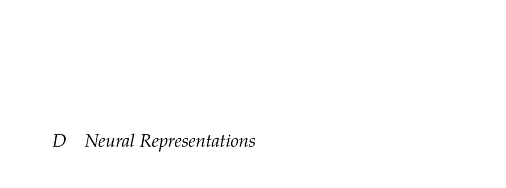

- **Neural Representations**
  - Neural networks are parametric, differentiable models of nonlinear functions optimized via gradient-based methods.
  - They are applicable to decision making tasks including probabilistic modeling and policy representation.
  - Deep learning techniques and implementations like Flux.jl facilitate efficient training.
  
- **Neural Networks**
  - Neural networks map inputs to outputs using parameters tuned to minimize a scalar loss function.
  - Parameters are typically optimized on training datasets using iterative gradient descent.
  - The differentiation of the network and loss enables gradient-based parameter tuning.
  - [Deep Learning](https://www.deeplearningbook.org) by Goodfellow et al. provides comprehensive insights.

- **Feedforward Networks**
  - Feedforward networks pass inputs through layers applying affine transforms followed by nonlinear activations.
  - Nonlinear activation functions such as ReLU, sigmoid, and softmax enable networks to fit arbitrary functions.
  - Multiple affine layers without activations collapse to a single affine transform, necessitating nonlinearities.
  - Gradients are computed efficiently using reverse accumulation, also known as backpropagation.
  - See [Backpropagation Paper](https://www.nature.com/articles/323533a0) by Rumelhart et al. for foundational concepts.

- **Parameter Regularization**
  - Weight regularization adds a penalty term, often L2 norm, to the loss function to prevent overfitting.
  - A scalar hyperparameter controls the strength of regularization typically in the small value range (e.g., 10^-6).
  - Multiple parameter configurations can yield the same training loss, motivating the need for regularization.

- **Convolutional Neural Networks**
  - Convolutional layers apply learnable filters across input tensors, reducing parameters and supporting translation invariance.
  - These layers exploit local spatial correlations in images using sliding windows and shared weights.
  - CNNs typically reduce spatial dimensions while increasing feature depth through successive layers.
  - The MNIST example illustrates how convolutional layers extract features efficiently with fewer parameters.
  - [Gradient-Based Learning Applied to Document Recognition](https://ieeexplore.ieee.org/document/726791) by LeCun et al. is seminal.

- **Recurrent Networks**
  - Recurrent neural networks maintain internal state to process sequential inputs and produce variable-length outputs.
  - They can be unrolled in time to model many-to-one, one-to-many, or many-to-many input-output relationships.
  - Deep RNNs face vanishing and exploding gradient problems, which hamper learning across long sequences.
  - Specialized architectures like LSTM and GRU mitigate vanishing gradients by gating memory updates.
  - See Hochreiter and Schmidhuber’s [LSTM paper](https://www.bioinf.jku.at/publications/older/2604.pdf) for detailed study.

- **Autoencoder Networks**
  - Autoencoders compress high-dimensional inputs through a bottleneck layer to learn low-dimensional feature embeddings.
  - They are trained to reconstruct inputs minimizing reconstruction loss, enabling unsupervised representation learning.
  - Variational autoencoders (VAEs) extend autoencoders by modeling embeddings as probability distributions.
  - VAEs minimize reconstruction loss plus a KL divergence term to regularize encoding distributions toward a unit Gaussian.
  - Decoders of VAEs can act as generative models by sampling from latent distributions.
  - Relevant resource: Kingma and Welling’s [Auto-Encoding Variational Bayes](https://arxiv.org/abs/1312.6114).

- **Adversarial Networks**
  - Generative Adversarial Networks (GANs) incorporate a discriminator to classify real vs generated data outputs.
  - The generator network learns to deceive the discriminator, encouraging the production of realistic outputs.
  - This adversarial training eliminates the need for engineered loss functions capturing output realism.
  - GAN training alternates between improving the generator and discriminator but may suffer from instability.
  - Foundational reference: Goodfellow et al.’s [Generative Adversarial Nets](https://arxiv.org/abs/1406.2661).
