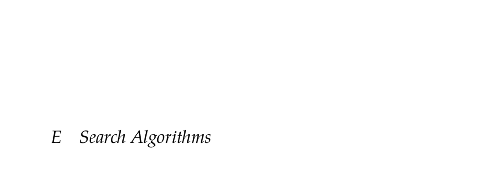

- **E Search Algorithms**
  - **E.1 Search Problems**
    - A search problem aims to find a sequence of actions maximizing reward through deterministic state transitions.
    - It involves a state space S, action space A, deterministic transition function T(s,a), and reward function R(s,a).
    - Goal states are typically absorbing, yielding zero reward after reaching.
    - The objective is to maximize the sum of rewards without discounting future rewards.
    - Further reading: [Introduction to Algorithms - Search Problems](https://mitpress.mit.edu/books/introduction-algorithms)
  - **E.2 Search Graphs**
    - Finite-state/action search problems can be modeled as search graphs with nodes as states and edges as transitions.
    - Edges are labeled with the action taken and the expected reward from the source state.
    - Search expands a tree from the initial state, with new nodes added upon transitions.
    - Visual examples include the 3x3 sliding tile puzzle graph and tree.
    - Further reading: [Graph Search Algorithms](https://en.wikipedia.org/wiki/Graph_search_algorithms)
  - **E.3 Forward Search**
    - Forward search examines all action-state transitions up to a depth d using recursion and depth-first exploration.
    - Terminal states or depth zero use a heuristic estimate of value U(s) for evaluation.
    - The search tree size grows exponentially as O(|A|^d) where |A| is the number of actions.
    - It is simple but computationally costly, as all reachable states to depth d are visited.
    - Further reading: [Artificial Intelligence: A Modern Approach - Forward Search](https://aima.cs.berkeley.edu/)
  - **E.4 Branch and Bound**
    - Branch and bound reduces computation by pruning suboptimal paths using upper (Q) and lower (U) bounds.
    - Actions are ordered by upper bound values, and subtrees with upper bound worse than the best found are pruned.
    - Its efficiency depends heavily on heuristic bounds; worst-case complexity equals forward search.
    - Example comparison shows it can skip large portions of the search tree in favorable conditions.
    - Further reading: [Branch and Bound Algorithm](https://en.wikipedia.org/wiki/Branch_and_bound)
  - **E.5 Dynamic Programming**
    - Dynamic programming stores previously computed state results in a transposition table to avoid redundant evaluations.
    - It leverages optimal substructure where optimal solutions to subproblems compose optimal solutions to larger problems.
    - This memoization prevents exponential growth in state evaluations, significantly improving efficiency.
    - Compared to forward search, it reduces the number of visited states drastically.
    - Further reading: [Dynamic Programming Tutorial](https://www.geeksforgeeks.org/dynamic-programming/)
  - **E.6 Heuristic Search**
    - Heuristic search improves branch and bound by ordering actions based on a heuristic estimate of future returns.
    - Uses a heuristic Uhi(s) that is admissible (upper bound) and consistent (satisfies inequality in E.2).
    - Caches state evaluations like dynamic programming, avoiding redundant computations.
    - Does not require a lower bound function, unlike branch and bound.
    - Examples show it outperforms branch and bound by efficiently ordering actions and pruning the search space.
    - Further reading: [Heuristic Search - Stanford](http://web.stanford.edu/class/cs221/)
