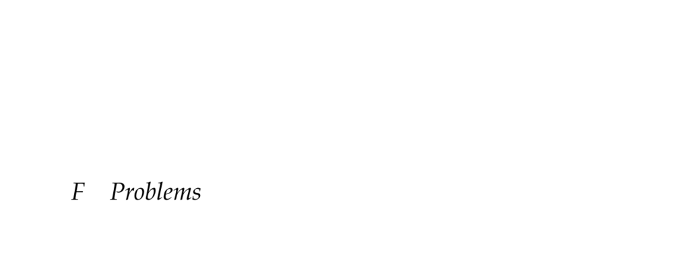

- **F Problems**
  - **F.1 Hex World**
    - The hex world is an MDP with a tile map where each cell is a state and six possible move directions with stochastic outcomes.  
    - Movement succeeds with 0.7 probability in the chosen direction and 0.15 probability for each neighboring direction.  
    - Terminal states yield a specified reward and no further rewards follow.  
    - The straight-line hex world simplifies the map to a linear chain to illustrate reward propagation.  
    - See L. Baird, “Residual Algorithms: Reinforcement Learning with Function Approximation,” ICML 1995.  
  - **F.2 2048**
    - 2048 is a discrete tile game played on a 4×4 board where tiles shift in four directions and merge tiles of equal value.  
    - After each move, a new tile of value 2 or 4 appears in a random empty space.  
    - Rewards are earned only when tiles merge, equaling the merged tile’s value.  
    - Common strategy involves cornering large tiles to consolidate high-value merges.  
    - See G. Cirulli, 2014.  
  - **F.3 Cart-Pole**
    - Cart-pole manipulates a cart moving laterally with a rigid pole hinged on it; the goal is to keep the pole balanced vertically within lateral bounds.  
    - The continuous state space includes cart position and velocity, pole angle, and pole angular velocity.  
    - Actions apply discrete left or right forces; physics includes angular and linear acceleration with friction and gravity.  
    - Initialized with small random perturbations; episode ends when pole falls or cart exceeds bounds.  
    - See A.G. Barto et al., IEEE Trans. Sys Sci & Cybernetics, 1983 and OpenAI Gym implementations.  
  - **F.4 Mountain Car**
    - Mountain Car requires a vehicle to escape a valley by moving left and right to gain momentum due to gravity pulling it back down.  
    - The continuous state space includes horizontal position and velocity with three discrete actions: accelerate left, right, or coast.  
    - Deterministic transitions include velocity updates influenced by acceleration and cosine of position multiplied by gravity.  
    - Reward is -1 at each step until the goal position is crossed.  
    - See A. Moore, PhD Dissertation 1990, and S.P. Singh & R.S. Sutton, Machine Learning, 1996.  
  - **F.5 Simple Regulator**
    - The simple regulator is a single-state, single-action continuous LQR with linear-Gaussian transitions.  
    - Next state distribution is Gaussian centered on current state plus action; rewards penalize the square of the state only.  
    - The optimal policy is linear in the state, pulling the system toward zero, and value decreases quadratically with state magnitude.  
    - The Riccati equation methods are not directly applicable due to indefinite action cost matrix.  
  - **F.6 Aircraft Collision Avoidance**
    - The problem involves deciding to issue climb, descend, or no advisory to avoid colliding with an intruder aircraft on an intercept course.  
    - State variables include relative altitude, vertical speed, last advisory, and time to collision, with nonlinear discrete dynamics including noise.  
    - Rewards penalize close intrusions and issuing advisories different from the previous action.  
    - Can be solved by backward induction over a discretized grid using value iteration.  
    - See M.J. Kochenderfer & J.P. Chryssanthacopoulos, MIT Lincoln Lab Project Report ATC-371, 2011.  
  - **F.7 Crying Baby**
    - A POMDP with two states (hungry, sated), three actions (feed, sing, ignore), and two observations (crying, quiet).  
    - The baby’s hunger is unobservable; singing is an information gathering action that modifies crying probabilities.  
    - Feeding always satiates the baby, ignoring risks hunger persistence or emergence.  
    - Rewards penalize hunger regardless of action and penalize feeding and singing effort differently.  
    - The optimal infinite-horizon policy with γ=0.9 balances caregiving effort and hunger penalties.  
    - See M.J. Kochenderfer, Decision Making Under Uncertainty, MIT Press, 2015.  
  - **F.8 Machine Replacement**
    - A discrete POMDP managing a machine with up to two faulty components producing products with probabilistic defects.  
    - Four actions: manufacture without examination, manufacture with examination, interrupt production/inspect/replace faulty components, and replace all components.  
    - Observations of defective products depend on examination; rewards vary with product quality and inspection/maintenance costs.  
    - Transition dynamics model independent breakdown probabilities and defective product probabilities.  
    - Optimal policies for various horizons exhibit disjoint regions of action dominance.  
    - See R.D. Smallwood & E.J. Sondik, Operations Research, 1973.  
  - **F.9 Catch**
    - The catch problem involves maximizing expected utility over finite catches, where success probability depends on unknown proficiency s and throw distance d.  
    - Success probability follows a logistic function over distance parameterized by s, which has a discrete prior.  
    - Rewards equal the throw distance if caught; zero otherwise.  
    - The action space is discrete throw distances from 10 to 100.  
  - **F.10 Prisoner’s Dilemma**
    - Two-agent, two-action simultaneous game where agents choose to cooperate or defect with conflicting individual rewards.  
    - Cooperation by both yields moderate punishment; unilateral defection benefits the defector at the other’s expense; mutual defection yields intermediate punishment.  
    - Infinite horizon versions use discount factor γ=0.9.  
    - See A.W. Tucker, and W. Poundstone, Prisoner’s Dilemma, Doubleday 1992.  
  - **F.11 Rock-Paper-Scissors**
    - Two-agent simultaneous game with three actions. Each action beats one and loses to another with unit rewards and penalties accordingly.  
    - Rewards and penalties are symmetric and zero in case of a tie.  
    - Repeated game's infinite horizon uses discount factor γ=0.9.  
  - **F.12 Traveler’s Dilemma**
    - Two players simultaneously state values between 2 and 100; if equal, both receive that reward.  
    - If values differ, the lower claim receives its value plus 2, the higher receives the lower minus 2.  
    - Unique Nash equilibrium is at the minimum claim, $2, which is paradoxical given common human behavior.  
    - See K. Basu, American Economic Review, 1994.  
  - **F.13 Predator-Prey Hex World**
    - Multiagent extension of hex world with sets of predators and prey positioned on hex grid states.  
    - Predators attempt to capture prey by moving to their cells; captured prey respawn randomly.  
    - Rewards for predators scale by number of prey and predators in the same cell; predators incur movement penalties; prey penalized heavily for capture.  
    - State transitions combine independent agent movement under original hex world stochastic dynamics.  
  - **F.14 Multi-Caregiver Crying Baby**
    - Extension of the crying baby problem to two caregivers acting simultaneously with the same possible states, actions, and observations.  
    - Feeding by either caregiver always satiates the baby; other actions have original transition dynamics.  
    - Both caregivers receive identical baby hunger penalties but differ in effort penalties favoring feeding or singing.  
    - Both receive the same noisy observation of the baby’s crying status but cannot necessarily observe each other’s actions.  
  - **F.15 Collaborative Predator-Prey Hex World**
    - Team-based predator-prey hex world with multiple predators collaborating to catch a single prey moving randomly.  
    - Predators have noisy local observations indicating prey presence only in neighboring cells.  
    - Predators incur a penalty for movement, and a shared positive reward if at least one captures the prey.  
    - Upon capture, the prey respawns at a random cell.
