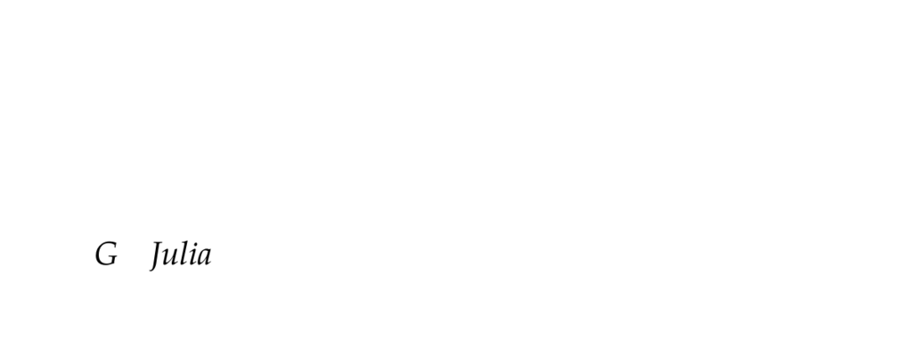

- **Julia**
  - **G.1 Types**
    - **G.1.1 Booleans**
      - The Bool type represents truth values true and false.
      - Variable names support Unicode with some restrictions.
      - Boolean operators include not (!), and (&&), and or (||).
      - Comments begin with the # symbol.
      - See the Julia official documentation on [Booleans](https://docs.julialang.org/en/v1/base/base/#Base.Bool).
    - **G.1.2 Numbers**
      - Julia supports Int64 and Float64 types for integers and floating-point numbers.
      - Arithmetic operations (+, -, *, /, ^, %) and comparisons are standard.
      - Division of integers results in floating-point output.
      - Unicode can be used for comparison operators.
      - Refer to [Julia Numerical Types](https://docs.julialang.org/en/v1/manual/types/#Numeric-Types).
    - **G.1.3 Strings**
      - Strings are arrays of characters defined within double quotes.
      - Strings are mainly used for error reporting in the text.
      - The type of a string object is String.
      - Consult [Julia Strings](https://docs.julialang.org/en/v1/manual/strings/).
    - **G.1.4 Vectors**
      - Vectors are one-dimensional arrays created using square brackets.
      - Common functions include trues(), ones(), zeros(), rand(), push!(), pop!(), append!(), sort!().
      - Indexing starts at 1 and includes support for ranges and slicing.
      - Broadcasting operations are supported for elementwise functions.
      - See [Julia Arrays](https://docs.julialang.org/en/v1/manual/arrays/).
    - **G.1.5 Matrices**
      - Matrices are two-dimensional arrays formed using spaces and semicolons within brackets.
      - Supports special matrices like identity and diagonal matrices.
      - Matrix operations include transpose, inversion, determinant, concatenation, and elementwise functions.
      - Linear algebra functions become available after using the LinearAlgebra package.
      - Further reading at [Julia Matrices](https://docs.julialang.org/en/v1/manual/arrays/#Matrices).
    - **G.1.6 Tuples**
      - Tuples are ordered lists possibly containing mixed types, constructed with parentheses.
      - Tuples are immutable; elements cannot be changed once created.
      - Supports indexing and slicing operations.
      - See [Tuples in Julia](https://docs.julialang.org/en/v1/manual/arrays/#Tuples).
    - **G.1.7 Named Tuples**
      - Named tuples associate names with each element.
      - Access elements using dot notation.
      - Named tuples types include field names and their types.
      - Useful to destructure into variables.
      - Learn more at [Named Tuples](https://docs.julialang.org/en/v1/manual/tuples/#Named-Tuples).
    - **G.1.8 Dictionaries**
      - Dictionaries hold key-value pairs using the syntax key=>value.
      - Supports indexing by key, key existence checks (haskey), and dynamic insertion.
      - Can be created empty or with initial pairs.
      - Documentation available at [Dictionaries](https://docs.julialang.org/en/v1/manual/dictionaries/).
    - **G.1.9 Composite Types**
      - Composite types group named fields; immutable by default.
      - Use struct keyword, mutable struct for mutable instances.
      - Type annotations for fields improve runtime performance via compiler optimization.
      - Instances constructed with parentheses passing field values.
      - See [Composite Types](https://docs.julialang.org/en/v1/manual/types/#Composite-Types).
    - **G.1.10 Abstract Types**
      - Abstract types form supertypes organizing the type hierarchy.
      - Float64's hierarchy ascends: Float64 < AbstractFloat < Real < Number < Any.
      - subtypes can show concrete types below an abstract type.
      - Custom abstract types are defined with abstract type keyword.
      - More info at [Abstract Types](https://docs.julialang.org/en/v1/manual/types/#Abstract-Types).
    - **G.1.11 Parametric Types**
      - Parametric types accept type parameters within braces.
      - Dict{K,V} example shows key and value type parameters.
      - Julia infers parameters automatically but also supports explicit specification.
      - User-defined parametric types are possible but not covered here.
      - Documentation: [Parametric Types](https://docs.julialang.org/en/v1/manual/types/#Parametric-Types).
  - **G.2 Functions**
    - **G.2.1 Named Functions**
      - Functions defined with function keyword or assignment form.
      - Named functions map arguments to return values.
      - Can be invoked with parentheses.
      - See [Function Definition](https://docs.julialang.org/en/v1/manual/functions/).
    - **G.2.2 Anonymous Functions**
      - Anonymous functions have no name; defined with arrow operator (->).
      - Can be assigned to variables or passed as arguments.
      - Useful in higher-order functions.
      - More at [Anonymous Functions](https://docs.julialang.org/en/v1/manual/functions/#Anonymous-Functions).
    - **G.2.3 Callable Objects**
      - Types can be made callable by defining (x::Type)() or (x::Type)(arg).
      - Enables objects to behave like functions.
      - Demonstrated with custom type A.
      - Refer to [Callable Objects](https://docs.julialang.org/en/v1/manual/types/#Callable-Types).
    - **G.2.4 Optional Arguments**
      - Functions can specify default values for optional arguments.
      - Arguments with defaults allow omitted parameters during calls.
      - Supports multiple optional arguments.
      - Documentation at [Optional Arguments](https://docs.julialang.org/en/v1/manual/functions/#Optional-Arguments).
    - **G.2.5 Keyword Arguments**
      - Keyword arguments defined after semicolon in function signature.
      - Keyword arguments have default values and are invoked by name.
      - Mix of positional and keyword arguments supported.
      - See [Keyword Arguments](https://docs.julialang.org/en/v1/manual/functions/#Keyword-Arguments).
    - **G.2.6 Function Overloading**
      - Multiple methods of the same function name can be defined with different argument types.
      - Julia dispatches to the most specific matching method.
      - Types specified using :: operator in argument lists.
      - See [Multiple Dispatch](https://docs.julialang.org/en/v1/manual/multiple-dispatch/).
    - **G.2.7 Splatting**
      - The ... operator unpacks elements of collections into function arguments.
      - Works with arrays and tuples.
      - Useful for forwarding arguments.
      - Documentation at [Splatting and Varargs](https://docs.julialang.org/en/v1/manual/functions/#Varargs).
  - **G.3 Control Flow**
    - **G.3.1 Conditional Evaluation**
      - Conditional execution uses if, elseif, else blocks.
      - Ternary operator (condition ? true_val : false_val) offers concise conditional expressions.
      - Boolean expressions control code path.
      - Refer to [Control Flow and Conditional Statements](https://docs.julialang.org/en/v1/manual/control-flow/#Control-Flow-).
    - **G.3.2 Loops**
      - while loops repeat until a condition fails.
      - for loops iterate over ranges or collections.
      - Loop variables can be assigned using =, in, or ∈.
      - Loops can modify or preserve collections.
      - See [Loops](https://docs.julialang.org/en/v1/manual/control-flow/#Loops).
    - **G.3.3 Iterators**
      - Julia supports various iterators usable in loops and comprehensions.
      - Functions like enumerate, eachindex, zip, subsets, and Cartesian product provide iteration utilities.
      - collect converts iterators to arrays.
      - External IterTools package offers additional iterator functionalities.
      - More info at [Iterators](https://docs.julialang.org/en/v1/manual/iterators/).
  - **G.4 Packages**
    - **G.4.1 NamedTupleTools.jl**
      - Provides utilities for creating, merging, selecting, and deleting named tuple fields.
      - Enhances manipulation of named tuples beyond base Julia features.
      - Functions include namedtuple, merge, select, delete.
      - Use case is efficient, readable named tuple operations.
      - Package link: [NamedTupleTools.jl](https://github.com/oxinabox/NamedTupleTools.jl).
    - **G.4.2 LightGraphs.jl**
      - Enables construction and manipulation of graph data structures.
      - Supports directed graphs, edges addition/removal, neighbor queries.
      - Provides functions to retrieve number of vertices.
      - Commonly used for graph algorithm implementations.
      - See [LightGraphs.jl](https://juliagraphs.org/LightGraphs.jl/stable/).
    - **G.4.3 Distributions.jl**
      - Provides representations for probability distributions, sampling, and fitting.
      - Supports univariate and multivariate distributions including Normal, MvNormal, Dirichlet.
      - Sampling generated with rand function variants.
      - Distribution fitting functions estimate parameters from data.
      - Documentation: [Distributions.jl](https://juliastats.org/Distributions.jl/stable/).
    - **G.4.4 JuMP.jl**
      - Allows formulation and solving of optimization problems.
      - Supports variable definition, objective specification, and constraints.
      - Compatible with external solvers like GLPK.jl.
      - Provides macros for concise model construction.
      - More info at [JuMP.jl](https://jump.dev/JuMP.jl/stable/).
