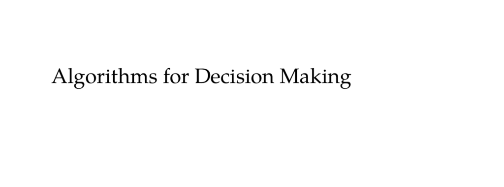

- **Preface**
  - The book introduces algorithms for optimal decision making under uncertainty.
  - It covers mathematical problem formulations, algorithms, figures, examples, and exercises.
  - The book targets advanced undergraduates, graduate students, and professionals with prerequisites in calculus, linear algebra, and probability.
  - Fundamental algorithms are implemented in Julia, with permissions for free use and invitations for translations.
  - Ancillary material is available at the book’s webpage.
  - [Algorithms for Decision Making](http://mitpress.mit.edu/algorithms-for-decision-making)

- **Acknowledgments**
  - The textbook developed from a Stanford course on decision making under uncertainty.
  - The authors acknowledge many individuals for feedback and contributions to discussions and exercises.
  - The book’s style is inspired by Edward Tufte with wide margins and small multiples.
  - The typesetting and color scheme use specific packages and palettes to accommodate visual accessibility.
  - Software tools and fonts such as pythontex and JuliaMono support the book’s code presentation.

- **1 Introduction**
  - **1.1 Decision Making**
    - An agent acts based on noisy, incomplete observations of its environment.
    - The decision-making process involves choosing actions under uncertainty about outcomes, models, states, and interacting agents.
    - Four sources of uncertainty define the decision-making challenges.
    - [Artificial Intelligence: A Modern Approach](https://aima.cs.berkeley.edu/)
  - **1.2 Applications**
    - Aircraft collision avoidance demands early alert systems balancing safety and false alerts.
    - Autonomous driving systems use sensors and prediction of behaviors for safe navigation.
    - Personalized breast cancer screening balances benefits and risks using decision models.
    - Financial decision systems optimize consumption and portfolio allocation over uncertain lifespans.
    - Distributed wildfire surveillance with drones requires collaboration and exploration for effective coverage.
    - See appendix F for additional example problems.
  - **1.3 Methods**
    - Explicit programming defines complete decision strategies by designers, suited for simple problems.
    - Supervised learning generalizes from expert examples but may not exceed expert performance.
    - Optimization searches decision strategy spaces using simulations without guidance from models.
    - Planning uses known models for more efficient search, critical when accounting for uncertainty.
    - Reinforcement learning enables strategy learning through interaction, balancing exploration and exploitation.
  - **1.4 History**
    - Automation concepts trace to Greek myths and logic rule origins.
    - Renaissance inventors and science fiction popularized intelligent machines and robots.
    - Challenges in decision making under uncertainty persist despite decades of research.
    - Economics introduced utility theory and game theory to model human decisions.
    - Psychological research on trial-and-error and reinforcement laid foundations for reinforcement learning.
    - Neuroscience discoveries of neurons inspired neural networks and connectionist AI paradigms.
    - Computer science evolved symbolic reasoning and connectionism for machine intelligence.
    - Engineering integrates perception, planning, and control for autonomous systems.
    - Mathematics provides probability theory, Bayesian inference, and sampling methods for reasoning under uncertainty.
    - Operations research developed optimization methods for resource and decision allocation.
  - **1.5 Societal Impact**
    - Decision algorithms support environmental sustainability, medical diagnostics, and urban infrastructure.
    - They enable autonomous transportation and disease modeling.
    - Algorithmic power can amplify both beneficial and harmful intentions.
    - Challenges include bias, fairness, adversarial attacks, and moral-legal responsibility frameworks.
    - [Artificial Intelligence for Social Good: A Survey](https://arxiv.org/abs/2001.01818)
  - **1.6 Overview**
    - The book is organized into five parts covering uncertainty representation, sequential decisions, model uncertainty, state uncertainty, and multiagent systems.
    - Part I discusses probabilistic reasoning with probability distributions and utility theory.
    - Part II addresses sequential decision problems formulated as Markov decision processes.
    - Part III covers model uncertainty with reinforcement learning, emphasizing exploration-exploitation trade-offs.
    - Part IV treats state uncertainty with partially observable Markov decision processes.
    - Part V studies multiagent systems including games and decentralized decision making.

- **Part I: Probabilistic Reasoning**
  - **2 Representation**
    - Representation of uncertainty uses probability as a degree of belief satisfying specific axioms.
    - Probability distributions are used to model uncertainty over single or multiple variables.
    - Conditional independence is exploited to efficiently represent joint distributions.
    - [Probability Theory: The Logic of Science](https://bayes.wustl.edu/Manual/BayesManual.pdf)
  - **2.1 Degrees of Belief and Probability**
    - Plausibility of propositions is quantitatively compared using a real-valued function.
    - Subjective probability axioms justify using probability measures for degrees of belief.
    - Probabilities range from 0 (impossible) to 1 (certain).
  - **2.2 Probability Distributions**
    - Discrete distributions assign probability mass functions over finite sets.
    - Continuous distributions use probability density functions with integral normalization.
    - Cumulative distribution functions and quantile functions provide alternative characterizations.
    - Common distributions include uniform, Gaussian, truncated Gaussian, and mixture models.
  - **2.3 Joint Distributions**
    - Joint distributions model multiple variables simultaneously.
    - Marginalization applies the law of total probability to obtain individual distributions.
    - Discrete joint distributions use tables but suffer exponential parameter growth.
    - Independence assumptions reduce parameter complexity by factorizing joint distributions.
    - Factor representations and decision trees exploit repeated structure to compactly represent distributions.
