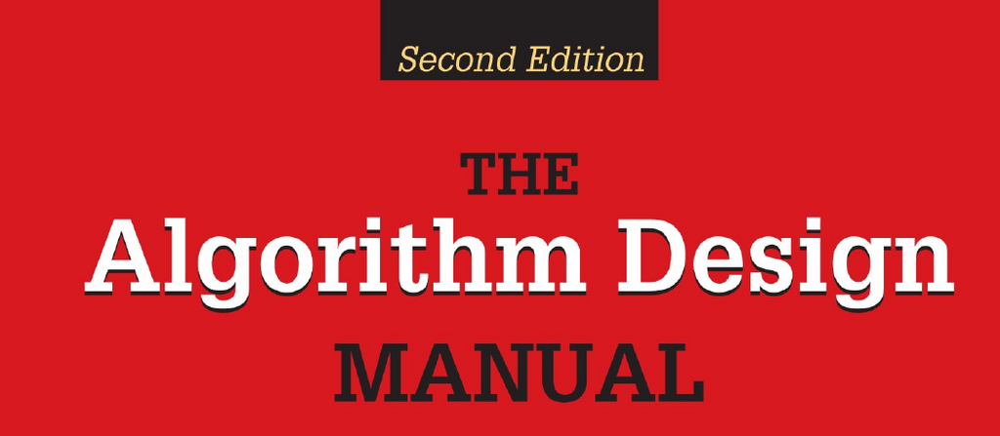

- **Practical Algorithm Design**
  - **Introduction to Algorithm Design**
    - An algorithm is a procedure solving a well-specified general problem with defined input and output.
    - Good algorithms must be correct, efficient, and implementable; correctness requires proofs or demonstrations.
    - Robot Tour Optimization illustrates heuristic failures and the complexity of the Traveling Salesman Problem.
    - Movie Scheduling Problem shows the importance of selecting correct heuristics and demonstrates an optimal scheduling algorithm.
    - Mathematical induction is essential for verifying recursive algorithms.
    - Critical modeling turns real-world problems into abstract algorithmic structures.
    - External resources include [The Algorithm Design Manual by Steven S. Skiena](https://www.springer.com/gp/book/9781848000704).
  - **Algorithm Analysis**
    - The RAM model assumes uniform unit cost for simple operations and memory accesses.
    - Best, worst, and average-case complexities describe algorithm performance over all input instances.
    - The Big Oh notation abstracts away constants and lower-order terms to express asymptotic time complexity.
    - Formal definitions of O, Ω, and Θ characterize upper bounds, lower bounds, and tight bounds respectively.
    - Sample expressions demonstrate practical application of Big Oh notation.
    - Further study can be done via [Introduction to Algorithms by Cormen et al.](https://mitpress.mit.edu/books/introduction-algorithms-third-edition).
