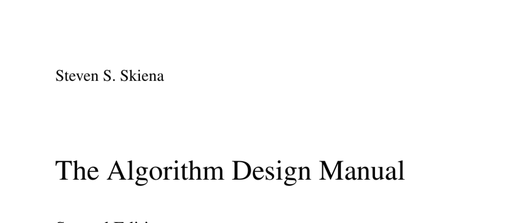

- **2.1 The RAM Model of Computation**
  - The RAM model assumes each simple operation takes one time step and loops or subroutines consist of many such steps.
  - Each memory access takes one step, and memory is considered unlimited and uniform in access cost.
  - Despite idealized assumptions, the RAM model effectively approximates real computer performance and aids machine-independent analysis.
  - Models have practical size ranges, similar to using a flat Earth model for certain problems.
  - For deeper understanding, see basic models of computation like the [Random Access Machine](https://en.wikipedia.org/wiki/Random-access_machine).

- **2.1.1 Best, Worst, and Average-Case Complexity**
  - Worst-case complexity measures the maximum steps for any instance of size n, best-case the minimum, and average-case the expected steps.
  - Worst-case analysis is most useful because it provides guaranteed upper bounds independent of input distribution.
  - Average-case analysis requires assumptions about input distribution, making it less practical.
  - Best-case is often overly optimistic and not relied upon for algorithm guarantees.
  - For an introduction, consult [Algorithm Complexity Fundamentals](https://www.geeksforgeeks.org/analysis-of-algorithms-set-1-asymptotic-analysis/).

- **2.2 The Big Oh Notation**
  - Big Oh notation describes upper bounds on time complexity functions up to constant factors after some threshold n0.
  - Big Omega and Big Theta provide corresponding lower bounds and tight bounds respectively.
  - Big Oh ignores constants and lower-order terms to focus on dominant growth behavior.
  - Proper application requires identifying constants c and n0 satisfying the bound definitions for sufficiently large n.
  - See [Big O notation](https://en.wikipedia.org/wiki/Big_O_notation) for formal definitions and examples.

- **2.3 Growth Rates and Dominance Relations**
  - Common growth rates are constant, logarithmic, linear, n log n, quadratic, cubic, exponential, and factorial.
  - Functions are grouped into equivalence classes by Big Oh; a faster growing function dominates the slower.
  - Dominance relations are essential to compare algorithm efficiency at scale.
  - Real-world examples clarify why exponential and factorial complexities become impractical quickly.
  - For detailed analysis, see [Asymptotic notation](https://cs.stackexchange.com/questions/4625/different-complexity-classes-explained-with-real-life-examples).

- **2.3.1 Dominance Relations**
  - Big Oh classes separate functions so that either one dominates the other or they are equivalent.
  - Dominance defines that f(n) = O(g(n)) when g(n) grows faster than or equal to f(n).
  - Only a few complexity classes suffice for most practical algorithm analysis.
  - Dominance ordering from slowest to fastest growth helps classify algorithmic efficiency.
  - Reference: [Hierarchy of complexity classes](https://en.wikipedia.org/wiki/Time_complexity#Hierarchy_theorems).

- **2.4 Working with the Big Oh**
  - Adding functions in Big Oh results in the dominance of the larger growth function.
  - Multiplying functions multiplies their Big Oh classes; constants can be ignored.
  - Careful bounding ensures correct reasoning about combined algorithm complexities.
  - Transitivity of Big Oh is provable by chaining bounding inequalities.
  - For practical methods, see [Simplifying Big-O expressions](https://www.bigocheatsheet.com/).

- **2.4.1 Adding Functions**
  - Sum of two Big Oh functions simplifies to the Big Oh of their maximum.
  - This principle allows dropping lower order terms in complexity expressions.
  - Useful for combining costs of different parts of an algorithm.
  - Example: n^3 + n^2 + n = O(n^3).

- **2.4.2 Multiplying Functions**
  - Multiplication by a positive constant does not change Big Oh class.
  - Multiplying two functions results in Big Oh of their product.
  - Important when analyzing nested loops or combined algorithm parts.

- **2.5 Reasoning About Efficiency**
  - Intuition with nested loops guides worst-case running time analysis.
  - Crude upper-bounding by maximum nesting counts yields correct though sometimes loose bounds.
  - Counting operations explicitly helps, but Big Oh provides manageable simplification.

- **2.5.1 Selection Sort**
  - Selection sort performs n iterations; inner loop scans remaining elements.
  - Total comparisons sum to n(n−1)/2, a quadratic count.
  - Worst-case time complexity is Θ(n^2), meaning quadratic behavior dominates.
  - For more on sorting algorithms, see [Selection sort](https://en.wikipedia.org/wiki/Selection_sort).

- **2.5.2 Insertion Sort**
  - Inner loop iterations vary; worst case assumes inner loop always runs i times.
  - Multiplying outer and inner loop counts bounds running time by O(n^2).
  - This method yields a correct, though possibly loose, worst-case bound.
  - See [Insertion sort](https://en.wikipedia.org/wiki/Insertion_sort) for examples and behavior.

- **2.5.3 String Pattern Matching**
  - Naive substring search tries to match pattern at each text position.
  - Worst-case time complexity is O(nm) where n and m are text and pattern lengths.
  - Length calculation of strings also contributes linearly but is dominated by nested loops.
  - Simplifications use Big Oh rules to combine and drop insignificant terms.
  - For optimized methods, refer to [String matching algorithm](https://en.wikipedia.org/wiki/String_matching).

- **2.5.4 Matrix Multiplication**
  - Matrix multiplication involves triple nested loops over dimensions x, y, z.
  - Each element of result matrix computed as dot product of row and column vectors.
  - Time complexity is O(xyz) reflecting the three nested loops.
  - Basic algorithm presented, more efficient methods exist in literature.
  - For advanced algorithms, see [Matrix multiplication](https://en.wikipedia.org/wiki/Matrix_multiplication_algorithm).
