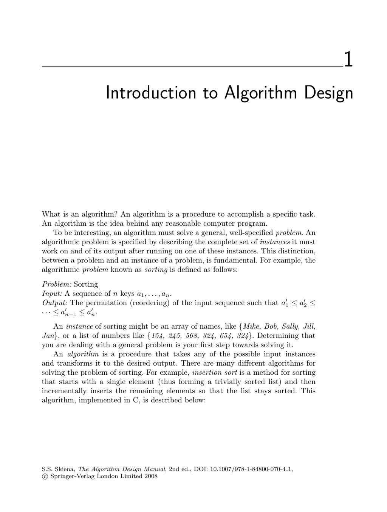

- **Introduction to Algorithm Design**
  - **What is an Algorithm?**
    - An algorithm is a procedure to accomplish a specific task and forms the idea behind any computer program.
    - It solves a general, well-specified problem through input instances and desired output.
    - Sorting is given as an example problem with inputs as sequences of keys and output as a sorted permutation.
    - Different algorithms exist for the same problem; insertion sort is presented with an animation and C code.
    - Algorithms must strive to be correct, efficient, and easy to implement, though these goals may conflict.
    - For deeper algorithm efficiency issues, refer to Chapter 2.
  - **Robot Tour Optimization**
    - The problem models programming a robot arm to visit points minimizing travel time, known as the traveling salesman problem (TSP).
    - The nearest-neighbor heuristic selects the closest unvisited point repeatedly but can produce suboptimal tours.
    - The closest-pair heuristic connects closest endpoints but also fails on some input instances.
    - An exhaustive enumeration of all permutations guarantees optimality but is computationally infeasible for large n.
    - TSP is introduced as a central challenging problem with more details in Section 16.4.
    - The main lesson is the distinction between always-correct algorithms and heuristics that may fail.
  - **Selecting the Right Jobs**
    - The movie scheduling problem seeks the largest subset of non-overlapping intervals maximizing jobs.
    - Simple heuristics (earliest job first, shortest job first) can be incorrect and illustrated via counterexamples.
    - Exhaustive search over all subsets is correct but not scalable for large n.
    - An efficient, correct greedy algorithm picks jobs by earliest completion time and discards conflicting jobs.
    - This algorithm benefits from problem restrictions (interval graphs) enabling correctness and efficiency.
    - Lesson: Algorithm correctness must be demonstrated carefully, not assumed.
  - **Reasoning about Correctness**
    - Correctness proofs require precise problem definition, assumptions, a logical chain, and a conclusion symbol.
    - Algorithm descriptions use English, pseudocode, or real code with a tradeoff between clarity and precision.
    - Fuzzy problem statements prevent correctness proofs; narrowing inputs may enable valid algorithms.
    - Counterexamples are the best way to prove incorrectness, requiring simplicity and verifiability.
    - Strategies to find counterexamples include thinking small, exhaustive case analysis, focusing on weaknesses, ties, and extremes.
    - Induction and recursion often demonstrate correctness of recursive/incremental algorithms.
    - Inductive proof pitfalls: boundary cases and assuming stability under incremental changes.
    - Summation formulae are introduced as common mathematical tools in algorithms with typical arithmetic and geometric progressions.
    - Further exercises expand on induction and summation proofs.
    - For formal verification techniques see [Gries89].
  - **Modeling the Problem**
    - Algorithm design requires modeling applications in terms of abstract combinatorial objects.
    - Fundamental structures include permutations, subsets, trees, graphs, points, polygons, and strings.
    - Recursive decompositions apply broadly to these structures and enable algorithm design.
    - Proper modeling links real-world problems to well-studied algorithmic formulations.
    - Understanding cataloged algorithm problems aids in effective modeling and solution.
    - The section warns against over-constraining or oversimplifying models.
    - Recursive thinking involves decomposing large structures into smaller versions of the same.
    - Examples from each combinatorial structure demonstrate recursive decomposition.
    - Further study in the catalog section of the book is encouraged.
  - **About the War Stories**
    - War stories illustrate real-world algorithm design successes and failures.
    - Stories demonstrate the iterative process from problem to solution.
    - Awareness that stories are true but dialog may be dramatized is emphasized.
    - War stories link to catalog problems reinforcing the utility of standardized problem formulations.
    - Recommended additional readings include Bentley’s Programming Pearls and The Mythical Man Month.
  - **War Story: Psychic Modeling**
    - Describes the challenge of minimizing lottery tickets needed to guarantee a prize given psychic predictions.
    - The problem reduces to a special case of set cover and involves combinations of subsets.
    - The initial model tried to cover all subsets but overestimated required tickets.
    - Correct modeling recognized partial coverage and overlapping subsets sufficed, reducing ticket number.
    - The approach uses ranking/unranking subsets and bit vectors for coverage bookkeeping.
    - Randomized search heuristics aided in handling larger problem sizes.
    - The story emphasizes the importance of correct problem modeling before implementation.
    - For details on set cover and NP-completeness: see Section 18.1.
  - **Chapter Notes**
    - References recommended algorithm textbooks by Cormen et al., Kleinberg/Tardos, and Manber.
    - Formal algorithm correctness proof methods referenced via Gries.
    - Movie scheduling relates to interval graphs and independent set problems; Golumbic’s work cited.
    - Programming Pearls and Mythical Man Month are recommended war story collections.
    - More detail on the lotto ticket set cover solution is in [YS96].
  - **Exercises**
    - Exercises include finding counterexamples to heuristics for various problems like knapsack and set cover.
    - Proof exercises focus on correctness for recursive algorithms, sorting, multiplication, polynomial evaluation.
    - Induction exercises cover summations, divisibility, and properties of trees and cubes.
    - Estimation exercises encourage rough calculation of quantities related to real-world problems.
    - Implementation projects task readers to implement TSP heuristics and lotto ticket set coverage.
    - Interview problems include integer division algorithm, fastest horses determination, and real-world estimation.
    - Programming challenges from external websites are recommended for practice.
    - Relevant references for these exercises include the catalog in Part II and online judge systems.
