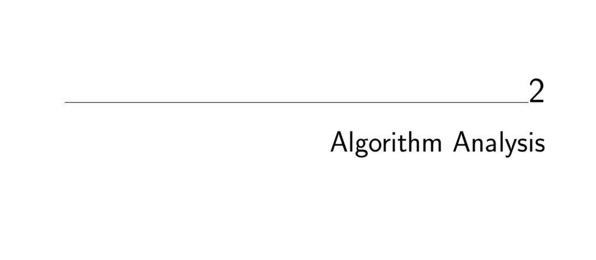

- **Algorithm Analysis**
  - **The RAM Model of Computation**
    - The RAM model assumes each simple operation and each memory access takes exactly one time step.
    - Loops and subroutines are modeled as compositions of single-step operations, with run time proportional to their iterations.
    - The model assumes unlimited memory and ignores caching or disk-related delays.
    - Despite its simplifications, the RAM model effectively predicts algorithm performance on real machines.
    - Useful comparison: flat Earth model analogy clarifies the practical utility of simplified abstractions.
  - **Best, Worst, and Average-Case Complexity**
    - Worst-case complexity is the maximum number of steps taken for any input of size n.
    - Best-case complexity is the minimum steps for any input of size n.
    - Average-case complexity represents the mean steps over all inputs of size n.
    - Worst-case analysis is preferred for reliability and predictability in algorithm evaluation.
    - [The Algorithm Design Manual](https://doi.org/10.1007/978-1-84800-070-4)
  - **The Big Oh Notation**
    - Big Oh gives an asymptotic upper bound on algorithm running time, ignoring constants and lower-order terms.
    - Defines O(g(n)) for upper bounds, Ω(g(n)) for lower bounds, and Θ(g(n)) when both apply.
    - Assumes a large enough input size n0 beyond which inequalities hold.
    - Simplifies complex exact formulas and smoothes over minor fluctuations in time.
    - Practice examples reinforce understanding of the notation and its applications.
  - **Growth Rates and Dominance Relations**
    - Common time complexities range from constant, logarithmic, linear, superlinear, quadratic, cubic to exponential and factorial functions.
    - Dominance relations classify functions by growth, e.g., n! dominates 2^n, which dominates n^3, and so forth.
    - Tables illustrate practical limits of each complexity class in terms of feasible input sizes.
    - Dominance determines which terms are significant in combined expressions.
    - [Big O Cheat Sheet](https://www.bigocheatsheet.com)
  - **Working with the Big Oh**
    - Summation of complexities follows the dominant term; multiplication multiplies complexities.
    - Constants factors are ignored as they do not change asymptotic behavior.
    - Transitivity holds: if f = O(g) and g = O(h), then f = O(h).
    - Useful in simplifying nested loops or combined steps to get overall complexity.
  - **Reasoning About Efficiency**
    - Selection sort’s worst-case complexity is Θ(n²) computed by summing inner loop iterations.
    - Insertion sort’s worst case is O(n²), assuming inner loops run to maximum iterations.
    - String pattern matching naïve algorithm runs in O(nm) worst-case time, accounting for substring checks.
    - Matrix multiplication with three nested loops has O(xyz) complexity, or O(n³) for square matrices.
    - Detailed walk-through clarifies fundamental analyses of typical nested loops.
  - **Logarithms and Their Applications**
    - Logarithms are inverse exponential functions, growing very slowly.
    - Binary search runs in O(log n) time by repeatedly halving search space.
    - Height of trees relates to logarithm base of node branching factor (e.g., binary tree height ~ log₂ n).
    - Number of bits needed to represent n items is log₂ n.
    - Logarithms simplify multiplication and enable fast exponentiation in O(log n) steps.
    - Harmonic numbers sum to about ln n, explaining logarithmic terms in average-case analyses.
    - Federal sentencing guidelines for fraud use logarithmic scaling for sentencing based on stolen amounts.
    - [Introduction to Algorithms](https://mitpress.mit.edu/books/introduction-algorithms-third-edition)
  - **Properties of Logarithms**
    - Logarithm bases of 2, e (natural log), and 10 are important in computing and mathematics.
    - Logarithms convert multiplication to addition and permit base changes with scaling factors.
    - Base changes do not affect asymptotic growth rate due to constant multiplicative factors.
    - Logarithms reduce polynomial functions’ growth, justifying logarithmic time complexity labels.
  - **War Story: Mystery of the Pyramids**
    - The problem involves representing integers as sums of pyramidal numbers with an upper bound of one billion.
    - Initial quadratic-time brute force algorithms become impractical for large n.
    - Improved algorithm uses precomputed sums and binary search, reducing complexity to O(n^{4/3} log n).
    - Algorithmic improvements vastly outperform hardware speedups on large computations.
    - Experimentation with data structures like hash tables and bit vectors further optimized performance.
    - [Niven and Zuckerman, An Introduction to the Theory of Numbers](https://global.oup.com/academic/product/an-introduction-to-the-theory-of-numbers-9780471625469)
  - **Advanced Analysis (*)**
    - Esoteric functions appearing include inverse Ackermann function α(n), log log n, log n / log log n, and n^{1+ε}.
    - These functions describe very slow or nuanced growths relevant to advanced data structure analyses.
    - Limits from calculus underpin dominance relations; faster-growing functions dominate slower ones.
    - Polynomials dominate logarithmic functions; higher-degree exponentials dominate lower-degree ones.
    - Dominance implies strict ordering of complexity classes important for nuanced algorithm comparison.
  - **Exercises**
    - Exercises include program analysis, Big Oh proofs, summation evaluations, and logarithm identities.
    - Problems range from simple loop-based complexity calculations to advanced limit and functional dominance proofs.
    - Interview and programming challenges reinforce practical understanding of algorithmic concepts.
    - Encourages practice with proofs, asymptotic reasoning, and complexity classification.
    - Resources for further exercise and challenge problems include [Programming Challenges](http://www.programming-challenges.com) and [UVA Online Judge](http://online-judge.uva.es)
