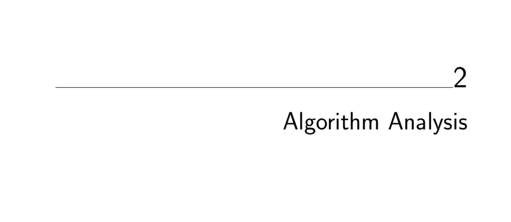

- **Algorithm Analysis**
  - **The RAM Model of Computation**
    - The RAM model assumes each simple operation and each memory access takes exactly one time step.  
    - Loops and subroutines are modeled as compositions of many single-step operations, their time depending on iterations or subprogram nature.  
    - The RAM model ignores memory hierarchy effects such as caching or disk access.  
    - Despite simplifications, this model effectively predicts algorithmic performance machine-independently.  
    - Further reading: [The Algorithm Design Manual](https://doi.org/10.1007/978-1-84800-070-4) by S. S. Skiena.
  - **Best, Worst, and Average-Case Complexity**
    - Worst-case complexity is the maximum number of steps an algorithm takes on any input of size n.  
    - Best-case complexity is the minimum steps on any input of size n.  
    - Average-case complexity is the mean number of steps over all inputs of size n.  
    - Worst-case analysis is most useful since it provides guaranteed upper bounds independent of input distribution.  
  - **The Big Oh Notation**
    - Big Oh (O) notation defines an upper bound on a function's growth, ignoring constant factors and lower order terms.  
    - Ω notation defines a lower bound, and Θ notation defines a tight bound combining both.  
    - Big Oh provides a simplified framework for comparing algorithm efficiency without focusing on implementation details.  
    - Examples illustrate proofs of O, Ω, and Θ relations by selecting suitable constants and thresholds.  
  - **Growth Rates and Dominance Relations**
    - Complexity functions are grouped into dominance classes with common growth behavior, e.g., constant, logarithmic, linear, quadratic, exponential, factorial.  
    - Faster-growing functions dominate slower-growing ones, determining practical algorithm suitability.  
    - Common classes cover most practical algorithms, simplifying the landscape of complexity analysis.  
  - **Working with the Big Oh**
    - When adding functions, the dominant term governs the sum's Big Oh complexity.  
    - Multiplying functions multiplies their Big Oh classes, retaining their product growth rate.  
    - Constants multiply out harmlessly without affecting Big Oh classification.  
    - Big Oh relationships are transitive, allowing chaining of inequalities in analysis.  
  - **Reasoning About Efficiency**
    - Loop nesting depth and iteration counts drive worst-case time complexity calculations.  
    - Selection sort runs in Θ(n²) time by summing nested loop iterations.  
    - Insertion sort worst-case runs in O(n²) time by assuming maximum inner loop iterations.  
    - String pattern matching worst-case time is O(nm) based on nested loop bounds related to text and pattern lengths.  
    - Matrix multiplication has O(xyz) complexity, typically O(n³) for square matrices, derived by summing triple nested loops.  
  - **Logarithms and Their Applications**
    - Logarithms are inverse exponential functions and grow slowly, commonly appearing when repeatedly halving or doubling occurs.  
    - Binary search takes O(log n) time by halving problem size each step.  
    - A balanced d-ary tree of height h can have up to d^h leaves, linking height to log base d of n.  
    - To represent n distinct items, at least log₂ n bits are needed because bit patterns double with each bit.  
    - Fast exponentiation uses divide-and-conquer to compute powers in O(log n) multiplications.  
    - Harmonic numbers sum reciprocals and often produce logarithmic terms in average case analysis.  
    - The Federal Sentencing Guidelines use logarithmic scaling to determine punishment levels based on amounts stolen.  
    - Further reading: [Logarithm Properties](https://en.wikipedia.org/wiki/Logarithm).
  - **Properties of Logarithms**
    - Log base conversion formula enables changing logarithm bases without altering growth class.  
    - Big Oh ignores logarithm bases as multiplicative constants disappear in asymptotic analysis.  
    - Logarithms reduce polynomial functions to logarithmic time in algorithmic growth.  
    - Logarithms play a critical role in complexity analysis of factorials and nested data structures.  
  - **War Story: Mystery of the Pyramids**
    - The problem involves expressing integers as sums of pyramidal numbers and verifying a conjecture up to 1,000,000,000.  
    - Initial brute force approach ran in quadratic time and was impractical for large n.  
    - Improved method precomputed sums of pyramidal numbers, reducing complexity to O(n^{4/3} log n).  
    - Careful data structure choice and low-level optimizations improved performance substantially, showing algorithmic improvements can exceed hardware upgrades.  
    - Relevant topics include knapsack problems and advanced data structure optimizations.  
    - Further reading: [Knuth's Concrete Mathematics](https://www-cs-faculty.stanford.edu/~knuth/gkp.html).
  - **Advanced Analysis (*)**
    - Introduces esoteric complexity functions like inverse Ackermann function α(n), log log n, log n / log log n, and log² n.  
    - Functions like n^{1+ε} describe algorithms with arbitrarily close to linear but slightly superlinear growth.  
    - Dominance relations are formalized via limits of function ratios as n approaches infinity.  
    - Polynomial functions dominate logarithmic ones, and exponentials with larger bases dominate smaller bases.  
    - Summary dominance order presented combining advanced functions with common classes.  
  - **Exercises**
    - Problems cover program analysis requiring determination of return values and time complexity.  
    - Exercises focus on Big Oh proofs, function dominance, and runtime evaluations using summations and logarithms.  
    - Some problems explore logarithmic properties, algorithm correctness, and reasoning about complexity.  
    - Interview and programming challenge questions include subset selection, data replication, minimum element assignment expectancy, and classical puzzle problems.  
    - Suggested external resources for deeper practice include [Programming Challenges](http://www.programming-challenges.com) and [UVA Online Judge](http://online-judge.uva.es).
