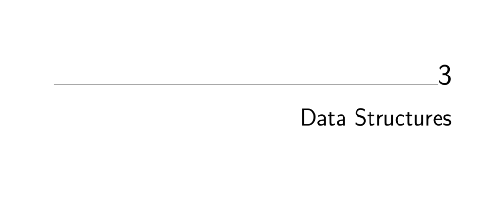

- **Data Structures**
  - **3.1 Contiguous vs. Linked Data Structures**
    - Data structures classify as contiguous (arrays, matrices, heaps, hash tables) or linked (lists, trees, graph adjacency lists).
    - Contiguous arrays offer constant-time access, space efficiency, and memory locality.
    - Linked structures allow flexible memory allocation, ease of insertion and deletion, but incur pointer overhead and lack efficient random access.
    - Dynamic arrays grow by doubling size, offering amortized linear time for insertions.
    - See [The Algorithm Design Manual](https://doi.org/10.1007/978-1-84800-070-4) for more.
  - **3.2 Stacks and Queues**
    - Stacks use Last-In-First-Out (LIFO) order with push and pop operations.
    - Queues use First-In-First-Out (FIFO) order with enqueue and dequeue operations.
    - Both can be implemented via arrays or linked lists depending on size constraints.
    - Queues are fundamental in breadth-first graph search algorithms.
    - More on container types in [Data Structures and Algorithms in Java](https://example.org).
  - **3.3 Dictionaries**
    - Dictionaries support search, insert, and delete operations based on keys.
    - Additional operations include finding minimum, maximum, successor, and predecessor keys.
    - Implementations vary between unsorted arrays, sorted arrays, and linked lists, each with different time complexities.
    - Trade-offs exist between efficient search and update operations depending on data structure used.
    - See detailed dictionary implementations in [Algorithms, 4th Edition](https://example.org).
  - **3.4 Binary Search Trees**
    - Binary search trees have nodes with keys, left/right child pointers, and optional parent pointers.
    - Search, insertion, deletion, and traversal operations run in O(h) time, where h is the height of the tree.
    - Poor insertion order can produce unbalanced trees of height O(n).
    - Balanced search trees (e.g., red-black, splay trees) guarantee O(log n) height and operations.
    - Further study in [CLRS, Chapter 12](https://example.org).
  - **3.5 Priority Queues**
    - Priority queues support insert, find-minimum (or maximum), and delete-minimum (or maximum) operations.
    - Implementations vary over unsorted arrays, sorted arrays, and balanced binary search trees with distinct time complexities.
    - Storing a pointer to the minimum element can optimize find-minimum to O(1).
    - Priority queues underlie various algorithms including event simulation and graph algorithms.
    - Explore heaps in detail in [Introduction to Algorithms](https://example.org).
  - **3.6 War Story: Stripping Triangulations**
    - Triangulated surfaces can be partitioned into strips to improve rendering efficiency.
    - Finding minimal strip covers corresponds to covering the dual graph with paths, an NP-complete problem.
    - Naive and greedy heuristics differ in strip count and runtime complexity.
    - Using priority queues and dictionaries drastically improves performance for optimizing strip covers.
    - See [ESV96] for implementation details.
  - **3.7 Hashing and Strings**
    - Hash functions map keys (including strings) to integers used as indices in hash tables.
    - Collision resolution is done via chaining (linked lists) or open addressing (probing).
    - Hashing supports dictionary operations with expected O(1) insert/search/delete.
    - Rabin-Karp algorithm uses rolling hash for efficient expected linear-time substring searches.
    - Applications include duplicate detection, plagiarism detection, and cryptographic data integrity.
    - Knuth’s work provides an in-depth study of hashing: [Knuth's The Art of Computer Programming](https://example.org).
  - **3.8 Specialized Data Structures**
    - Specialized structures exist for strings (suffix trees/arrays), geometric data (kd-trees), graphs (adjacency lists/matrices), and sets (bit vectors, union-find).
    - These structures optimize particular operations like pattern matching, spatial queries, or graph traversals.
    - Understanding specialized data structures is vital for efficient domain-specific algorithms.
    - Catalog entries provide extensive details: see Section 12 in [The Algorithm Design Manual](https://doi.org/10.1007/978-1-84800-070-4).
  - **3.9 War Story: String ’em Up**
    - DNA sequences as strings over a four-letter alphabet motivate advanced string algorithms.
    - Sequencing by hybridization requires building all consistent substrings efficiently.
    - Binary search trees and hash tables proved insufficiently fast or space-efficient.
    - Suffix trees and compressed suffix trees enable efficient substring queries with linear space.
    - Persistence and profiling aided identifying and optimizing bottleneck dictionary operations.
    - More on suffix trees in [Algorithms on Strings, Trees and Sequences](https://example.org).
  - **3.10 Exercises**
    - Exercises cover topics like linked list manipulation, balanced tree modifications, dictionary operations, bin packing heuristics, partial sums, data structure design for ordered operations, and string operations.
    - Challenge problems include dictionary implementations, Caesar cipher decoding, and algorithmic puzzles.
    - Interview problems focus on practical data structure manipulations and algorithm design.
    - Programming challenges provide hands-on experience with problem-solving and implementation.
