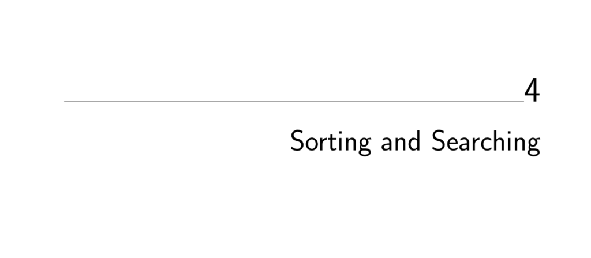

- **Sorting and Searching**
  - **Applications of Sorting**
    - Sorting enables algorithmic improvements from naive O(n²) to O(n log n) for large n.
    - Sorting is foundational for problems such as binary search, closest pair, element uniqueness, frequency distribution, selection, and convex hull construction.
    - Sorting often behaves like a data structure due to its utility in various algorithmic contexts.
    - See Section 14.1 for broader problem catalog applications of sorting.
    - Further reading: [The Algorithm Design Manual](https://link.springer.com/book/10.1007/978-1-84800-070-4)
  - **Pragmatics of Sorting**
    - Sorting order (increasing/decreasing) and stability affect algorithm suitability.
    - Stable sorting requires preserving relative order among equal keys, often via secondary keys.
    - Sorting complex records necessitates specifying key fields and maintaining data integrity.
    - Sorting routines, like C’s `qsort`, utilize comparison functions to ensure application-specific orderings.
    - Using built-in library sorts is recommended for efficiency and reliability.
  - **Heapsort: Fast Sorting via Data Structures**
    - Heaps implement priority queues supporting efficient insert and extract-min in O(log n) time.
    - Implicit binary tree representation via arrays and indexing avoids pointers for heaps.
    - Heapsort runs in worst-case O(n log n) time by building a heap and repeatedly extracting min.
    - Heap construction can be optimized from O(n log n) to O(n) via bottom-up bubble-down heapify.
    - Heapsort is in-place and suitable for main memory sorting; priority queues have wide applications.
  - **War Story: Give me a Ticket on an Airplane**
    - Airfare pricing complexity arises from combinatorial fare sets and restrictive rules.
    - Evaluating combinations efficiently requires generating pairwise sums in sorted order.
    - A priority queue can produce next-cheapest pair sums dynamically without enumerating all.
    - Duplicate management may be handled via hash tables to avoid redundant evaluations.
    - Problem generalizes to multiple-leg itineraries and is practical for interactive use.
  - **Mergesort: Sorting by Divide-and-Conquer**
    - Mergesort recursively divides the array in halves, sorts each, then merges results.
    - Merging two sorted lists takes O(n) time by sequentially comparing front elements.
    - Mergesort guarantees worst-case O(n log n) time with stable sorting behavior.
    - Requires auxiliary buffer for arrays; well-suited for linked lists without extra space.
  - **Quicksort: Sorting by Randomization**
    - Quicksort partitions elements by a pivot into lower and higher subarrays recursively.
    - Linear-time partitioning followed by recursive calls yield average-case O(n log n) time.
    - Worst case is O(n²) when pivots are consistently poor (smallest or largest element).
    - Randomized pivot selection ensures expected O(n log n) running time independent of input.
    - Randomization techniques in algorithms reduce worst-case scenarios and improve robustness.
    - Further reading: [Randomized Algorithms](https://mitzenmacher.upfal.org/book.html) by Mitzenmacher and Upfal
  - **War Story: Skiena for the Defense**
    - External sorting dominates in practical large-scale applications due to disk I/O costs.
    - Disk characteristics make minimizing seeks and maximizing sequential reads/writes critical.
    - Multiway mergesort using heaps effectively merges large sorted runs on disk in external memory.
    - Benchmarking is complicated by hardware and data characteristics; practical sorting differs greatly from theoretical.
  - **Binary Search and Related Algorithms**
    - Binary search finds keys in O(log n) time by recursive halving on sorted arrays.
    - Variants exist to count occurrences, identify exact boundaries of duplicates, and perform one-sided searches.
    - Numerical problems such as computing square roots can be solved by binary (bisection) search.
    - Binary search exemplifies divide-and-conquer principles for efficient problem solving.
  - **Divide-and-Conquer**
    - Divide-and-conquer algorithms split problems into smaller instances, solve recursively, then combine.
    - Recurrence relations model their time complexity, generally of the form T(n) = aT(n/b) + f(n).
    - The Master Theorem provides cases to solve such recurrences to determine total running time.
    - Examples include mergesort (O(n log n)), binary search (O(log n)), faster heap construction (O(n)), and Strassen’s matrix multiplication (O(n^2.81)).
    - Understanding recurrences is key to analyzing recursive algorithm efficiency.
    - Further reading: [Introduction to Algorithms](https://mitpress.mit.edu/books/introduction-algorithms) by Cormen et al.
