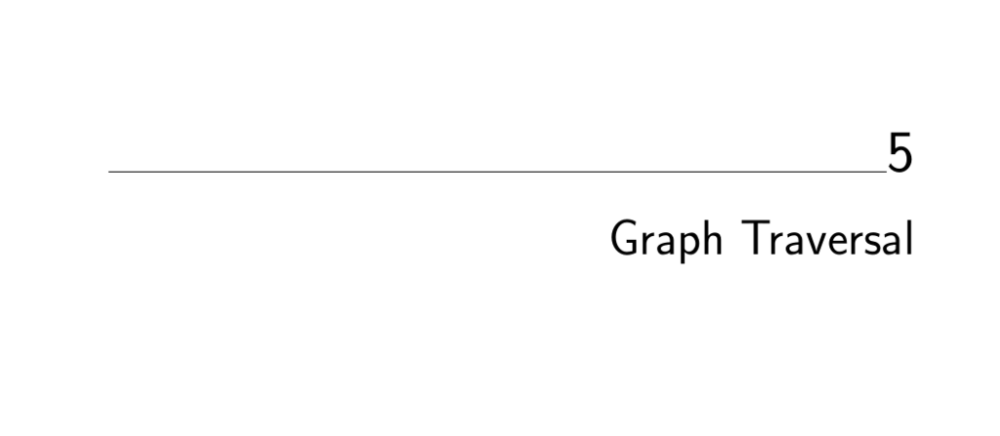

- **Graph Traversal**
  - **Flavors of Graphs**
    - Graphs can be undirected or directed and weighted or unweighted, affecting algorithm choices.
    - Graphs are classified as simple or non-simple based on the presence of loops or multiple edges.
    - Sparsity and density describe the proportion of edges to possible vertex pairs, impacting data structure efficiency.
    - Additional properties include cyclicity, embedding, implicit vs. explicit representation, and labeled vs. unlabeled vertices.
    - See Figure 5.2 for a visual summary of important graph properties.
  - **The Friendship Graph**
    - Models social relationships where vertices represent people and edges represent friendships.
    - Typically a sparse, undirected, labeled, and possibly weighted graph capturing real-world social dynamics.
    - Examines symmetry, self-loops, multiedges, vertex degree, geographic embedding, and implicit data representation.
    - Highlights the importance of accurate graph modeling for application relevance.
  - **Data Structures for Graphs**
    - Two primary representations: adjacency matrices and adjacency lists.
    - Adjacency matrices allow O(1) edge queries but can waste space in sparse graphs.
    - Adjacency lists use O(m + n) space, favoring sparse graphs and efficient traversal.
    - Table 5.5 summarizes performance and memory trade-offs between data structures.
    - Illustrated with code examples defining graph storage using adjacency lists.
  - **War Stories**
    - **Moore’s Law and Combinatorica**
      - Original Combinatorica used adjacency matrices due to programming language and hardware constraints.
      - Updated version switched to adjacency lists for significant performance and memory improvements.
      - Highlights the importance of asymptotic complexity and evolving hardware in algorithm design.
      - See Figure 5.7 for performance comparison between old and new implementations.
    - **Getting the Graph**
      - Naive construction of a dual graph by pairwise triangle comparison is O(n²), too slow for large inputs.
      - Optimized method uses adjacency lists indexed by vertices to reduce complexity closer to linear time.
      - Emphasizes that initial data structure construction requires efficient algorithm design.
  - **Traversing a Graph**
    - Graph traversal systematically visits every edge and vertex.
    - Vertices pass through three states: undiscovered, discovered, and processed.
    - A work structure (queue or stack) manages exploration order to avoid repeated visits.
    - Traversal guarantees visiting all edges and vertices in the connected component.
  - **Breadth-First Search**
    - Uses a FIFO queue to explore vertices in layers radiating outward from the start.
    - Generates a shortest-path tree from the starting vertex to all others in unweighted graphs.
    - Edges not in the BFS tree are classified as cross edges connecting nodes within or between levels.
    - Provides implementations with customizable vertex and edge processing callbacks.
    - The parent array enables shortest path reconstruction.
  - **Applications of Breadth-First Search**
    - **Connected Components**
      - Identifies maximal subsets of vertices mutually reachable in undirected graphs.
      - Repeated BFS from unexplored vertices finds all components.
      - Extensions for directed graphs include weakly and strongly connected components.
    - **Two-Coloring Graphs**
      - Uses BFS to test and construct bipartite 2-colorings by assigning opposite colors to discovered vertices.
      - Detects conflicts where edges join vertices of the same color.
      - Useful in applications modeling bipartite relations like gender-separated interactions.
  - **Depth-First Search**
    - Uses a LIFO stack (or recursion) to explore along paths, backtracking when no new vertices are found.
    - Vertices have entry and exit times that organize traversal timing.
    - DFS edges classify into tree and back edges in undirected graphs and also forward and cross edges in directed graphs.
    - Recursion simplifies implementation and implicitly manages traversal state.
  - **Applications of Depth-First Search**
    - **Finding Cycles**
      - Back edges in DFS reveal cycles by connecting a vertex to an ancestor.
      - Algorithm detects first cycle by identifying back edges during edge processing.
    - **Articulation Vertices**
      - Vertices whose removal disconnects the graph are found by analyzing reachable ancestors during DFS.
      - Conditions distinguish root, bridge, and parent articulation vertices based on DFS tree structure and back edges.
      - Quantifies graph fragility and robustness using DFS entry and reachable ancestor times.
    - **Depth-First Search on Directed Graphs**
      - Edge classification includes tree, back, forward, and cross edges.
      - Algorithm for edge classification uses vertex states and timestamps.
    - **Topological Sorting**
      - Orders vertices of a DAG such that all edges point forward in the order.
      - DFS labels vertices by finishing times, with topological sort corresponding to reverse postorder.
      - Detects cycles by presence of back edges, signaling a graph is not a DAG.
    - **Strongly Connected Components**
      - Partitions directed graphs into maximal subsets with mutually reachable vertices.
      - Uses DFS and low-point tracking to identify components in linear time.
      - DFS stack management and edge classification govern component discovery.
- **Chapter Notes**
  - Expanded material originates from [SR03] and Combinatorica literature [Ski90], [PS03].
  - Social network analysis references include Barabasi [Bar03] and Watts [Wat04].
- **Exercises**
  - Exercises cover simulation of BFS/DFS, data structure conversions, graph algorithms, and design challenges.
  - Topics include traversal orderings, shortest paths, connected components, coloring, articulation points, topological sort, and strongly connected components.
  - Programming problems mirror real-world graph applications like bicoloring, scheduling, and network analysis.
