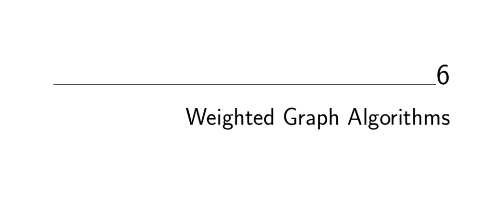

- **Weighted Graph Algorithms**
  - The chapter discusses graph algorithms explicitly designed for weighted graphs, where edges have numerical weights.
  - Weighted graphs model real-world networks such as road maps, with weights representing distances, costs, or times.
  - The adjacency list data structure includes edge weights alongside adjacency information to represent weighted graphs.
  - [The Algorithm Design Manual, Chapter 6](https://doi.org/10.1007/978-1-84800-070-4)

- **Minimum Spanning Trees**
  - Spanning trees connect all vertices with minimum total edge weight, solving network design problems efficiently.
  - Prim’s algorithm grows a minimum spanning tree incrementally, always choosing the smallest connecting edge.
  - Kruskal’s algorithm builds the minimum spanning tree by adding edges in ascending weight order while avoiding cycles.
  - Union-Find data structures efficiently manage connected components in Kruskal’s algorithm.
  - Variants include maximum spanning trees, minimum product spanning trees, and bottleneck spanning trees.
  - [Prim's Algorithm](https://en.wikipedia.org/wiki/Prim%27s_algorithm), [Kruskal's Algorithm](https://en.wikipedia.org/wiki/Kruskal%27s_algorithm), [Union-Find](https://en.wikipedia.org/wiki/Disjoint-set_data_structure)

  - **Prim’s Algorithm**
    - Starts from an arbitrary vertex and grows the tree by adding the minimum-weight edge connecting the tree to a new vertex.
    - Uses arrays to track vertices in the tree and distances to non-tree vertices for O(n²) implementation.
    - Can be optimized to O(m + n log n) with priority queues.
    - The algorithm’s correctness is proved by contradiction, showing no better minimum spanning tree can exist given the greedy selections.
    - Further optimization depends on data structures like heaps.

  - **Kruskal’s Algorithm**
    - Sorts edges by weight and adds them one by one, merging components if they connect different ones.
    - Uses the Union-Find data structure to detect cycles and manage components efficiently.
    - Runs in O(m log m) time for sparse graphs.
    - Proven correct via show that any deviation from minimality contradicts the edge selection process.
    - Particularly effective on sparse graphs due to its reliance on sorted edge lists.

  - **Union-Find Data Structure**
    - Maintains a partition of vertices into disjoint sets supporting quick union and find operations.
    - Uses trees with parent pointers and union by size to limit tree height to O(log n).
    - Enables efficient cycle detection and component management in Kruskal’s algorithm.
    - Performs unions and finds in O(log n) worst case, with further improvements possible.
    - Useful in many graph and connectivity problems.

  - **Variations on Minimum Spanning Trees**
    - Maximum spanning trees can be found by negating edge weights and running minimum spanning tree algorithms.
    - Minimum product spanning trees result from applying logarithms to edge weights and running minimum spanning tree algorithms.
    - Bottleneck spanning trees minimize the maximum edge weight and coincide with edges chosen by Kruskal’s algorithm.
    - Minimum spanning tree uniqueness occurs when all edge weights are distinct.
    - Hard variants include Steiner trees and low-degree spanning trees not solvable by these greedy methods.
    - [Steiner Tree Problem](https://en.wikipedia.org/wiki/Steiner_tree_problem), [Minimum Bottleneck Spanning Tree](https://en.wikipedia.org/wiki/Minimum_bottleneck_spanning_tree)

- **War Story: Nothing but Nets**
  - A real-world application involved optimizing robotic circuit board testing by clustering test points using minimum spanning trees.
  - Breaking large nets (sets of connected points) into smaller clusters based on edge length in the MST reduces total robotic arm travel.
  - The appropriate distance metric was the L∞ norm (max of coordinate differences), matching equal horizontal and vertical motor speeds.
  - Minimum spanning trees provide a natural clustering method to ensure connectivity and reduce travel times.
  - Modeling robot movement as graph paths allowed for computational savings and improved efficiency.
  - [Clustering via MST](https://en.wikipedia.org/wiki/Single-linkage_clustering)

- **Shortest Paths**
  - Shortest paths find minimum-weight routes connecting vertices, generalizing BFS for weighted graphs.
  - Dijkstra’s algorithm computes shortest paths from a source to all vertices for graphs with non-negative edge weights by iteratively relaxing edges.
  - The algorithm maintains distances and expands the closest vertex outside the known shortest-path tree.
  - All-pairs shortest paths are computed efficiently by Floyd-Warshall’s algorithm using dynamic programming on adjacency matrices.
  - Floyd’s algorithm also computes transitive closure, detecting reachability between all pairs of nodes in directed graphs.
  - Negative edge weights challenge Dijkstra’s algorithm, which assumes all weights are non-negative.
  - [Dijkstra's Algorithm](https://en.wikipedia.org/wiki/Dijkstra%27s_algorithm), [Floyd-Warshall Algorithm](https://en.wikipedia.org/wiki/Floyd%E2%80%93Warshall_algorithm)

  - **Dijkstra’s Algorithm**
    - Finds shortest paths from a single source to all other vertices in graphs with non-negative weights.
    - Uses a greedy approach to expand the frontier of known shortest paths step by step.
    - Maintains distance arrays and parent pointers to reconstruct paths.
    - Runs in O(n²) as presented, with improvements possible via priority queues.
    - Fails when negative edge weights exist, as it prematurely fixes suboptimal paths.

  - **All-Pairs Shortest Path (Floyd’s Algorithm)**
    - Uses a dynamic programming approach to build all-pairs shortest paths by incrementally allowing intermediate vertices.
    - Requires O(n³) time, with simple and cache-friendly implementations.
    - Works naturally on adjacency matrices with MAXINT representing absent edges.
    - Does not reconstruct paths by default but can do so by tracking intermediate vertices.
    - Facilitates computation of graph properties such as diameter and centers.
    - Also computes transitive closure by checking path existence.

  - **Transitive Closure**
    - Determines reachability between all pairs of vertices in a directed graph.
    - Can be computed using Floyd’s algorithm or repeated BFS/DFS.
    - Applications include detecting influence or blackmail chains in social networks as described.
    - Reachability is indicated by finite path distances in Floyd’s output.

- **War Story: Dialing for Documents**
  - The problem involves decoding English text typed on telephone keypads with ambiguous multi-letter keys.
  - Initial approaches used trigram statistical models to guess letters but lacked sufficient grammatical context.
  - Integrating a dictionary and recognizing multiple word candidates per code improved reconstruction.
  - Modeling possible interpretations as paths in a layered graph, weighted by word probabilities and transitions, enabled shortest path algorithms to find the most probable decoding.
  - This graph-based approach is related to the Viterbi algorithm widely used in speech recognition.
  - The solution achieved over 99% accuracy on large text samples and was licensed commercially.
  - [Viterbi Algorithm](https://en.wikipedia.org/wiki/Viterbi_algorithm)

- **Network Flows and Bipartite Matching**
  - Network flow models transport through capacity-limited edges, aiming to maximize flow from source to sink.
  - Bipartite matching problems reduce to finding maximum flows in specialized flow networks.
  - Maximum flow corresponds to maximum matching because of capacity and vertex constraints.
  - The residual graph encodes remaining capacities and allows augmenting paths to increase flow.
  - The augmenting path algorithm iteratively finds paths of positive residual capacity to improve current flow.
  - Edmonds-Karp algorithm uses BFS to find shortest augmenting paths, guaranteeing O(n³) runtime.
  - The max-flow min-cut theorem states maximum flow equals the capacity of the minimum cut separating source and sink.
  - Applications range from job assignments to connectivity analysis.
  - [Max-flow Min-cut Theorem](https://en.wikipedia.org/wiki/Max-flow_min-cut_theorem), [Edmonds-Karp Algorithm](https://en.wikipedia.org/wiki/Edmonds%E2%80%93Karp_algorithm)

- **Design Graphs, Not Algorithms**
  - Effective graph algorithm use relies on designing the right problem representation as a graph.
  - Examples include transforming max spanning tree to min spanning tree via weight negation.
  - Bipartite matching is solved by creating flow networks mapping vertices and edges appropriately.
  - Modeling complex systems into graphs allows application of classical, well-understood algorithms.
  - Case studies include route planning for characters as shortest path problems on valid position grids.
  - DNA fragment ordering uses topological sorting of directed acyclic graphs.
  - Rectangle packing relates to graph coloring, mapping overlapping constraints to edges.
  - File name shortening maps to bipartite matching to assign unique shorter names.
  - Line segmentation in OCR is modeled as finding low-weight shortest paths through pixel graphs.
  - Graph design focuses on problem abstraction rather than inventing new algorithms.
  - [Graph Modeling](https://en.wikipedia.org/wiki/Graph_(abstract_data_type)#Applications)

- **Exercises**
  - Problems cover simulating graph algorithms like Kruskal, Prim, shortest paths, and max flows.
  - Exercises require proving algorithmic properties, counterexamples, and algorithm modifications.
  - Tasks include implementing efficient union-find variants and testing properties with negative weights.
  - Shortest path exercises explore vertex-weighted graphs, cycles, longest paths, and specialized shortest paths.
  - Network flow and matching exercises address matchings in trees and edge covers.
  - Programming challenges link to real-world problem solving on online judges for practical application.
