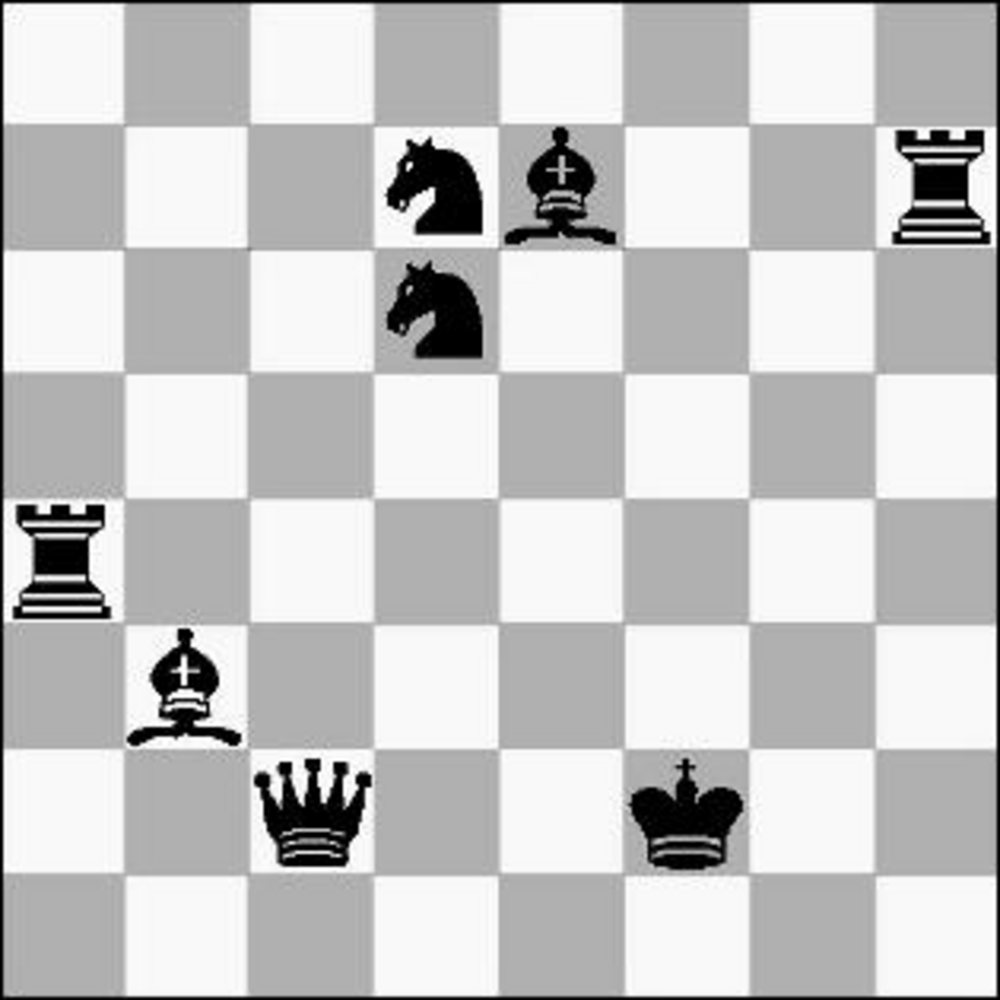

- **7 Combinatorial Search and Heuristic Methods**
  - Many problems can be solved optimally using exhaustive search but with high time complexity.
  - Pruning the search space is essential for larger problems to reduce computational burden.
  - Heuristic methods such as simulated annealing are introduced for beyond brute-force search.
- **7.1 Backtracking**
  - Backtracking systematically iterates through all possible configurations in the search space.
  - It models solutions as vectors composed of elements from finite ordered sets.
  - Backtracking constructs a tree of partial solutions and performs depth-first traversal.
  - Five subroutines are essential: is_a_solution, construct_candidates, process_solution, make_move, and unmake_move.
  - Pruning and recursion make backtracking both correct and efficient.
  - [The Algorithm Design Manual](https://link.springer.com/book/10.1007/978-1-84800-070-4)
  - **7.1.1 Constructing All Subsets**
    - Number of subsets of an n-element set is 2^n, doubling with each additional element.
    - Subsets are represented by vectors where each element is true/false depending on item inclusion.
    - The algorithm builds subsets by choosing true or false for each position.
  - **7.1.2 Constructing All Permutations**
    - Number of permutations is n! for n distinct elements, no repetitions allowed.
    - Candidates for position k are elements not already in positions 1 to k-1.
    - The algorithm generates permutations in lexicographic order using bit-vectors for efficiency.
  - **7.1.3 Constructing All Paths in a Graph**
    - Enumerates all simple s-t paths where candidates at each step are adjacent vertices not yet visited.
    - Backtracking prunes impossible paths and reports a solution when the current node equals t.
- **7.2 Search Pruning**
  - Pruning cuts off the search when partial solutions cannot lead to full solutions.
  - For example, in TSP, pruning occurs if partial tour cost exceeds known best tour cost.
  - Exploiting symmetries like fixing the first vertex reduces the search space significantly.
  - Pruning can dramatically reduce running time and enable solving problems with n between 15 and 50.
- **7.3 Sudoku**
  - Sudoku is a 9×9 grid puzzle where each row, column, and 3×3 sector must contain digits 1 through 9 without repetition.
  - Backtracking is applied by representing the state as a sequence of open squares and their candidate values.
  - Most constrained square selection significantly improves pruning efficiency over arbitrary selection.
  - Look-ahead pruning detects dead ends early by verifying candidate values remain for each square.
  - Empirical results show pruning strategies reduce solving steps from millions to under ten thousand.
- **7.4 War Story: Covering Chessboards**
  - The problem is to cover all 64 squares on a chessboard with the eight main chess pieces threatening them.
  - Naïve search space is huge (~10^15), requiring substantial pruning and symmetry exploitation.
  - Ordering piece placement by mobility and separating weak and strong attacks improves pruning.
  - The program ran efficiently on 1988 hardware, revealing no arrangement covering all 64 by main pieces.
  - Clever pruning yields greater impact on runtime than any other optimization.
- **7.5 Heuristic Search Methods**
  - Heuristic methods address large combinatorial problems where exhaustive search is infeasible.
  - They share components: solution space representation and cost (evaluation) function.
  - **7.5.1 Random Sampling**
    - Generates uniformly random candidate solutions evaluated by their cost.
    - Performs well if many acceptable solutions exist or if the search space lacks coherent structure.
    - Poor performance on problems like TSP where good solutions are rare and clustered.
  - **7.5.2 Local Search**
    - Explores neighborhood of a solution via small transitions such as swapping elements.
    - Hill climbing accepts only improving moves and can get stuck in local optimal solutions.
    - Effective in convex landscapes or when incremental cost evaluation is cheap.
    - Improves significantly over random sampling but still far from global optimum on TSP.
  - **7.5.3 Simulated Annealing**
    - Inspired by physical annealing, occasionally accepts worse solutions to escape local optima.
    - Uses a cooling schedule with temperature regulating acceptance probability of inferior moves.
    - Parameters include initial temperature, temperature decay, iteration length per temperature.
    - Achieves better and faster convergence to near-optimal solutions than random sampling or hill climbing.
    - Recommended as the heuristic search method of choice in practice.
  - **7.5.4 Applications of Simulated Annealing**
    - Maximum Cut: partitions graph vertices to maximize crossing edge weights; uses bit vector and vertex flips.
    - Independent Set: selects vertex subsets with no edges; cost considers size and edge violations with temperature dependence.
    - Circuit Board Placement: places rectangular modules optimizing area, wire length, and overlap using grid placement and cost weights.
- **7.6 War Story: Only it is Not a Radio**
  - Problem: assemble the maximum number of working "not-radios" from different parts each with defect measures.
  - The goal: balance good and bad parts so assemblies have total defect below a threshold.
  - Matching problem reduces to hypergraph matching, which is NP-complete for more than two parts.
  - Modeled as a type of constrained bin packing with maximum number of complete bins.
  - Used simulated annealing to swap parts and optimize number of working assemblies, achieving record results.
- **7.7 War Story: Annealing Arrays**
  - Problem: generate optimal dense oligonucleotide arrays via scheduling row and column commands.
  - Model solution as subsets of prefixes and suffixes realizing all input strings.
  - Cost function balances chip dimensions and coverage of strings.
  - Used simulated annealing with move operations including swap, add, delete, and selective insertions.
  - Achieved significant reductions (e.g., from 192×192 to 130×132 for HIV 7-mers) in practical runtime.
- **7.8 Other Heuristic Search Methods**
  - Introduces genetic algorithms inspired by natural selection maintaining populations of candidate solutions.
  - Reproduction operations include mutation and crossover guided by solution fitness.
  - Genetic algorithms generally underperform simulated annealing for combinatorial problems due to complexity and slow convergence.
  - Recommends simulated annealing over genetic algorithms for heuristic search.
  - Additional details available in [Aarts and Lenstra](https://link.springer.com/book/10.1007/978-1-4613-1761-2).
- **7.9 Parallel Algorithms**
  - Parallelism can accelerate computation but often with limited speedup due to overhead and algorithmic factors.
  - Speedup is meaningless unless compared against the best sequential algorithm.
  - Debugging parallel programs is challenging due to non-deterministic communication.
  - Advocates partitioning problems into independent tasks with minimal interprocessor dependencies for effective parallelism.
- **7.10 War Story: Going Nowhere Fast**
  - Parallelizing Waring’s conjecture task by simple block partitioning led to load imbalance.
  - Runtime per integer increased with integer size, causing last processors to have longer jobs.
  - Lack of load balancing wasted resources and caused user dissatisfaction.
  - Proper load balancing is vital in parallel processing to ensure efficient use of resources.
- **7.11 Exercises**
  - Exercise topics include backtracking for derangements, permutations of multisets, graph isomorphism, anagram finding, and subgraph isomorphism.
  - Combinatorial optimization problems cover bandwidth minimization, max satisfiability, maximum clique, vertex and edge coloring, feedback vertex sets, and set cover.
  - Interview problems range from permutation generation to k-element subsets, anagram construction, keypad words, and unique room occupancy sequences.
  - Programming challenges include little bishops, 15-puzzle, tug of war, and color hash with online judge systems.
