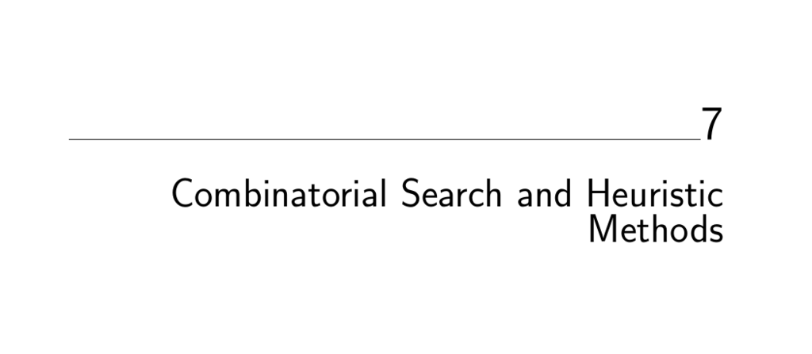

- **Combinatorial Search and Heuristic Methods**
  - **Backtracking**
    - Iterates systematically through all possible configurations of a search space using depth-first traversal.
    - Represents solutions as vectors where each element is selected from a finite set.
    - Applies tests for solution completion and potential extendibility at each step.
    - Uses recursion and five key subroutines for candidate construction, solution checking, solution processing, and move management.
    - Illustrations include constructing all subsets, permutations, and paths in a graph.
    - See [The Algorithm Design Manual](https://doi.org/10.1007/978-1-84800-070-4) for implementation details.
  - **Search Pruning**
    - Pruning cuts off search paths that cannot lead to complete or optimal solutions.
    - Exploits early detection of dead-ends and symmetry in the search space to reduce complexity.
    - Significantly reduces the search tree size, making larger problems computationally feasible.
    - Typical size limits for optimal combinatorial search with pruning range between 15 and 50 items.
    - Pruning principles are essential for efficient exhaustive search methods.
  - **Sudoku**
    - Solves Sudoku puzzles using backtracking with a state space based on open squares and their feasible number candidates.
    - Candidate generation accounts for row, column, and sector constraints.
    - Implements pruning with two heuristics: most constrained square selection and look-ahead to detect dead-ends early.
    - Experimental results demonstrate dramatic speedups and search space reductions from pruning strategies.
    - Sudoku solving illustrates the practical impact of careful heuristic design in combinatorial search.
  - **War Story: Covering Chessboards**
    - Investigates whether eight main chess pieces can simultaneously threaten all 64 squares on a chessboard.
    - Initial search space is excessively large, requiring symmetry exploitation and pruning based on coverage limits per piece.
    - Uses weak and strong attack definitions to prune the search effectively.
    - Employs ordering of piece placement according to maximum mobility for better pruning.
    - Final exhaustive search on a 1988 PC-RT runs within one day, proving no configuration covers all 64 squares, but seven pieces suffice if queen and knight occupy the same square.
  - **Heuristic Search Methods**
    - Presents three heuristic approaches for combinatorial optimization: random sampling, local search (hill climbing), and simulated annealing.
    - Random sampling selects solutions uniformly at random, effective only when good solutions are abundant or no spatial coherence exists.
    - Local search iteratively improves solutions via neighborhood transitions but risks getting trapped in local optima.
    - Simulated annealing allows occasional uphill moves, mimicking physical annealing to escape local optima and approach global optima.
    - Simulated annealing’s cooling schedule and acceptance criteria govern solution space exploration versus exploitation.
    - Simulated annealing demonstrates superior solution quality and convergence speed on TSP examples.
    - For deeper study, see [Aarts and Lenstra, Local Search in Combinatorial Optimization](https://www.springer.com/gp/book/9781118031402).
  - **War Story: Only it is Not a Radio**
    - Addresses a selective assembly problem matching defective parts to maximize functional assemblies.
    - Prototype problem involves matching multiple parts per assembly with total defect below a threshold.
    - Relates to matching and hypergraph matching problems, which are NP-complete for >2 parts.
    - Models the problem akin to a bin packing variant with constraints on parts per bin.
    - Uses simulated annealing with cost functions rewarding complete assemblies and gradual improvement of partial assemblies.
    - Achieved improvement over factory results by producing seven working not-radios, exceeding prior best of six.
  - **War Story: Annealing Arrays**
    - Discusses scheduling of row and column synthesis steps in DNA oligonucleotide array fabrication.
    - Models problem as selecting minimal prefix and suffix sets covering all target strings.
    - Implements simulated annealing with custom move sets and a cost function balancing array dimensions and coverage.
    - Achieves a significant array size reduction (from 192×192 to 130×132) on HIV 7-mer oligonucleotide set.
    - Emphasizes iterative tuning of evaluation functions, random move selection, and cooling schedules.
  - **Other Heuristic Search Methods**
    - Introduces genetic algorithms as bio-inspired methods maintaining populations of solutions undergoing crossover and mutation.
    - Notes that genetic algorithms often exhibit slower convergence and higher complexity than simulated annealing in practice.
    - Genetic operators frequently lack problem-specific structure exploitation.
    - Recommends simulated annealing over genetic algorithms for heuristic combinatorial optimization.
    - For detailed comparisons, see [Mühlenbein and Fogel (2000)](https://doi.org/10.1007/978-1-4615-4155-2_2).
  - **Parallel Algorithms**
    - Highlights potential benefits of parallel processing but warns about pitfalls including limited speedup, debuggability, and workload balancing.
    - Emphasizes that improving sequential algorithms can yield greater benefits than parallelization.
    - Advises focusing on coarse-grained tasks with minimal interprocessor communication.
    - Details a war story showing lack of proper load balancing results in ineffective parallel speedup.
    - Parallel speedup may be negated by poor algorithm design or problem characteristics.
  - **War Story: Going Nowhere Fast**
    - Describes attempts to parallelize testing Waring’s conjecture using distinct integer intervals on a hypercube.
    - Encountered machine unreliability, system usage constraints, and escalating computation times per interval.
    - Demonstrated poor load balancing when computational work increases with input size.
    - Illustrates importance of balancing computational load across processors in parallel algorithms.
    - References partition algorithms from Section 8.5 for balanced workload distribution.
  - **Exercises**
    - Includes problems on derangements, permutations of multisets, graph isomorphism, anagram search, subgraph isomorphism, and turnpike reconstruction using backtracking.
    - Challenges the design and implementation of combinatorial optimization algorithms and heuristics for bandwidth minimization, max satisfiability, clique, coloring, feedback vertex set, and set cover.
    - Provides interview-style programming tasks involving permutations, subsets, anagrams, keypad word generation, and combinatorial sequence construction.
    - Contains specialized programming challenge problems with online judge references available at [Programming Challenges](http://www.programming-challenges.com).
