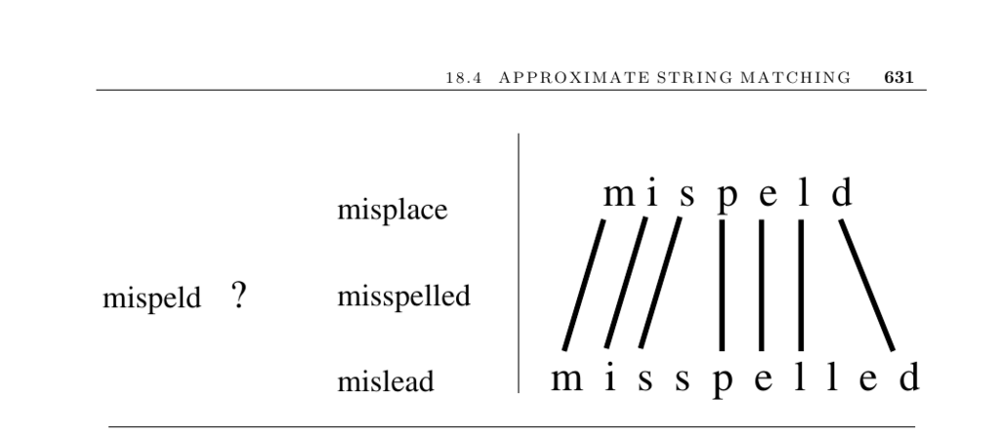

- **18.4 Approximate String Matching**  
  - Approximate string matching finds the minimum-cost transformation of one string into another using insertions, deletions, and substitutions.  
  - The problem supports applications like spelling correction, DNA sequence similarity, OCR error analysis, and file difference detection.  
  - The edit distance or Levenshtein distance is the common metric used to quantify these transformations.  
  - See [Wikipedia Levenshtein Distance](http://en.wikibooks.org/wiki/Algorithm_implementation/Strings/Levenshtein_distance) for implementations in various languages.

  - **Dynamic Programming Approach**  
    - Uses a cost matrix D[i, j] representing the minimal cost to convert the first i characters of pattern p into the first j characters of text t.  
    - The recurrence considers match/substitution, deletion, and insertion operations.  
    - Boundary conditions vary with whether matching the full text or substring; e.g., substring matching allows zero cost for D[0, j].  
    - An implementation example is available in Section 8.2 (page 280).

  - **Algorithmic Issues and Enhancements**  
    - Matching full text vs. substring affects boundary conditions of the dynamic programming table.  
    - Substitution, insertion, and deletion costs can be tuned based on application needs; some cost settings avoid substitutions entirely.  
    - Backtracking through the cost matrix enables recovery of the explicit alignment and edit operations.  
    - Banding techniques reduce computation when strings are similar by restricting search to a diagonal band.  
    - Filtration methods break patterns into pieces to find exact matches quickly before full approximation.

  - **Bit-Parallel Algorithms**  
    - Modern CPUs' word sizes (e.g., 64-bit) enable parallel pattern comparisons via bit-masks for characters of the pattern.  
    - Bit-parallelism shifts and AND operations propagate match states efficiently.  
    - The agrep program uses this approach for approximate matching with strong speed improvements.  
    - Navarro’s nrgrep combines bit-parallelism with filtration for more consistent performance.  
    - See [agrep](http://www.tgries.de/agrep/) and [nrgrep](http://www.dcc.uchile.cl/~gnavarro/software/) for tools.

  - **Space Minimization and Hirschberg’s Algorithm**  
    - Quadratic space usage is reduced to linear space by storing only two rows or columns of the matrix during computation.  
    - Hirschberg’s recursive algorithm recovers the optimal alignment in linear space by dividing the matrix and solving subproblems.  
    - This method retains O(mn) time complexity and is practical for long strings.  
    - Details and C implementations appear in Section 8.2 (page 280).

  - **Gap Penalties and Affine Gap Costs**  
    - Alignments can model gaps as runs of indels with different cost structures: A + Bt for a gap of length t.  
    - Large gap opening cost A discourages many small gaps, favoring fewer longer gaps.  
    - The dynamic programming recurrences E, F, and G track gap and match states to compute affine gap penalties in O(mn) time.  
    - This approach better models real biological or text sequence variations.  
    - See [Gus97] for a dedicated treatment of string matching with gap penalties.

  - **Phonetic Similarity and Soundex**  
    - Soundex encodes English words to match similar-sounding names despite spelling differences.  
    - The algorithm discards vowels, silent and doubled letters, then maps consonants to numeric codes.  
    - All variants of a name yield the same Soundex code, facilitating approximate phonetic matching.  
    - The method dates back to the 1920s and remains effective for name matching tasks.  
    - Further reading includes [BR95] and [Knu98].  

  - **Additional Implementations and References**  
    - TRE library supports exact and approximate regular expression matching with worst-case O(nm²) runtime.  
    - Advances in bit-parallel algorithms and approximate string matching are covered in surveys by Navarro and Raffinot [NR07].  
    - Masek and Paterson improved edit distance computation using the four Russians technique [MP80].  
    - The classical dynamic programming algorithm is attributed to Wagner and Fischer [WF74].  
    - For a detailed historical and surveys overview, see [SK99], [HD80], and [Nav01a].
