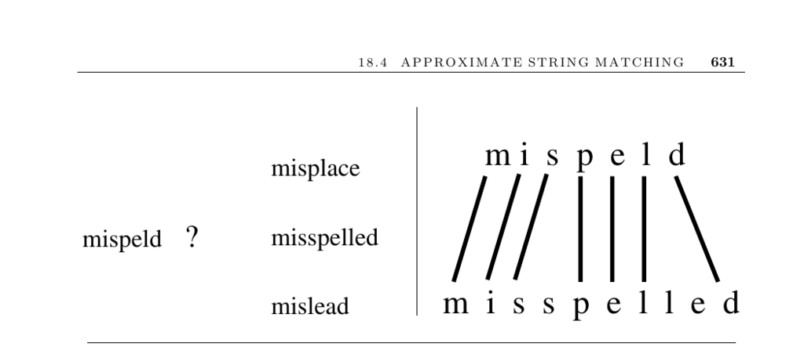

- **18.4 Approximate String Matching**
  - **Problem Description**
    - The problem is to find the minimum-cost transformation of a text string t into a pattern string p using insertions, deletions, and substitutions.
    - Approximate string matching is fundamental for error-prone contexts such as spelling correction and biological sequence analysis.
    - Exact string matching is a special case without errors, covered in Section 18.3.
    - See [Wikipedia Levenshtein Distance](http://en.wikibooks.org/wiki/Algorithm_implementation/Strings/Levenshtein_distance) for implementations in multiple programming languages.
  - **Dynamic Programming Approach**
    - Defines D[i, j] as the cost to edit the first i characters of p to the first j characters of t using three options: match/substitution, deletion, and insertion.
    - Boundary conditions distinguish between full string matching and substring matching, affecting initial costs.
    - Cost assignments for insertions, deletions, and substitutions impact the resulting alignment and can be customized.
    - Alignment sequences can be reconstructed by backward tracing through the dynamic programming matrix.
    - Reference implementation described in Section 8.2.
  - **Algorithmic Improvements and Variations**
    - Banding optimizes performance when strings are very similar by limiting the search to cells within distance d of the diagonal.
    - Filtration techniques use exact matching on pattern pieces to eliminate unlikely candidate regions.
    - Bit-parallel algorithms use computer word-level operations to speed up matching, with agrep as an implementation example.
    - Linear space algorithms like Hirschberg’s recursively reconstruct alignments using O(min(m,n)) space.
    - Gap penalties model the cost of runs of insertions/deletions differently to encourage fewer, longer gaps.
    - See [Navarro and Raffinot 2007](https://doi.org/10.1007/978-3-540-30790-3) for recent bit-parallel algorithm advances.
  - **Alternative Matching Models**
    - Phonetic algorithms like Soundex map strings based on how they sound, useful for names with spelling variations.
    - Soundex maps letters to codes and ignores vowels and doubled letters, producing a code with one letter and up to three digits.
    - Metaphone is a newer phonetic matching algorithm improving on Soundex.
    - See [Knuth's The Art of Computer Programming](https://doi.org/10.5555/58082) for exploration of Soundex.
  - **Implementations and Tools**
    - agrep supports approximate general regular expression pattern matching with errors.
    - Navarro’s nrgrep combines bit-parallelism and filtration for improved performance.
    - TRE is a regular-expression matching library handling exact and approximate matches with complexity O(nm²).
    - All tools are available online with links provided in the text.
  - **Notes and References**
    - The foundational dynamic programming algorithm is attributed to [WF74].
    - Advances in approximate matching include the four Russians algorithm and algorithms efficient when edit distance is small.
    - Surveys and textbooks such as [Gus97] and [SK99] provide comprehensive background.
    - The bit-parallel approach by Myers achieves O(mn/w) time complexity.
    - Historical and technical references on Soundex and phonetic hashing cited for further study.
