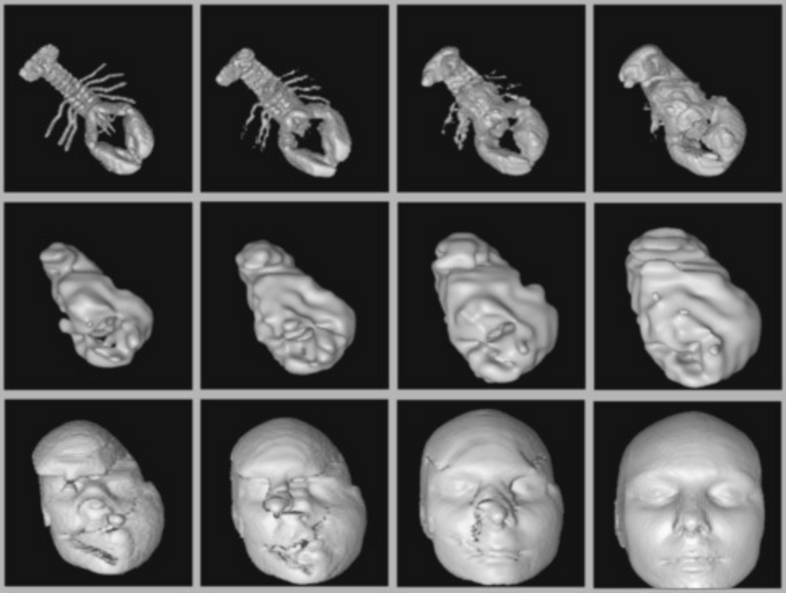

- **Dynamic Programming**
  - Algorithms for optimization problems require proof of global optimality beyond greedy and exhaustive search.
  - Dynamic programming efficiently implements recursive solutions by caching partial results to avoid recomputation.
  - It is especially effective on combinatorial objects with a natural left-to-right order like strings and polygons.
  - [The Algorithm Design Manual](https://doi.org/10.1007/978-1-84800-070-4) by Steven S. Skiena contains detailed coverage.

  - **Caching vs. Computation**
    - Recursive Fibonacci computation suffers exponential time due to repeated subproblem evaluations.
    - Caching stores subproblem results, transforming exponential recursion into linear-time computation.
    - Dynamic programming eliminates recursion by evaluating from base cases upward, further optimizing space.
    - Binomial coefficients can be computed via similar recurrence relations with efficient table evaluations.
    - [Dynamic Programming and Recursion](https://en.wikipedia.org/wiki/Dynamic_programming) offers background.

  - **Approximate String Matching**
    - Edit distance measures string similarity based on substitution, insertion, and deletion costs.
    - Recursive edit distance algorithms recompute subproblems exponentially, whereas dynamic programming caches results.
    - Dynamic programming tables store costs and parent pointers to compute minimal edit sequences in O(|P||T|) time.
    - Variants include substring matching, longest common subsequence, and maximum monotone subsequence implemented via cost adaptations.
    - [Wagner–Fischer algorithm](https://en.wikipedia.org/wiki/Wagner%E2%80%93Fischer_algorithm) is the classical method.

  - **Longest Increasing Sequence**
    - The longest increasing subsequence problem identifies the maximum-length sorted subsequence of a numerical sequence.
    - Dynamic programming recurrence defines lengths of longest sequences ending at each element.
    - Predecessor tracking enables reconstruction of the optimal subsequence.
    - Naive implementation runs in O(n²), with advanced methods achieving O(n log n).
    - [Longest Increasing Subsequence](https://en.wikipedia.org/wiki/Longest_increasing_subsequence) details methods and improvements.

  - **War Story: Evolution of the Lobster**
    - Morphing images requires matching corresponding pixel runs between two images without crossing intervals.
    - Dynamic programming aligns runs by minimizing cost functions over length and position differences.
    - The problem decomposes recursively into smaller subproblems due to order and non-crossing constraints.
    - Results enable realistic morph sequences without inappropriate feature alignment.
    - [Image Morphing Techniques](https://link.springer.com/chapter/10.1007/978-1-4612-1560-4_11) discusses related algorithms.

  - **The Partition Problem**
    - Partitioning a sequence into k contiguous ranges to minimize the maximum range sum models workload balancing.
    - Recurrence relation combines partitions by evaluating all possible divider placements.
    - Dynamic programming with prefix sums computes optimal partitions in O(k n²) time.
    - Auxiliary tables store divider locations to reconstruct optimal partitions.
    - [Linear Partition Problem](https://en.wikipedia.org/wiki/Partition_problem) for related concepts.

  - **Parsing Context-Free Grammars**
    - Parsing maps strings to parse trees based on context-free grammar rules in Chomsky normal form.
    - Dynamic programming tracks all nonterminals generating substrings of the input.
    - The CKY algorithm uses O(n³) time and O(n²) space to parse strings of length n.
    - Extensions allow minimal edit-cost parsing and error correction by generalizing cost functions.
    - [CKY algorithm](https://en.wikipedia.org/wiki/CYK_algorithm) explains parsing techniques.

  - **Minimum Weight Triangulation**
    - Triangulating polygons involves partitioning into triangles with minimum sum of internal diagonal lengths.
    - Dynamic programming selects the optimal vertex to pair with boundary edges, recursively triangulating subpolygons.
    - The algorithm runs in O(n³) time with O(n²) space.
    - Including points inside polygons renders the problem NP-complete.
    - [Minimum-weight triangulation problem](https://en.wikipedia.org/wiki/Minimum-weight_triangulation) for details.

  - **Limitations of Dynamic Programming: TSP**
    - Without inherent left-to-right ordering, dynamic programming may require exponential time/space due to complex state spaces.
    - Longest simple path and traveling salesman problems illustrate failures of naive dynamic programming due to cycles and missing ordering.
    - Expanded state definitions with subsets reduce, but do not eliminate, exponential complexity.
    - The principle of optimality must hold for dynamic programming to be correct and efficient.
    - [Traveling Salesman Problem](https://en.wikipedia.org/wiki/Travelling_salesman_problem) covers algorithmic challenges.

  - **War Story: What’s Past is Prolog**
    - Optimizing trie data structures for Prolog rules requires reordering characters under leaf order constraints.
    - Dynamic programming can find minimal tries maintaining rule order despite exponential naive search space.
    - The small number of possible consecutive runs enables polynomial-time evaluation.
    - Without order constraints, the optimization becomes NP-complete.
    - [Tries](https://en.wikipedia.org/wiki/Trie) provide background on trie data structures.

  - **War Story: Text Compression for Bar Codes**
    - PDF-417 bar codes use multiple character modes to compactly represent alphanumeric and punctuation text.
    - Encoding involves mode latch and mode shift commands, complicating optimal code selection.
    - Dynamic programming finds the minimal-cost encoding by tracking minimal costs per position and mode.
    - Optimal encoding showed an observed 8% improvement over heuristic greedy algorithms.
    - [PDF-417](https://en.wikipedia.org/wiki/PDF417) page explains barcode symbology and encoding.

  - **Chapter Notes**
    - Dynamic programming is attributed to Bellman; edit distance algorithms to Wagner and Fischer.
    - Minimum weight triangulation hardness and polynomial algorithms are active research topics.
    - Parsing and edit distance generalizations are well-documented in algorithmic literature.
    - [The Algorithm Design Manual](https://doi.org/10.1007/978-1-84800-070-4) remains an authoritative source.
