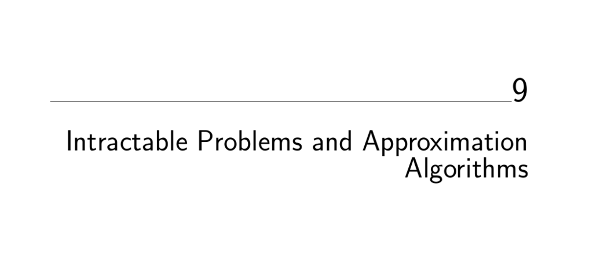

- **Intractable Problems and Approximation Algorithms**
  - Introduces techniques to prove that no efficient algorithm exists for certain problems.
  - Highlights NP-completeness as a tool to determine problem hardness.
  - Explains problem reductions as transformations preserving solution equivalences.
  - Introduces complexity aspects of NP-completeness and approximation algorithms.
  - References: [The Algorithm Design Manual](https://doi.org/10.1007/978-1-84800-070-4)
  
  - **Problems and Reductions**
    - Defines problems, instances, and reductions as translations preserving correctness.
    - Illustrates reductions with Bandersnatch and Bo-billy problem analogy.
    - Explains implications of reductions for algorithmic complexity bounds.
    - Summarizes reductions as proofs of equivalent computational difficulty.

  - **Decision Problems**
    - Defines decision problems with yes/no answers to simplify reductions.
    - Demonstrates transforming optimization problems like TSP into decision form.
    - Explains benefits of focusing on decision problems for hardness proofs.

  - **Reductions for Algorithms**
    - Describes generating new algorithms by reducing problems to solvable ones.
    - Presents examples of reductions leading to polynomial-time algorithms.

    - **Closest Pair**
      - Shows closest pair decision problem can be solved via sorting.
      - Sorting neighbors yield the closest pair with O(n log n) complexity.
      - Discusses implications and limits of sorting-based reduction.

    - **Longest Increasing Subsequence**
      - Shows LIS can be reduced to edit distance problem.
      - Uses the sorted sequence T from S for edit distance alignment.
      - Reduction yields quadratic algorithm but not the fastest known LIS solution.

    - **Least Common Multiple**
      - Defines LCM and GCD problems and their relations.
      - Uses Euclid’s algorithm for efficient GCD computation without factoring.
      - Reduces LCM computation to GCD using formula LCM(x,y) = xy / GCD(x,y).

    - **Convex Hull**
      - Reduces sorting to convex hull by mapping numbers to points on parabola y=x².
      - Shows convex hull’s Ω(n log n) lower bound via reduction implies sorting bound.
      - Demonstrates equivalence of sorting complexity and convex hull computation.

  - **Elementary Hardness Reductions**
    - Introduces reductions to prove NP-hardness of problems like Hamiltonian Cycle.
    - Maps Hamiltonian cycle instances to Traveling Salesman Decision Problem.
    - Explains equivalence of hardness between vertex cover and independent set.
    - Presents reductions linking clique, independent set, and vertex cover.
    - Emphasizes role of satisfiability as ultimate NP-complete problem.

    - **Hamiltonian Cycle**
      - Defines problem of finding cycle that visits every vertex once.
      - Reduces Hamiltonian cycle to TSP decision with specific edge weights.
      - Transformation is polynomial time and preserves solution equivalence.

    - **Independent Set and Vertex Cover**
      - Defines vertex cover as smallest vertex subset covering all edges.
      - Defines independent set as vertex subset with no edges between them.
      - Provides reduction between vertex cover and independent set via complement.
      - Shows both problems have equivalent computational hardness.

    - **Clique**
      - Defines clique as complete subgraph with edges between all vertex pairs.
      - Reduces independent set problem to clique problem by complement graph.
      - Establishes chain of problem hardness linking vertex cover, independent set, clique.

  - **Satisfiability**
    - Defines SAT as deciding satisfiability of Boolean formula clauses.
    - Provides examples of satisfiable and unsatisfiable clause sets.
    - Presents 3-SAT as a restriction with exactly three literals per clause.
    - Describes polynomial-time reduction of SAT to 3-SAT transforming clauses.
    - Notes 2-SAT is solvable in linear time, unlike 3-SAT which is NP-complete.

  - **Creative Reductions**
    - Emphasizes importance and direction of reductions in proving hardness.
    - Presents reduction of 3-SAT to Integer Programming with Boolean constraints.
    - Shows integer programming with 0/1 variables and clause inequalities.
    - Details reduction of 3-SAT to Vertex Cover using variable and clause gadgets.
    - Demonstrates NP-completeness proofs via problem translations preserving solutions.

    - **Integer Programming**
      - Maps Boolean variables and clauses from 3-SAT to integer variables and inequalities.
      - Restricts variables to 0 or 1 for correspondence to true/false.
      - Shows equivalence between solutions of IP and original SAT instances.

    - **Vertex Cover**
      - Constructs graph gadget for each variable (two vertices connected by edge).
      - Constructs triangle gadgets for each clause.
      - Links variable gadgets to clause gadgets via edges.
      - Shows vertex cover of size n + 2c corresponds to satisfiable formula.

  - **The Art of Proving Hardness**
    - Advises selecting minimal restricted source problems (e.g., 3-SAT, Hamiltonian path).
    - Suggests making target problems as general as necessary.
    - Lists four main hard source problems for reductions: 3-SAT, integer partition, vertex cover, Hamiltonian path.
    - Encourages amplifying penalties for invalid choices in reductions.
    - Recommends high-level strategic thinking and gadget construction.
    - Suggests alternating between seeking algorithms and hardness proofs when stuck.

  - **War Stories**
    - **Hard Against the Clock**
      - Describes on-demand proof of NP-completeness for a problem via 3-SAT reduction.
      - Illustrates constructing programs that simulate clauses.
      - Demonstrates encoding of satisfiability as equivalence between two programs.
    - **And Then I Failed**
      - Shares experience struggling with an NP-hardness proof for uniconnected subgraph.
      - Details reasoning about edge direction and graph construction constraints.
      - Solves proof by splitting edges and adding a sink node gadget.
      - Reveals NP-completeness proofs can be simple once problem is viewed correctly.

  - **P vs. NP**
    - Explains the essential open question about existence of polynomial-time solutions.
    - Distinguishes between verification (NP) and discovery (P) problems.
    - Defines classes P (problems solvable in polynomial time) and NP (solutions verifiable in polynomial time).
    - Highlights that every problem in P is also in NP.
    - Notes NP-complete problems are hardest in NP, with SAT as central example.
    - Explains Cook’s theorem proving SAT is as hard as any NP problem.
    - Differentiates NP-hard problems (at least as hard as NP) and NP-complete (NP-hard and in NP).
    - Gives examples of problems outside NP, like chess.

  - **Dealing with NP-complete Problems**
    - Presents three practical strategies: fast average-case algorithms, heuristics, and approximation algorithms.
    - Defines approximation algorithms as providing guaranteed bounds on solution quality.
    - Suggests combining heuristics and approximation algorithms for best results.

    - **Approximating Vertex Cover**
      - Gives a 2-approximation algorithm selecting both endpoints of edges iteratively.
      - Explains lower bound via maximal matching edges forcing subset size.
      - Discusses pitfalls of naive heuristics and benefits of simple methods.

    - **The Euclidean Traveling Salesman**
      - Emphasizes importance of triangle inequality in Euclidean metric.
      - Uses minimum spanning tree cost as lower bound for TSP tour.
      - Approximates TSP by shortcutting a depth-first traversal of the MST.
      - Guarantees solution no worse than twice optimal under triangle inequality.

    - **Maximum Acyclic Subgraph**
      - Shows any vertex ordering induces an acyclic subgraph by partitioning edges.
      - Explains half the edges can be kept acyclically by choosing orientation side.
      - Suggests heuristics to improve the approximations using randomization or swaps.

    - **Set Cover**
      - Defines set cover problem as selecting minimal subsets covering all elements.
      - Presents greedy heuristic selecting subsets covering most uncovered elements.
      - Explains logarithmic approximation factor based on coverage milestones.
      - Notes existence of instances where approximation ratio is Ω(log n).

  - **Chapter Notes**
    - Attributes NP-completeness concept to Cook’s foundational paper.
    - Describes Karp’s landmark reductions to canonical hard problems.
    - Recommends Garey and Johnson’s book as definitive NP-completeness reference.
    - Notes few problems remain of unknown complexity status, like graph isomorphism.
    - Mentions original unidirected subgraph NP-hardness proof in a 1976 paper.

  - **Exercises**
    - Contains various problems on transformations, reductions, and NP-completeness proofs.
    - Includes challenges on approximation algorithms and special case algorithms.
    - Provides programming challenges related to geometry and computational geometry.
    - Encourages implementations and backtracking heuristics for SAT and vertex cover.
    - Addresses verifying membership in NP and reasoning about complexity classes.
