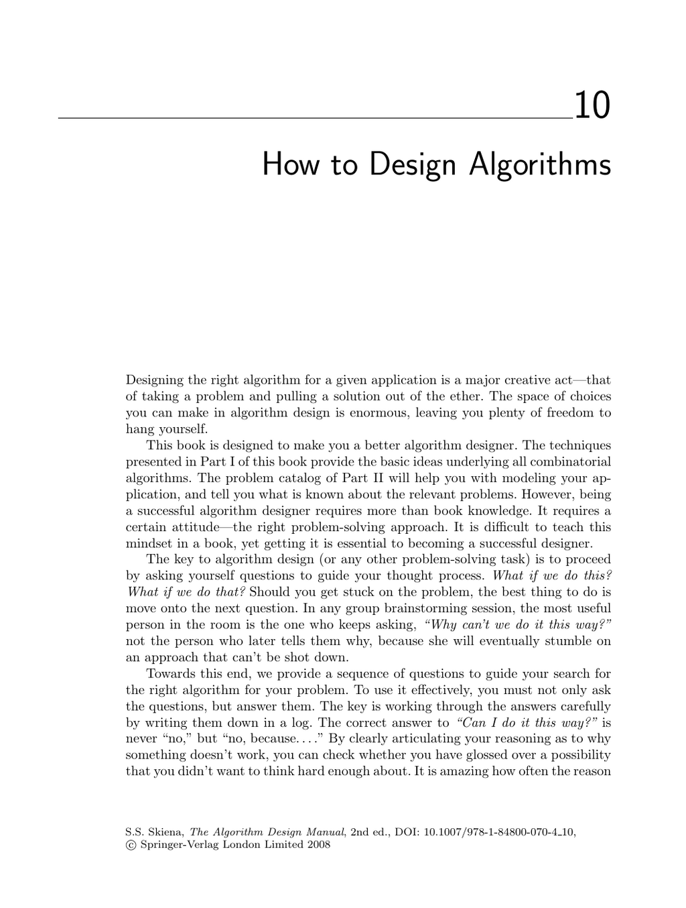

- **How to Design Algorithms**
  - **Understanding the problem**
    - The key is to precisely know the input format and desired output results.
    - Small input examples should be constructed to test and understand the problem.
    - Consider the importance of optimality, speed, and implementation effort.
    - Identify the problem type, such as numerical, graph, geometric, string, or set problems.
    - See [The Algorithm Design Manual](http://www.cs.sunysb.edu/~algorith/) for further resources.
  - **Finding simple algorithms or heuristics**
    - Explore brute force solutions and verify correctness and runtime feasibility.
    - Consider simple heuristics like picking the biggest or smallest item first and analyze their effectiveness.
    - Evaluate heuristics based on speed, ease of implementation, and behavior on different input types.
  - **Checking the algorithm catalog**
    - Identify if the problem is listed in known catalogs and what is known about it.
    - Search indexes, keywords, pictures, and online resources for implementations and background.
    - Utilize web search engines and dedicated algorithm repositories.
  - **Special cases of the problem**
    - Determine if simpler versions or restricted inputs can be solved efficiently.
    - Understand how special cases relate to the general problem and if solutions can be generalized.
    - Investigate if the problem is a special case of a broader class documented in catalogs.
  - **Relevant algorithm design paradigms**
    - Consider sorting items or keys to simplify the problem.
    - Explore divide-and-conquer or binary search strategies to split problem instances.
    - Use dynamic programming to exploit natural orderings in input or solutions.
    - Employ data structures like hash tables, heaps, or priority queues for repeated operations.
    - Apply randomized methods like sampling or simulated annealing for solution construction.
    - Formulate the problem as a linear or integer program if applicable.
    - Check if the problem is NP-complete and consult standard references like Garey and Johnson’s catalog.
  - **If still stumped**
    - Consider hiring expert consultants if resources allow.
    - Revisit earlier questions as new insights may emerge on repeated reviews.
    - Study general problem-solving techniques in resources like [How to Solve It](https://en.wikipedia.org/wiki/How_to_Solve_It) by George Polya.
