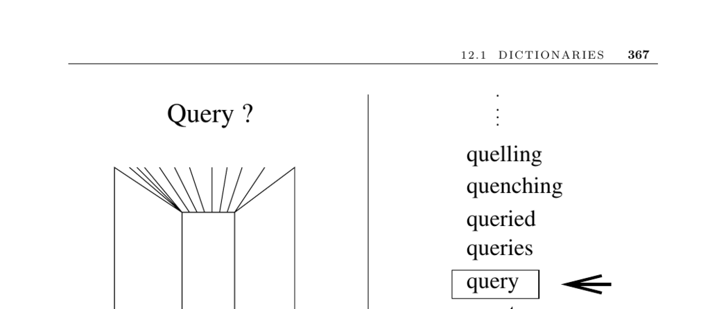

- **12.1 Dictionaries**
  - **Input description**
    - The input consists of a set of n records identified by one or more key fields.
  - **Problem description**
    - The task is to build and maintain a data structure for efficient location, insertion, and deletion of records by any query key q.
  - **Discussion**
    - Dictionaries are essential abstract data types in computer science.
    - Various implementations include hash tables, skip lists, and binary search trees, affecting performance significantly.
    - Isolating dictionary implementation from its interface enables easier experimentation and cleaner code.
  - **Choosing the right data structure**
    - Consider factors such as data size, knowledge of operation frequencies, access patterns, and performance priorities.
    - Different choices suit static, semi-dynamic, or fully dynamic datasets and uniform or skewed access patterns.
  - **Data structure options**
    - **Unsorted linked lists or arrays**
      - Suitable for small data sets; linked structures exhibit poor cache performance.
      - Self-organizing lists improve average search times by moving accessed keys to the front.
    - **Sorted linked lists or arrays**
      - Sorted linked lists are rarely worth maintaining unless removing duplicates.
      - Sorted arrays work if insertions and deletions are infrequent.
    - **Hash tables**
      - Preferred for moderate-to-large datasets (100 to 10 million keys).
      - Use of hash functions mapping keys to buckets enables quick key localization.
      - Design decisions include collision handling, table size, and choice of hash function.
      - A suitable hash function enables efficient calculation of successive window hashes.
      - Monitoring key distribution across buckets is critical for performance.
      - Refer to Section 3.7 for detailed hashing discussion.
    - **Binary search trees**
      - Support fast insertions, deletions, and queries.
      - Performance depends on balancing strategies (unbalanced, AVL, red-black, splay trees).
      - Splay trees exploit access locality by moving accessed keys to the root.
      - Implementation skill often outweighs the choice of tree variant.
    - **B-trees**
      - Best for very large data sets exceeding main memory capacity.
      - Collapse multiple search steps into large nodes to minimize disk accesses.
      - Performance depends on virtual memory and storage interaction.
      - Useful as applications become bottlenecked by data transfer costs.
    - **Skip lists**
      - Maintain multiple levels of sorted linked lists with probabilistic balancing.
      - Provide expected O(lg n) search times.
      - Easier to analyze and implement than balanced trees.
  - **Implementations**
    - Modern languages provide container libraries, e.g., C++ STL, LEDA, Java Collections.
    - Research identifies hashing as the top dictionary implementation for many scenarios.
    - External sources include Josuttis [Jos99], Meyers [Mey01], Musser [MDS01], and [MN99].
  - **Notes**
    - Knuth [Knu97a] remains a foundational resource on dictionaries despite missing newer structures.
    - The Handbook of Data Structures and Applications [MS05] offers current surveys.
    - DIMACS 1996 challenge provided practical implementations and datasets.
    - Cache and memory hierarchy effects dominate algorithm performance.
    - Cache-oblivious data structures guarantee performance without tuning for block size.
    - Amortized analysis balances expensive and cheap operations over time.
  - **Related problems**
    - Sorting and searching are closely connected problems referenced on pages 436 and 441.
