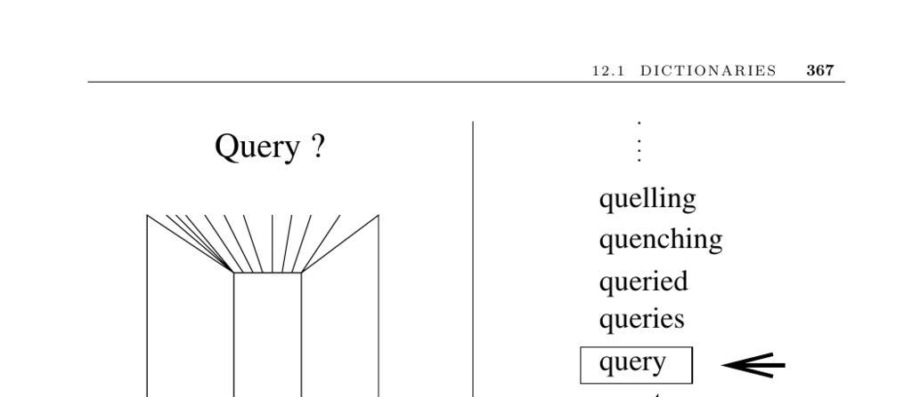

- **12.1 Dictionaries**
  - **Input description**
    - The data consists of n records identified by one or more key fields.
    - The goal is to build and maintain a data structure for efficient locate, insert, and delete operations.
  - **Problem description**
    - The dictionary abstract data type supports operations to locate, insert, and delete records by keys.
    - Choosing the appropriate dictionary implementation significantly affects performance.
  - **Implementation advice**
    - Isolate the dictionary implementation from its interface using explicit method calls.
    - Abstraction overhead is less important than the ability to switch implementations.
  - **Data structure selection considerations**
    - Consider the number of items and whether the size is known in advance.
    - Account for the relative frequency of insert, delete, and search operations.
    - Assess if key access patterns are uniform or skewed with temporal locality.
    - Evaluate whether speed of individual operations or total work over time is critical.
  - **Basic dictionary implementations**
    - Unsorted linked lists or arrays suit small data sets but scale poorly beyond 50–100 items.
    - Self-organizing lists improve average search times by moving accessed elements to the front.
  - **Sorted linked lists or arrays**
    - Sorted linked lists are rarely worth the maintenance overhead.
    - Sorted arrays are suitable only when insertions and deletions are infrequent.
  - **Hash tables**
    - Ideal for moderate to large collections (100 to 10 million keys).
    - Use functions mapping keys to integers with bucket arrays, usually implemented as unsorted lists.
    - Important design choices include collision handling, table size, and hash function selection.
    - Horner's rule enables efficient hash computation for strings.
    - Hash key distribution statistics are essential for performance evaluation.
    - See detailed hashing discussion in Section 3.7 (page 89).
  - **Binary search trees**
    - Support efficient insertions, deletions, and queries.
    - Unbalanced trees degrade with sorted input; balanced trees use rotations for restructuring.
    - Popular balanced trees include red-black trees; splay trees adapt to access locality.
    - Implementation quality often outweighs theoretical differences between tree types.
  - **B-trees**
    - Designed for very large data sets exceeding main memory (1 million+ items).
    - Collapse multiple search tree levels into large nodes to reduce disk accesses.
    - Effective use depends on understanding storage device and memory hierarchies.
    - Cache-oblivious algorithms improve performance without machine-specific tuning.
  - **Skip lists**
    - Implement sorted lists in hierarchical layers decided by coin flips, resulting in O(log n) expected query time.
    - Easier to analyze and code than balanced trees.
  - **Implementations in modern languages**
    - The C++ Standard Template Library (STL) offers a variety of dictionary structures.
    - LEDA provides comprehensive data structures including hashing and trees.
    - Java Collections (java.util) and JDSL offer dictionary implementations in Java.
  - **Notes and references**
    - Knuth’s works provide foundational analysis on dictionary data structures.
    - The Handbook of Data Structures and Applications covers up-to-date surveys.
    - DIMACS implementation challenges and data sets are publicly available.
    - Memory hierarchy impact is critical; cache-oblivious data structures optimize block transfers.
    - Amortized analysis evaluates total time over operation sequences, relevant for splay trees.
    - Consult [STL Documentation](http://www.sgi.com/tech/stl/), [LEDA](http://www.mpi-sb.mpg.de/LEDA/), and [Java Collections Framework](http://java.sun.com/javase/) for implementation details.
