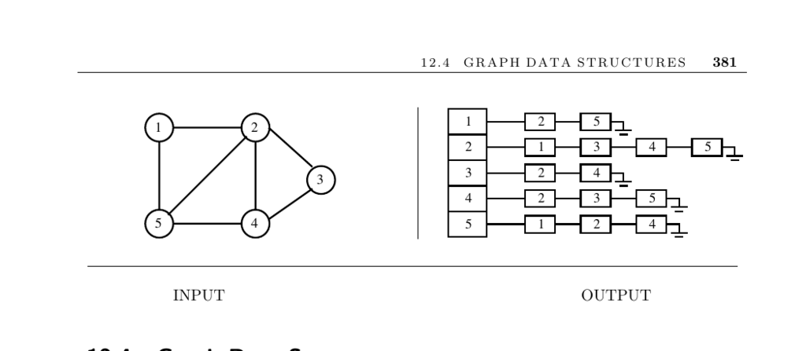

- **12.4 Graph Data Structures**
  - **Input and Problem Description**
    - The input is a graph G.
    - The problem is to represent graph G using a flexible, efficient data structure.
    - The two basic data structures for graphs are adjacency matrices and adjacency lists.
  - **Choosing a Graph Data Structure**
    - Adjacency matrices suit small or very dense graphs, while adjacency lists suit sparse or large graphs.
    - Factors to consider include graph size, density, intended algorithms, and whether the graph will be modified.
    - Attributes of vertices or edges are best stored as extra fields in adjacency list records.
  - **Special Graph Types and Representations**
    - Planar graphs are always sparse with at most 3n − 6 edges and are best represented by adjacency lists or geometrically if embeddings matter.
    - Hypergraphs generalize graphs by allowing edges with more than two vertices and can be represented by incidence matrices or bipartite incidence structures.
  - **Handling Very Large Graphs**
    - Very large graphs require lean data structures, such as packed bit vectors or arrays to reduce pointer overhead.
    - Hierarchical representations cluster vertices into subgraphs for compression and scalability.
    - Natural or application-specific decompositions are preferred over heuristic partitions for large graphs.
  - **Implementations and Libraries**
    - LEDA provides a high-quality C++ graph data type but is commercial.
    - The Boost Graph Library offers open-source C++ implementations of adjacency lists, matrices, and edge lists.
    - JUNG, JDSL, and JGraphT are popular Java graph libraries with algorithm support.
    - The Stanford Graphbase offers a flexible graph data structure in CWEB.
    - Other tools include the Programming Challenges library (C) and Combinatorica in Mathematica.
  - **Research and Notes**
    - Adjacency lists' efficiency is demonstrated by linear-time algorithms like those of Hopcroft and Tarjan.
    - Compact static graph types speed up graph algorithms, as shown by Naher and Zlotowski.
    - Minimizing bit representation of graphs and dynamic graph algorithms are active research areas.
    - Hierarchically-defined graphs appear frequently in VLSI design and have specific algorithms for planarity testing, connectivity, and minimum spanning trees.
  - **Related Topics**
    - Relevant related areas include set data structures and graph partitioning.
