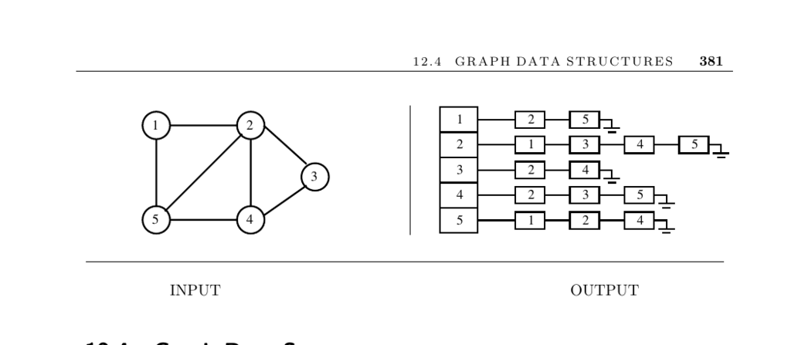

- **Graph Data Structures**
  - **Input and Problem Description**
    - Input is a graph G requiring representation via an efficient, flexible data structure.
    - The main choices for graph representation are adjacency matrices and adjacency lists.
    - Adjacency lists are generally preferred for most applications.
  - **Factors Influencing Data Structure Choice**
    - Size of the graph (number of vertices and edges) affects suitability of adjacency matrix vs. adjacency list.
    - Graph density determines if adjacency matrices or lists are more space-efficient.
    - The choice of algorithms influences data structure preference (matrices favor certain algorithms like all-pairs shortest path, lists favor DFS-based algorithms).
    - The need for modification of the graph during application runtime impacts appropriate data structure.
  - **Special Graph Types and Their Representations**
    - Planar graphs are always sparse with at most 3n − 6 edges and are best represented by adjacency lists.
    - Planar graphs are often represented geometrically when embeddings are essential.
    - Hypergraphs generalize graphs by allowing edges (hyperedges) that connect more than two vertices.
    - Two basic hypergraph data structures are incidence matrices and bipartite incidence structures.
  - **Challenges and Approaches for Large Graphs**
    - Efficient representation of very large graphs involves packing adjacency matrices or using compact adjacency lists.
    - Static graphs can reduce space by replacing edge lists with packed arrays.
    - Hierarchical representations cluster vertices into compressed subgraphs for manageability.
    - Natural or application-specific decompositions often outperform graph partitioning heuristics.
  - **Graph Data Structure Implementations**
    - LEDA offers a commercial, well-designed C++ graph library for clean and easy algorithm implementation.
    - The C++ Boost Graph Library provides adjacency lists, matrices, and edge lists with standard algorithms.
    - JUNG and JDSL are notable Java libraries for graph data structures and algorithms.
    - The Stanford Graphbase offers a simple, flexible CWEB-based graph data structure from Knuth.
    - The author's preference for C language graph types is from the book Programming Challenges.
    - Mathematica’s Combinatorica package provides graph data structures and visualization tools.
  - **Notes on Research and Efficiency**
    - Adjacency lists gained prominence through linear-time algorithms by Hopcroft and Tarjan.
    - Compact static graph structures can improve algorithm speed significantly.
    - Minimizing the bit complexity of graph representations is an area of theoretical research.
    - Dynamic graph algorithms maintain invariants under edge insertions/deletions using sparsification.
    - Hierarchically defined graphs are common in VLSI design and have dedicated algorithms for planarity, connectivity, and minimum spanning trees.
  - **Related Topics**
    - Set data structures complement graph data structures.
    - Graph partition algorithms link closely with hierarchical graph representations and are further discussed on page 541.
