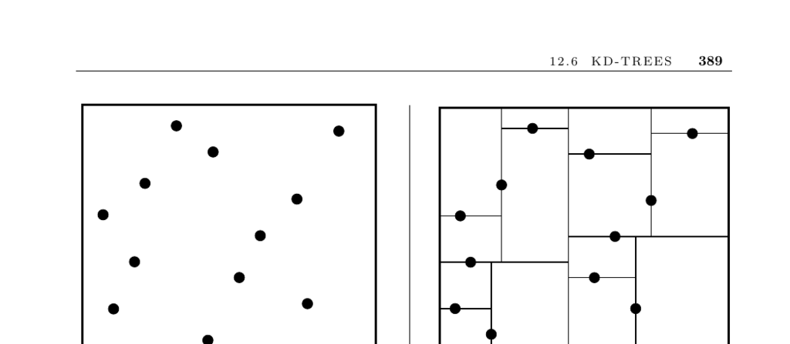

- **Kd-Trees Overview**
  - **Input and Problem Description**
    - The input is a set S of n points or geometric objects in k dimensions.
    - The problem involves constructing a tree that partitions space using half-planes.
    - Each object is contained within its own box-shaped region.
  - **Tree Construction and Splitting**
    - Kd-trees partition point sets by axis-aligned planes cycling through dimensions or selecting the largest dimension.
    - The partitioning ideally splits points evenly to ensure balanced tree height.
    - Partitioning continues until each point is isolated in a leaf cell.
  - **Spatial Regions and Cell Structure**
    - Each path from root to node defines a unique box-shaped region bounded by 2k planes.
    - Maintaining the intersection of half-spaces defines the region of interest at each node.
  - **Splitting Plane Selection Variants**
    - Cycling through dimensions partitions sequentially across axes.
    - Cutting along the largest dimension aims for fat, cube-like cells.
    - Quadtrees and octtrees use multiple axis-parallel planes to create multiple child cells.
    - BSP-trees use general cutting planes to handle complex object partitions.
    - R-trees manage overlapping boxes for objects that cannot be partitioned cleanly by axis planes.
  - **Partitioning Goals and Benefits**
    - Ideal partitions split both space and point sets evenly.
    - Fat cells lead to efficient spatial queries and better performance.

- **Applications of Kd-Trees**
  - **Point Location**
    - Queries start at the root node and traverse child nodes based on query point position relative to partition planes.
    - The process ends at the leaf cell containing the query point.
    - Efficient point location depends on the tree's height.
    - See Section 17.7 for more details.
  - **Nearest Neighbor Search**
    - Identify the cell containing the query point and estimate nearest neighbors.
    - Additional cells within the nearest neighbor distance must be checked to assure correctness.
    - Performance is better with fat cells and limited neighbor checks.
    - More details are in Section 17.5.
  - **Range Search**
    - Check if the query region intersects or contains a node’s region to decide tree traversal.
    - Irrelevant subtrees are pruned, improving search speed.
    - See Section 17.6 for detailed range search methods.
  - **Partial Key Search**
    - Queries with incomplete keys require branching on unknown dimensions.
    - Searching both children in partial unknown fields avoids missing candidates.
    - More fields known leads to faster searches.

- **Limitations and Performance Considerations**
  - **Dimensionality Constraints**
    - Kd-trees handle dimensions roughly from 2 up to about 20.
    - Effectiveness declines in high dimensions due to exponential volume ratios and neighbor growth.
    - Large numbers of neighboring cells in high dimensions impair search efficiency.
  - **Dimensionality Reduction Approaches**
    - Projecting data into lower dimensions can preserve distances while improving performance.
    - Recent advances in approximate nearest neighbor search use sparse weighted graphs for high-dimensional data.
  - **Implementation Resources**
    - KDTREE 2 offers C++ and Fortran 95 implementations for efficient nearest neighbor search.
    - Samet’s demos illustrate kd-tree variants visually and are linked with his comprehensive work.
    - Terralib provides GIS tools including spatial data structures.
    - DIMACS challenge data sets and codes are publicly available for research.
  - **References and Additional Reading**
    - Samet’s book [Sam06] is a key reference on kd-trees and spatial data.
    - Bentley’s 1975 paper [Ben75] first described kd-trees.
    - Dimensionality reduction techniques discussed in [IM04] and [BM01].
    - Approximate nearest neighbor search methods covered in [AM93, AMN+98].
