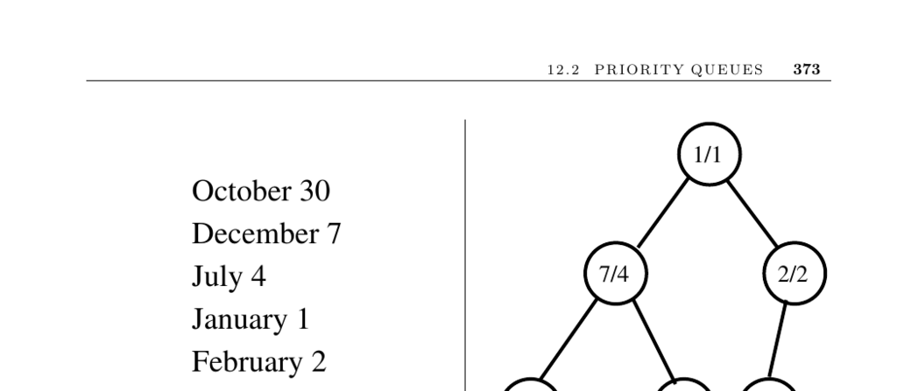

- **12.2 Priority Queues**
  - **Input description**
    - Priority queues handle a set of records with numerically or totally-ordered keys.
    - They provide quick access to the smallest or largest key in the set.
  - **Problem description**
    - The problem is to build and maintain data structures for efficient priority retrieval.
    - Priority queues retrieve items by highest priority, not by insertion order or key match.
  - **Discussion**
    - Priority queues are vital in simulations for managing future events ordered by time.
    - When no insertions occur after an initial query, sorting with a pointer suffices without a priority queue.
    - Dynamic operations (insertion, deletion, queries) require an explicit priority queue.
    - Key questions when selecting implementations include operation requirements, maximum size knowledge, and priority key changes.
  - **Basic implementations**
    - **Sorted array or list**
      - Efficient to identify and delete the smallest element by decrementing the top index.
      - Slow insertion due to maintenance of total order.
      - Suitable for few insertions only.
    - **Binary heaps**
      - Support insertion and extract-min operations in O(log n) time.
      - Represent implicit binary trees in an array where parent keys are less than descendants.
      - Appropriate when an upper bound on the size is known or with dynamic arrays.
    - **Bounded height priority queue**
      - Use arrays of linked lists as buckets for keys within a limited range.
      - Allow constant-time insertion and find-min when key range is small and discrete.
      - Typically employed in graph algorithms for sorting vertices by degree.
    - **Binary search trees**
      - Min and max elements are found at the leftmost and rightmost leaves.
      - Useful when dictionary operations or unbounded key ranges are needed.
    - **Fibonacci and pairing heaps**
      - Designed to optimize decrease-key operations in large computations.
      - Fibonacci heaps offer amortized constant-time insertion and decrease-key.
      - Pairing heaps provide similar bounds with less complexity and overhead.
  - **Implementations**
    - C++ STL offers priority_queue with push, top, and pop functions mapping to heap operations.
    - LEDA provides various priority queues including Fibonacci and pairing heaps.
    - Java Collections includes PriorityQueue in java.util, with alternatives like JDSL available.
    - Sanders’ sequence heap, based on k-way merging, doubles the speed of binary heaps.
    - Extensive experimental studies refine knowledge on priority queue performance.
  - **Notes**
    - The Handbook of Data Structures and Applications gives comprehensive surveys on priority queues.
    - Double-ended priority queues support both find-min and find-max operations.
    - von Emde Boas trees achieve O(log log n) time for all operations within keys 1 to n.
    - Fibonacci heaps enable improved algorithms for shortest paths and spanning trees but have high constant factor overhead.
    - Pairing heaps provide similar theoretical bounds with easier implementation.
    - Heap construction requires a linear number of comparisons, with known upper and lower bounds.
  - **Related Problems**
    - Connections exist with dictionaries, sorting, and shortest path computations.
  - **Further reading**
    - [C++ STL Priority Queue](http://www.sgi.com/tech/stl/)
    - [Java Collections Framework](http://java.sun.com/javase/)
    - [Handbook of Data Structures and Applications](https://example.org)
