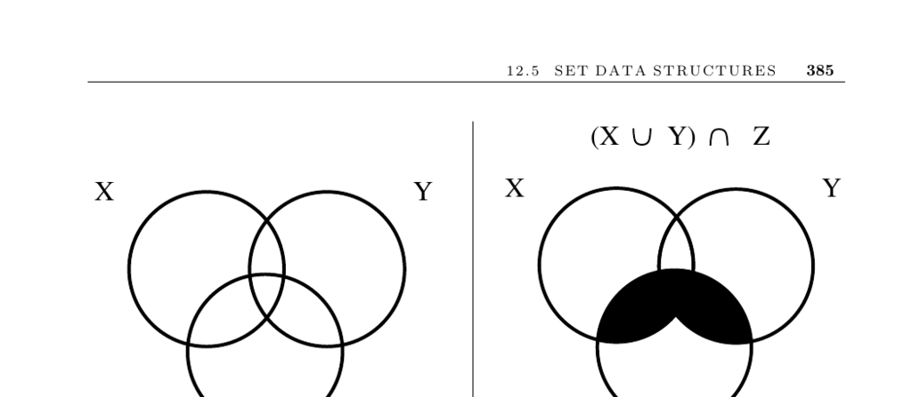

- **Set Data Structures**
  - **Input and Problem Description**
    - The universe U consists of items {u1, ..., un} and subsets S = {S1, ..., Sm} are defined on U.  
    - The main problem is to efficiently represent each subset for membership tests, union/intersection operations, and element insertions/deletions.  
    - Sets are unordered collections drawn from a fixed universal set, usually represented in sorted order for efficiency in operations.  
  - **Set Representation Alternatives**
    - Bit vectors encode subsets as n-bit arrays, using one bit per element for space efficiency and constant-time operations but suffer in sparse sets due to O(n) identification time.  
    - Containers or dictionaries hold only subset elements in structures like sorted arrays or linked lists, optimizing for sparse sets and linear-time union/intersection via traversal.  
    - Bloom filters use multiple hash functions to represent subsets probabilistically, enabling fixed-size, space-efficient set membership checks with controlled false positives.  
  - **Special Cases and Analogies**
    - Subsets with exactly two elements correspond to graph edges; arbitrary subsets form hypergraphs.  
    - Set partitions are collections of pairwise disjoint subsets important in applications like connected components and party affiliations.  
  - **Set Partition Data Structures**
    - Collections of containers offer direct element access at the cost of linear membership testing over subsets.  
    - Generalized bit vectors map elements to subset identifiers enabling constant-time queries but costly union operations proportional to universe size.  
    - Dictionaries with subset attributes associate each element with its subset in balanced trees but have slow union/intersection operations.  
    - Union-find structures represent subsets as rooted trees, supporting fast find and union operations with optimizations like path compression yielding near-constant amortized time.  
  - **Implementations and Libraries**
    - Modern languages offer sets via libraries: C++ STL (set, multiset) and Java Collections Framework (HashSet, TreeSet).  
    - LEDA library provides efficient dictionary, sparse array, and union-find structures in C++.  
    - Union-find is fundamental in Kruskal’s minimum spanning tree algorithm and widely available in graph libraries.  
    - Computer algebra systems like REDUCE support symbolic set operations in the SETS package.  
  - **Notes and External Resources**
    - Optimal set operation algorithms and surveys are given by [Rei72] and [Ram05].  
    - Bloom filter theory and experiments are extensively summarized in [BM05] and [PSS07].  
    - Advanced balanced trees supporting merge or cut operations are covered by Tarjan [Tar83].  
    - Disjoint set union complexity and algorithms are surveyed by Galil and Italiano [GI91], with classical results by Tarjan [Tar75, Tar79].  
    - Symbolic power set representations and related algorithms are discussed in [BCGR92].
