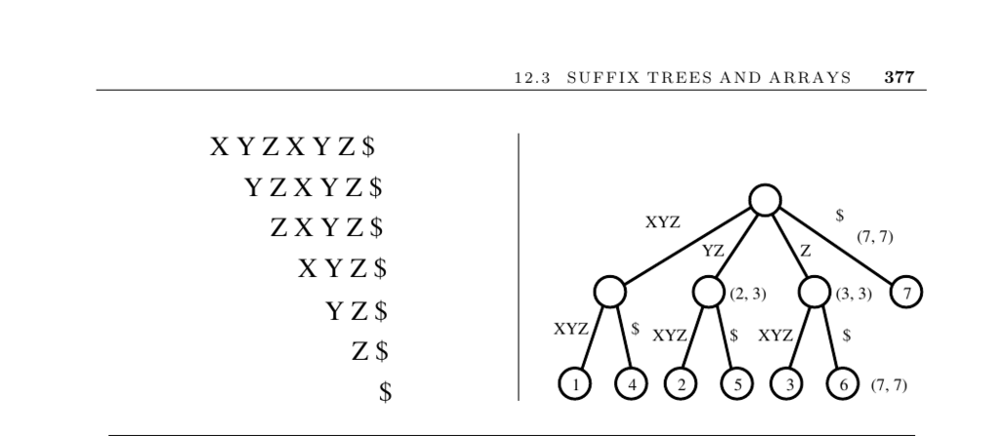

- **12.3 Suffix Trees and Arrays**
  - **Input description**
    - The input is a reference string S provided for processing.
    - The construction of suffix trees and arrays depends on this input string.
  - **Problem description**
    - The goal is to build a data structure to quickly find all occurrences of an arbitrary query string q in S.
    - Efficient searching of substrings is central to the problem.
  - **Discussion of suffix trees**
    - A suffix tree is a trie of all n suffixes of an n-character string S.
    - Proper construction reduces search time from O(n²) to linear time.
    - A collapsed suffix tree stores edge labels as substring indices, enabling O(n) space usage.
    - Linear time algorithms exist for suffix tree construction using pointer optimizations.
    - Applications include substring occurrence finding, longest common substring in multiple strings, and longest palindrome detection.
    - Recommended reading includes Gusfield [Gus97] and Crochemore and Rytter [CR03].
  - **Suffix arrays**
    - A suffix array is an array holding all suffixes of S in sorted order.
    - Binary search on suffix arrays enables substring lookup in O(log n) time.
    - They use roughly four times less memory than suffix trees.
    - Construction methods include building suffix trees or direct linear-time algorithms.
    - Recent efficient implementations are available, with links to [Schürmann and Stoye](http://bibiserv.techfak.uni-bielefeld.de/bpr/) and Pizza&Chili corpus.
  - **Implementations**
    - Multiple suffix tree and array implementations exist in C, C++, and Java.
    - Notable resources include BioJava, Libstree, Nelson’s C++ code, and Strmat.
    - Implementations provide practical access to theoretical algorithms.
  - **Notes and references**
    - Tries were introduced by Fredkin in 1962; suffix tree algorithms by Weiner, McCreight, and Ukkonen.
    - Suffix arrays were invented by Manber and Myers in 1993, with linear-time algorithms developed later.
    - Compressed full-text indexes achieve near entropy compression with fast query times [Makinen and Navarro 2007].
    - The least common ancestor (LCA) data structures enable constant-time queries on suffix trees.
    - Important references include Gusfield [Gus97], Crochemore and Rytter [CR03], and surveys by [PST07].
