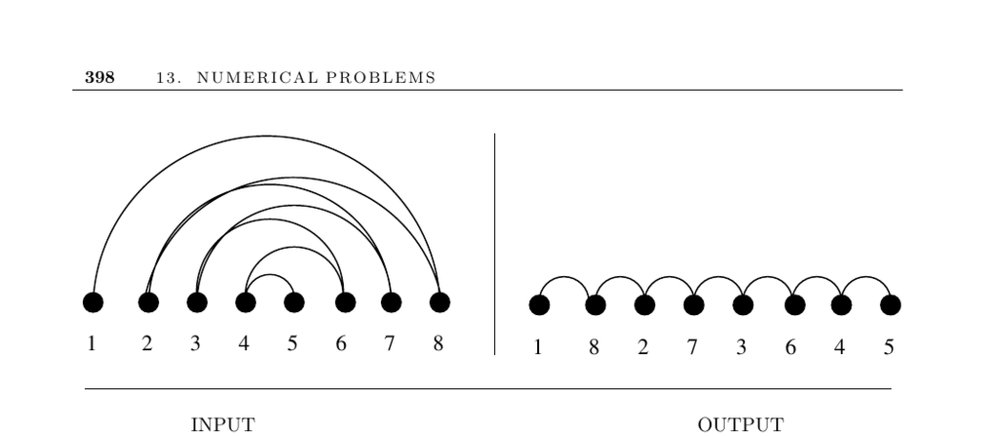

- **13.2 Bandwidth Reduction**
  - **Input description**
    - The input is a graph \( G = (V, E) \) representing an \( n \times n \) matrix \( M \) of zero and non-zero elements.
    - The graph vertices correspond to matrix rows and columns; edges represent non-zero elements.
  - **Problem description**
    - The goal is to find a permutation \( p \) of vertices minimizing the length of the longest edge \(\max_{(i,j) \in E} |p(i)-p(j)|\).
    - This minimizes the bandwidth \( b \), i.e., the distance of any non-zero matrix entry from the diagonal.
  - **Discussion**
    - Bandwidth reduction is important for efficient Gaussian elimination, reducing complexity to \( O(n b^2) \) when bandwidth \( b \ll n \).
    - The problem models applications such as circuit layout minimizing wire length and organizing hyperlinked images on tape to minimize search time.
    - Variations include linear arrangement (minimizing sum of edge lengths) and profile minimization (minimizing sum of longest leftward edge distances).
    - The bandwidth problem is NP-complete, even restricted to trees with max degree 3.
    - Practical solutions rely on heuristics, often based on breadth-first search ordering from selected start vertices.
    - Tie-breaking heuristics favor placing low-degree vertices to the left for better results.
  - **Heuristics and implementations**
    - Popular heuristics include the Cuthill-McKee and Gibbs-Poole-Stockmeyer algorithms.
    - Gibbs-Poole-Stockmeyer runs in worst-case \( O(n^3) \) time but performs near-linearly in practice.
    - Exact solutions use brute-force search with pruning guided by heuristic solutions and alternating left-right vertex placements.
    - Implementations are available: Del Corso and Manzini's exact solutions ([link](http://www.mfn.unipmn.it/~manzini/bandmin)) and Caprara and Salazar-González's integer programming-based branch-and-bound ([link](http://joc.pubs.informs.org/Supplements/Caprara-2/)).
    - Fortran implementations of Cuthill-McKee and Gibbs-Poole-Stockmeyer are on Netlib.
    - Empirical evaluations show Gibbs-Poole-Stockmeyer often outperforms other heuristics.
    - Additional resources include Petit’s experimental studies on minimum linear arrangement ([link](http://www.lsi.upc.edu/~jpetit/MinLA/Experiments/)).
  - **Notes**
    - The bandwidth problem’s hardness was first established by Papadimitriou and later shown NP-complete on low-degree trees.
    - Polynomial algorithms exist for fixed bandwidth \( k \), and approximation algorithms offer polylogarithmic guarantees.
    - Extensive surveys and graph-theoretic results are available from Diaz et al. ([DPS02]) and Chinn et al. ([CCDG82]).
