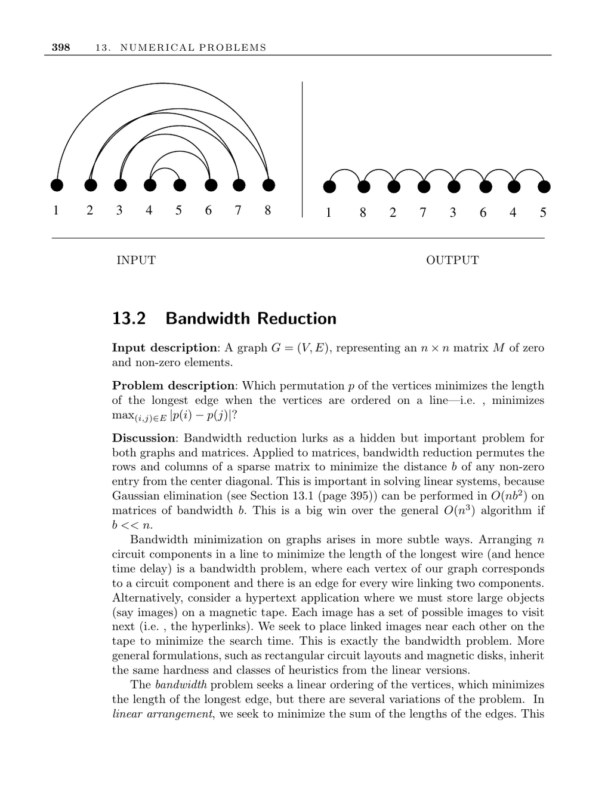

- **13.2 Bandwidth Reduction**
  - **Input Description**
    - The input is a graph \( G = (V, E) \) representing an \( n \times n \) matrix \( M \) of zero and non-zero elements.
  - **Problem Description**
    - The problem is to find a vertex permutation \( p \) that minimizes the length of the longest edge when vertices are ordered on a line, i.e., minimizes \(\max_{(i,j) \in E} |p(i) - p(j)|\).
    - Bandwidth reduction applies to graphs and matrices to minimize the distance of non-zero entries from the diagonal.
  - **Discussion**
    - Minimizing bandwidth improves Gaussian elimination from \( O(n^3) \) to \( O(nb^2) \) on matrices of bandwidth \( b \), providing substantial computational savings.
    - Applications include circuit layout for minimizing wire length and hypertext storage on magnetic tape to reduce search time.
    - Related problems include linear arrangement (minimize sum of edge lengths) and profile minimization (minimize sum of one-way distances).
  - **Computational Complexity**
    - The bandwidth problem and its variants are NP-complete, even on trees with maximum vertex degree 3.
    - This complexity leaves brute-force search and heuristics as main solution methods.
  - **Heuristics**
    - Common heuristics use breadth-first search (BFS) starting at a chosen vertex and order vertices by distance from this start point.
    - Good heuristic strategies include breaking ties by placing low-degree vertices to the left.
    - Popular heuristics include the Cuthill-McKee and Gibbs-Poole-Stockmeyer algorithms.
    - Gibbs-Poole-Stockmeyer has worst-case \( O(n^3) \) complexity but close to linear performance in practice.
  - **Exact Solutions**
    - Exact minimum bandwidth can be found via backtracking over \( n! \) permutations with pruning based on heuristics.
    - Implementations exist by Del Corso and Manzini [CM99] and Caprara and Salazar-González [CSG05], available online.
  - **Implementations and Empirical Studies**
    - Fortran implementations of the Cuthill-McKee and Gibbs-Poole-Stockmeyer algorithms are available from Netlib.
    - Empirical evaluations show Gibbs-Poole-Stockmeyer generally outperforms others on a suite of test matrices [Eve79b].
    - Petit [Pet03] provides experimental studies and code for minimum linear arrangement heuristics.
  - **Notes and Research Directions**
    - Extensive research includes 49 known bandwidth algorithms cited by Everstine [Eve79b].
    - Spectral heuristics have been investigated by Del Corso and Romani [CR01].
    - The problem’s hardness was established by Papadimitriou [Pap76b] and for degree-3 trees by [GGJK78].
    - Polynomial time algorithms exist for fixed bandwidth \( k \) [Sax80].
    - Polylogarithmic-approximation algorithms exist for the general problem [BKRV00].
  - **Related Problems**
    - Applications relate to solving linear equations and topological sorting.
  - **Further Reading**
    - See the survey by Diaz et al. [DPS02] for up-to-date algorithms on bandwidth and graph layout problems.
    - See [CCDG82] for foundational graph-theoretic results on bandwidth.
