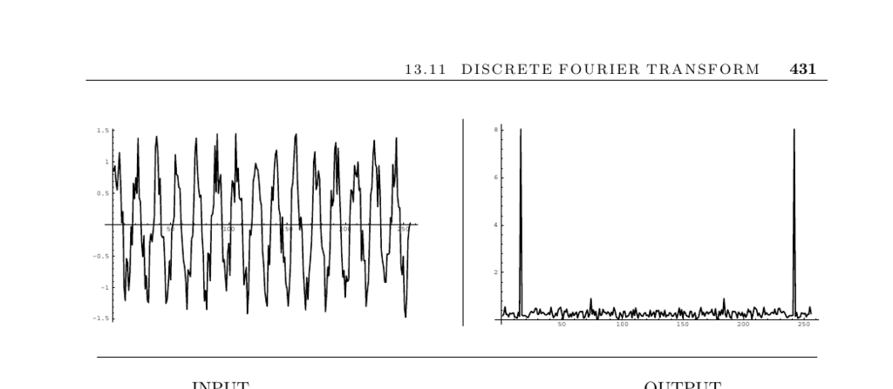

- **Input description**
  - The input is a sequence of n real or complex values \( h_i \) sampled uniformly from a function \( h \).
  - The index \( i \) ranges from 0 to \( n-1 \).
  - These samples represent points in a time series for transformation.

- **Problem description**
  - The discrete Fourier transform (DFT) computes \( H_m = \sum_{k=0}^{n-1} h_k e^{2 \pi i k m / n} \) for \( 0 \leq m \leq n-1 \).
  - The DFT transforms the input sequence into frequency space.
  - The inverse transform recovers the time domain sequence from \( H_k \).

- **Discussion**
  - Fourier transforms convert time-domain data into the frequency domain, allowing easier operation like filtering.
  - Common applications include filtering, image compression, convolution/deconvolution, and correlation computation.
  - For filtering, removing selected frequency components and inverse transforming can remove noise.
  - Image compression relies on omitting coefficients that contribute little to detailed appearance.
  - Convolution via Fourier transforms reduces complexity from \( O(n^2) \) to \( O(n \log n) \).
  - Correlation measures function similarity by shifting one function relative to another, efficiently computed via DFT.

  - **Discrete Fourier Transform definition**
    - The DFT input consists of \( n \) complex numbers \( h_k \).
    - The output consists of \( n \) complex numbers \( H_k \), representing sine functions of particular frequencies.
    - The formulas for the forward and inverse transforms involve complex exponentials \( e^{\pm 2 \pi i k m / n} \).

  - **Computation complexity and Fast Fourier Transform**
    - Naive DFT computation takes \( O(n^2) \) time.
    - The Fast Fourier Transform (FFT) computes the DFT in \( O(n \log n) \) time using divide-and-conquer.
    - The FFT typically assumes \( n \) is a power of two; zero padding is recommended if not.
    - FFT implementations are often tuned in hardware or assembly for real-time constraints.

  - **Implementations**
    - FFTW is a widely used C library offering efficient multidimensional FFTs for arbitrary input sizes.
    - FFTPACK is a Fortran package supporting various FFT types, with GNU Scientific Library providing a C/C++ reimplementation.
    - Algorithm 545 is a Fortran FFT optimized for virtual memory performance.

  - **Notes**
    - Comprehensive introductions are found in Bracewell [Bra99], Brigham [Bri88], and [PFTV07].
    - The FFT invention credit generally goes to Cooley and Tukey [CT65], with further historical insights in [Bri88].
    - Cache-oblivious FFT algorithms are discussed in [FLPR99] and form the basis of FFTW.
    - Non-FFT polynomial multiplication algorithms achieve approximately \( O(n^{1.59}) \) complexity.
    - Schönhage and Strassen's FFT-based multiplication runs in \( O(n \log n \log \log n) \).
    - The fundamental role of complex numbers in fast convolution algorithms remains an open question.
    - Many string matching algorithms use fast convolution techniques.
    - Wavelets have been proposed recently as an alternative to Fourier transform methods; see [Wal99].

- **Related Problems**
  - Data compression employs Fourier transform concepts (see page 637).
  - High-precision arithmetic relates to FFT applications (see page 423).
