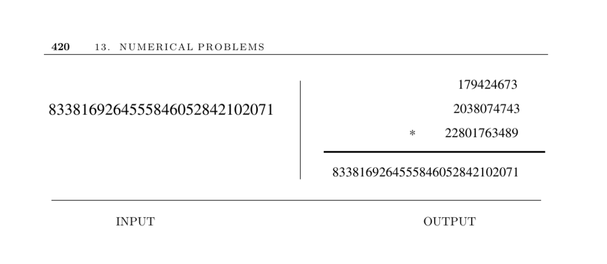

- **Factoring and Primality Testing**
  - **Input description**
    - The input is an integer \( n \).
    - The problem is to determine if \( n \) is prime or to find its factors if it is composite.
  - **Problem description**
    - The goal is to establish primality or to factor the given integer.
    - Factorization and primality testing have many practical applications, including cryptography and hash tables.
  - **Discussion**
    - Factoring and primality testing are related but algorithmically distinct problems.
    - Simple divisibility rules can prove compositeness without full factorization.
    - The basic method is trial division up to \(\sqrt{n}\).
    - Precomputed prime tables can speed up trials.
    - Bit vectors efficiently represent large sets of primes.
    - Trial division runs in exponential time relative to input size.
    - The number field sieve is the fastest known factoring algorithm, able to factor integers with up to 200 digits with high computational effort.
    - Randomized algorithms based on Fermat’s little theorem allow fast primality testing.
    - Practical systems like PGP use randomized tests to find large primes quickly.
    - The prime number theorem approximates the distribution of primes as \( n/\ln n \).
  - **Implementations**
    - PARI handles complex number-theoretic problems with arbitrary precision.
    - LiDIA is a C++ library implementing modern integer factorization methods.
    - NTL is a portable C++ library for arithmetic over integers and finite fields.
    - MIRACL includes six different integer factorization algorithms.
  - **Notes**
    - The AKS algorithm provides the first polynomial-time deterministic primality test.
    - Miller-Rabin is a widely used randomized primality test robust against Carmichael numbers.
    - The quadratic sieve and elliptic-curve methods are top factoring algorithms.
    - Historically, mechanical sieving devices accelerated factorization.
    - The complexity class status of primality impacted the wider P vs NP discussion.
    - Major integer factorization milestones include RSA-129 and RSA-200 factorizations.
    - For detailed algorithmic exposition, see [Crandall and Pomerance](https://example.org) and [Yan](https://example.org).
