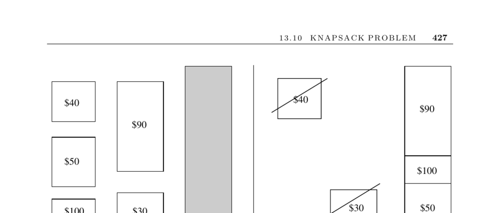

- **Knapsack Problem**
  - **Problem description**
    - Defines the knapsack problem as selecting a subset of items to maximize total value without exceeding capacity.
    - Highlights 0/1 knapsack where items cannot be divided.
    - Explains the difficulty caused by the 0/1 constraint compared to fractional knapsack.
    - Illustrates the practical significance in resource allocation under budget constraints.
  - **Issues in algorithm selection**
    - Discusses easy cases when items have uniform value or size, solvable by sorting.
    - Notes the NP-completeness of constant "price-per-pound" cases like integer partition and subset sum.
    - Describes the integer partition problem as a special case equivalent to bin packing into two bins.
    - Emphasizes dynamic programming feasibility when item sizes and capacity are small integers.
    - Mentions scaling heuristics for large capacity problems.
  - **Dynamic programming approach**
    - Explains the use of a boolean array C[i,S'] to track achievable size sums for subsets.
    - Describes iterative update of the array when adding each item.
    - Details reconstructing the solution by backtracking through stored item choices.
    - Extends the approach to track maximum value at each capacity sum.
    - States complexity as O(nC) time and O(C) space.
  - **Multiple knapsacks**
    - Suggests viewing multi-knapsack problems as bin packing.
    - References Section 17.9 for bin-packing algorithms.
    - Mentions specialized algorithms for multiple knapsacks in implementations.
  - **Exact and heuristic methods**
    - States exact algorithms include integer programming and backtracking using 0/1 variables.
    - Notes heuristics include greedy selection by highest value-to-size ratio.
    - Warns greedy heuristics can produce arbitrarily poor solutions.
    - Highlights scaling heuristic that reduces item sizes proportionally to enable dynamic programming.
  - **Implementations and references**
    - Lists Martello and Toth’s FORTRAN code collection for knapsack variants at http://www.or.deis.unibo.it/kp.html.
    - Mentions David Pisinger’s C-code collection including advanced dynamic programming algorithms at http://www.diku.dk/∼pisinger/codes.html.
    - References Algorithm 632 from ACM Collected Algorithms supporting multiple knapsacks.
    - Points to key literature: [KPP04], Martello and Toth [MT90a, MT87], and [SDK83].
    - Defines polynomial-time approximation schemes and points to [IK75], [BvG99], [CLRS01], [GJ79], and [Man89].
    - Notes Merkle and Hellman’s cryptosystem based on knapsack problem hardness [MH78].
  - **Related problems**
    - Identifies connections to bin packing and integer programming problems.
    - Cross-references Sections 17.9 (bin packing) and 13.6 (integer programming) for further exploration.
