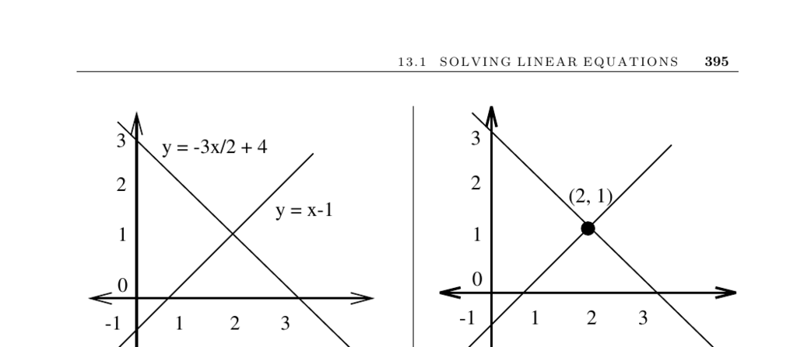

- **13.1 Solving Linear Equations**
  - **Input description**
    - The input is an m×n matrix A and an m×1 vector b representing m linear equations in n variables.
    - These inputs define the linear system A · x = b to be solved.
  - **Problem description**
    - The goal is to find the vector x such that A · x = b.
    - Solving linear systems is essential in scientific computing and various engineering analyses.
  - **Discussion**
    - Solving linear systems arises in about 75% of scientific computing problems.
    - Systems may have no solution, a unique solution, or infinitely many solutions; singular systems have zero determinant.
    - Gaussian elimination transforms the system to enable easy back-substitution for the solution.
    - The time complexity of Gaussian elimination on an n×n system is O(n³).
    - Numerical stability and roundoff errors are critical considerations during Gaussian elimination.
    - Pivot selection and equation scaling reduce numerical errors, emphasizing the importance of reliable solver libraries.
    - Specialized solver routines exist for particular matrix types to improve efficiency.
    - Sparse and banded matrices allow use of optimized algorithms reducing computational effort.
    - Repeated solves with the same coefficient matrix benefit from LU-decomposition to reduce runtime.
  - **LU-Decomposition**
    - LU-decomposition factorizes A into lower and upper triangular matrices L and U such that L · U = A.
    - Solving A · x = b reduces to solving two triangular systems, each in O(n²) time after O(n³) decomposition.
    - LU-decomposition aids matrix inversion and determinant computation efficiently.
  - **Matrix Inversion**
    - Solving linear systems is equivalent to matrix inversion but inversion is thrice as slow as Gaussian elimination.
    - It is recommended to avoid explicit matrix inversion when solving linear systems.
  - **Implementations**
    - LAPACK and its variants like CLAPACK (C) and LAPACK++ (C++) are standard libraries for solving linear systems.
    - JScience and JAMA provide matrix packages in Java.
    - Numerical Recipes offers accessible routines and guidance for reliable numerical solutions.
  - **Notes and References**
    - Golub and van Loan [GL96] is the standard algorithm reference for linear systems.
    - Other references include [CLRS01], numerical analysis texts [BT92, CK07, SK00], and surveys on data structures [PT05].
    - Parallel algorithms for linear systems are well-studied and widely applied [Gal90, KSV97, Ort88].
  - **Related Problems**
    - Matrix multiplication and determinant/permanent computations are closely related and referenced on pages 401 and 404 respectively.
