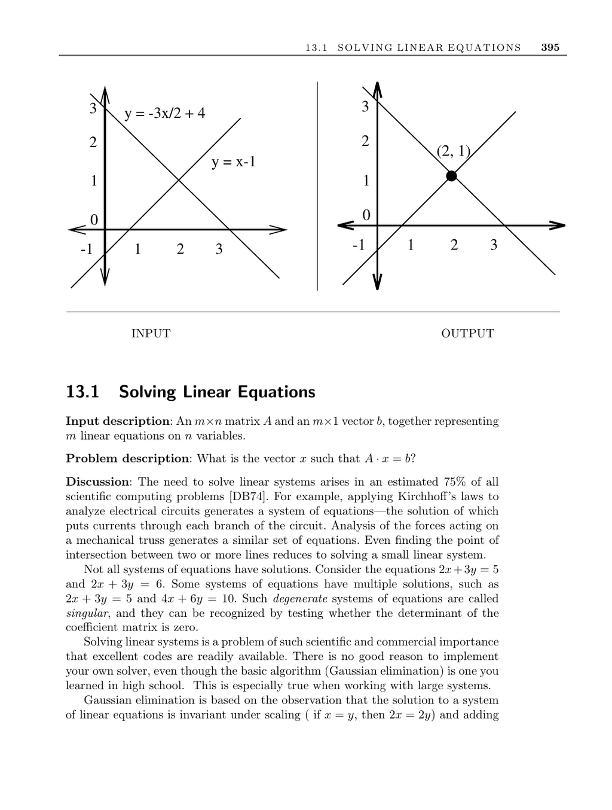

- **13.1 Solving Linear Equations**
  - **Input description**
    - The input consists of an m×n matrix A and an m×1 vector b representing m linear equations on n variables.
    - The goal is to find the vector x such that A · x = b.
    - The problem arises frequently in scientific computing, appearing in roughly 75% of problems.
  - **Problem description**
    - Solving linear equations is essential for tasks like circuit analysis and mechanical force calculations.
    - Not all systems have solutions; some have no solution or multiple solutions (singular systems).
    - Singular systems are recognized by a zero determinant of the coefficient matrix.
  - **Discussion**
    - Gaussian elimination is the basic algorithm to solve linear systems taught in high school.
    - It uses scaling and adding equations to eliminate variables and simplify the system.
    - The time complexity of Gaussian elimination on an n×n system is O(n³).
    - More efficient variants partially reduce the matrix and back-substitute, reducing operations by about 50%.
    - Numerical stability and roundoff errors must be managed by choosing proper pivot elements and scaling.
    - Testing solutions by substituting back into the original equations is necessary to verify accuracy.
    - Iterative methods can refine initial solutions to improve accuracy.
    - Selecting appropriate library routines is important, including special solvers for structured matrices.
    - Recognition of sparse or banded matrices allows usage of tailored algorithms for efficiency.
    - LU-decomposition factors A into L and U matrices (lower- and upper-triangular) enabling more efficient repeated solves.
    - LU-decomposition reduces solution time to two O(n²) steps after an O(n³) decomposition.
  - **Matrix inversion and related considerations**
    - Solving linear systems is equivalent to matrix inversion but inverting matrices is about three times slower than Gaussian elimination.
    - LU-decomposition facilitates inversion and determinant computation.
  - **Implementations and libraries**
    - LAPACK and LINPACK are standard, well-optimized Fortran libraries for linear systems.
    - Versions of LAPACK exist for other languages like CLAPACK (C) and LAPACK++ (C++).
    - Other packages include JScience and JAMA for Java, and Template Numerical Toolkit for C++.
    - Numerical Recipes provides guidance and routines and is useful for those lacking numerical background.
  - **Notes and references**
    - Golub and van Loan is the standard reference for linear system algorithms.
    - Other recommended resources include [CLRS01], [BT92], [CK07], and [SK00].
    - Parallel algorithms for solving linear systems are well studied and widely used in practice.
    - Matrix inversion and solving can be done in matrix multiplication time using Strassen’s algorithm.
    - Related problems include matrix multiplication and determinant/permanent calculations.
    - Further reading: [Numerical Recipes](http://www.nr.com), [Golub and van Loan](https://books.google.com/books?id=Pyf6PZUUWhcC)
