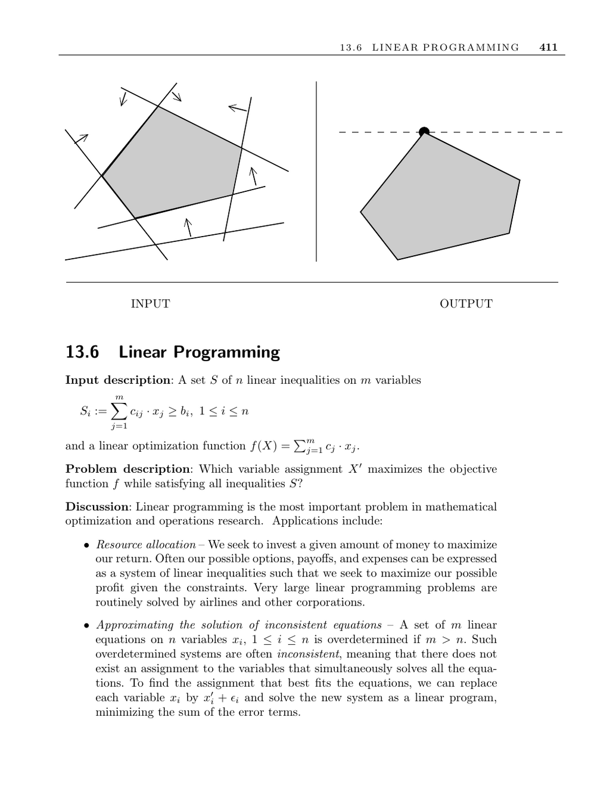

- **Linear Programming**
  - **Input description**
    - The input consists of a set S of n linear inequalities on m variables, each inequality having the form ∑(cij · xj) ≥ bi for 1 ≤ i ≤ n.
    - The objective function f(X) = ∑(cj · xj) is linear and must be maximized.
    - The problem is to find the variable assignment X maximizing f while satisfying all constraints.
  - **Problem description and applications**
    - Linear programming is fundamental in optimization and operations research.
    - Applications include resource allocation, approximation of inconsistent linear equations, and solving many graph problems like shortest path and network flow.
    - Integer linear programming is relevant for problems with integrality constraints but is NP-complete.
  - **Algorithmic approaches**
    - The simplex method is the standard algorithm, walking along vertices of a convex polytope to find the optimal solution.
    - Interior-point methods offer alternatives that traverse the polytope interior and often outperform simplex.
    - Efficient implementations handle sparsity, numerical stability, and pivoting rules.
  - **Key issues in linear programming**
    - Integrality constraints cause NP-completeness, addressed by cutting plane techniques.
    - Duality allows solving either the primal or dual formulation depending on the ratio of variables to constraints.
    - Nonlinear objectives or constraints may require alternate modeling or quadratic programming techniques.
    - Standard LP formulations require variables to be nonnegative and constraints as equalities, addressed by problem transformations.
  - **Implementations and resources**
    - Several free solvers exist, including lp_solve, CLP, and GLPK, with CLP leading in speed for linear programming.
    - NEOS offers remote optimization services for solving problems without local software.
    - Historical and survey algorithms include simplex-based Fortran codes and references for overdetermined systems.
    - The USENET FAQ and referenced URLs provide extensive resources and software lists.
  - **Historical and theoretical notes**
    - The simplex algorithm was invented in 1947; worst-case complexity is exponential but practical performance is good.
    - Smoothed analysis explains simplex efficiency under noise, and randomized polynomial-time simplex variants exist.
    - The ellipsoid algorithm proved polynomial-time solvability in 1979; Karmarkar’s interior-point method improves upon it.
    - Semidefinite programming generalizes linear programming with positive semidefinite constraints.
    - Linear programming is P-complete, implying unlikely efficient parallelization unless P equals NC.
  - **Related problems**
    - Linear programming relates closely to constrained and unconstrained optimization and network flow problems.
