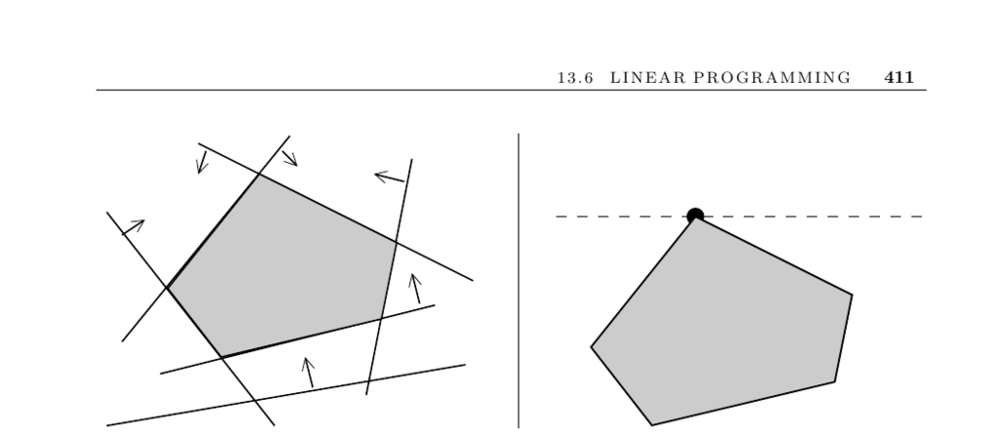

- **Linear Programming**
  - **Input Description**
    - A linear program consists of n linear inequalities on m variables, expressed as ∑ cij · xj ≥ bi for i=1 to n.
    - The objective function to be optimized is linear: f(X) = ∑ cj · xj.
  - **Problem Description**
    - Linear programming finds the variable assignment X that maximizes the objective function f subject to all inequalities.
  - **Applications**
    - Resource allocation problems model investment scenarios using linear constraints to maximize returns.
    - Approximates solutions for overdetermined inconsistent equations by linear programming minimizing error terms.
    - Many graph algorithms such as shortest path, bipartite matching, and network flow reduce to linear programming.
    - Integer linear programming extends LP by requiring integer-valued variables but is NP-complete.
  - **Algorithms and Discussion**
    - The simplex method iteratively moves along vertices of the feasible region to reach the optimal solution.
    - Interior-point methods improve upon simplex by operating inside the feasible region and often offer better performance.
    - Efficient implementations require handling sparsity, numerical stability, and pivot selection strategy.
    - Transformations exist to convert any LP model into a standard form accepted by solvers.
    - Mixed integer programming uses cutting plane techniques to enforce integer constraints through iterative LP solves.
  - **Practical Considerations**
    - Choice between solving primal or dual LP depends on the relative sizes of variables and constraints.
    - Quadratic and nonlinear optimization problems require specialized methods or reformulations because they are NP-complete.
    - Available free solvers include lp_solve, CLP, and GLPK, with differences in speed and problem type suitability.
    - Network-enabled optimization systems like NEOS allow solving LP problems remotely on specialized hardware.
  - **Historical and Theoretical Notes**
    - The simplex method dates from 1947 and is efficient in practice despite exponential worst-case complexity.
    - Smoothed analysis explains simplex’s practical efficiency under small input perturbations.
    - Polynomial-time interior-point methods such as Karmarkar’s and ellipsoid algorithms exist.
    - Linear programming is P-complete, implying it is unlikely to have highly parallel polylogarithmic time algorithms.
  - **Related Problems**
    - Linear programming is connected to constrained and unconstrained optimization as well as network flow problems.
  - **Further Reading**
    - The USENET FAQ provides extensive solver information: [http://www-unix.mcs.anl.gov/otc/Guide/faq/](http://www-unix.mcs.anl.gov/otc/Guide/faq/)
    - CLP solver at COIN-OR: [http://www.coin-or.org/](http://www.coin-or.org/)
    - GLPK documentation: [http://www.gnu.org/software/glpk/](http://www.gnu.org/software/glpk/)
    - NEOS Server for optimization: [http://www.mcs.anl.gov/home/otc/Server/](http://www.mcs.anl.gov/home/otc/Server/)
    - Foundational papers including [Dan63], [KM72], [Kha79], [Kar84], and smoothed analysis by Spielman and Teng [ST04].
