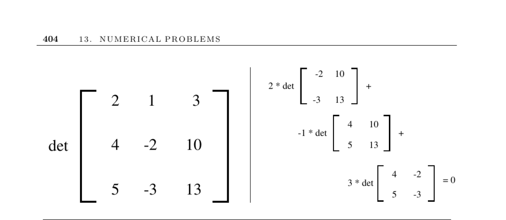

- **Numerical Problems**
  - **Determinants and Permanents**
    - The determinant |M| determines matrix singularity, point alignment, position relative to lines or planes, and geometric measurements such as area or volume.
    - The determinant calculation involves summing over all permutations with sign adjustments, having O(n!) complexity in definition but optimized implementations reduce this to O(n³).
    - The permanent is similar to the determinant but sums all positive products and counts combinatorial matchings; computing it is #P-complete and thus computationally harder.
    - Efficient permanent algorithms run in O(n²2ⁿ) time, enabling calculations on moderate-size matrices, with approximation methods available for larger matrices.
    - Further information and implementations can be found in libraries such as LINPACK, JScience, JAMA, and resources by Nijenhuis and Wilf, Cash, and Barvinok: [Barvinok's permanent codes](http://www.math.lsa.umich.edu/~barvinok/manual.html).
  - **Determinant Definition and Computation**
    - The determinant is defined as a sum over n! permutations, weighted by the sign of the permutation and the product of matrix elements.
    - Direct implementation of the definition is computationally expensive; LU-decomposition reduces complexity to O(n³).
    - The determinant satisfies multiplicative properties: det(AB) = det(A) × det(B), unlike the permanent.
    - LU-decomposition algorithms provide practical means for determinant computation.
    - See Section 13.1 and LINPACK for optimized determinant computations.
  - **Permanent Definition and Complexity**
    - The permanent of a matrix sums all products of matrix elements over permutations without sign alternation.
    - Permanent calculation is #P-complete, making it significantly more difficult than determinants.
    - Unlike determinants, perm(AB) ≠ perm(A) × perm(B), contributing to computational complexity.
    - Ryser's algorithm and variants offer O(n² 2ⁿ) time complexity for permanent calculation.
    - Probabilistic and approximation algorithms, including fully-polynomial randomized schemes, provide estimates for large matrices [JSV01].
  - **Applications and Related Problems**
    - Determinants test matrix singularity, geometric configurations, and compute measures like areas or volumes.
    - The permanent relates to counting perfect matchings in graphs and combinatorial structures.
    - Cramer’s rule links determinants to solving linear systems, though more efficient methods exist.
    - Related computational problems include linear system solving, geometric computations, and combinatorial matching.
    - External references include [Minc (1978)](https://books.google.com) on permanents and [Valiant (1979)](https://dl.acm.org/doi/10.1145/800157.805047) on complexity theory.
