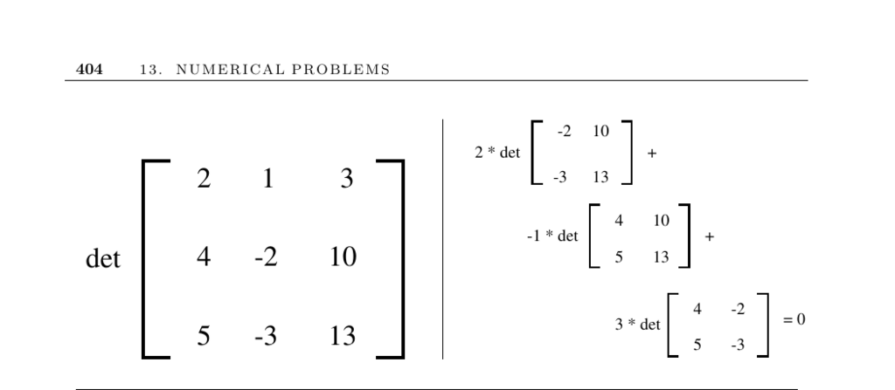

- **Determinants and Permanents**
  - **Determinant Definition and Properties**
    - The determinant of an n×n matrix is defined as a signed sum over all n! permutations of its columns.
    - The sign of each term depends on the parity of the permutation’s inversions.
    - Determinants can test if a matrix is singular, verify linear dependence of points, and determine relative position of points to geometric objects.
    - The determinant’s magnitude relates directly to areas and volumes of geometric shapes.
    - [JScience linear algebra package](http://math.nist.gov/javanumerics/) provides extensive tools for determinant computation.
  - **Computing Determinants**
    - Direct computation using permutation sums yields O(n!) complexity.
    - LU decomposition reduces computation time to O(n³) by finding the product of the diagonal elements.
    - Fast matrix multiplication techniques can compute determinants in less than O(n³) time.
    - LINPACK offers optimized Fortran routines for determinant computation.
    - Clarkson’s algorithm efficiently computes the sign of a determinant for robust geometry processing.
  - **The Permanent**
    - The permanent is defined similarly to the determinant but sums all positive products of matrix elements over permutations.
    - Computing the permanent is NP-hard, differing fundamentally from the determinant due to absence of sign.
    - The permanent of a graph’s adjacency matrix counts its perfect matchings.
    - Algorithms exist running in O(n²2ⁿ) time, faster than factorial time but still exponential.
    - Efficient approximation methods include Barvinok’s codes and fully-polynomial randomized schemes.
    - [Nijenhuis and Wilf’s Fortran routine](https://netlib.org/) and Barvinok’s resources provide implementations.
  - **Mathematical and Computational Notes**
    - Cramer’s rule uses determinants for solving linear systems but is less efficient than LU-decomposition methods.
    - The permanent problem is #P-complete, a complexity class indicating counting difficulty beyond NP-hardness.
    - Probabilistic and approximation algorithms enable practical computation of permanents for larger matrices.
    - Further theoretical and algorithmic details are discussed in Minc’s foundational work on permanents.
