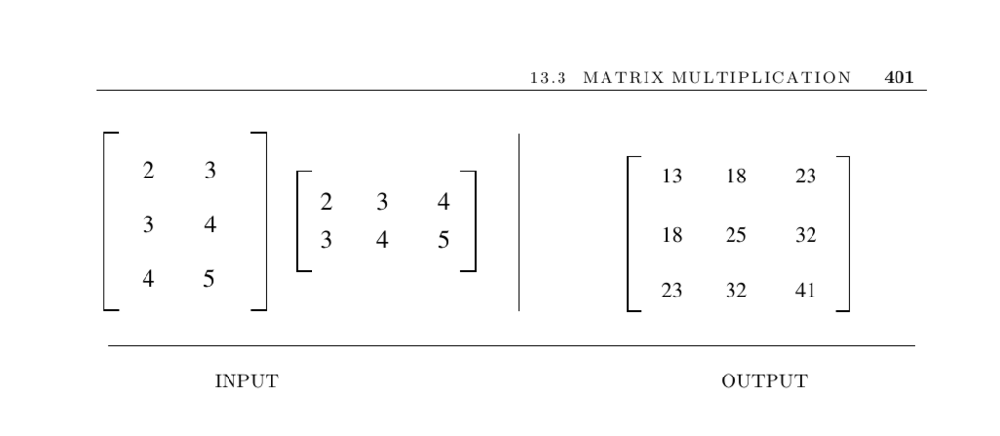

- **Matrix Multiplication Input and Output**
  - Describes multiplying an x × y matrix A by a y × z matrix B to produce an x × z matrix.
  - The example given illustrates the input matrices and the resulting product matrix.
  - Matrix multiplication is computed by summing over the shared dimension y.

- **Algorithm for Matrix Multiplication**
  - Presents a straightforward O(xyz) triple-loop algorithm to compute matrix products.
  - Emphasizes initializing output matrix entries to zero before accumulation.
  - Notes that loop ordering affects caching and runtime by 10–20%.
  - Mentions optimized computation for bandwidth-b sparse matrices running in O(xbz).
  - Recommends consulting Section 2.5.4 for a C implementation example.

- **Advanced Algorithms and Optimizations**
  - Summarizes existence of faster asymptotic algorithms like Strassen’s O(n^2.81) algorithm.
  - Highlights that these faster algorithms are complex, numerically less stable, and beneficial only for large matrices (n ≈ 100 or higher).
  - Discusses dynamic programming methods for optimal matrix chain multiplication parenthesization.
  - Points out the utility depends on irregular matrix dimensions and frequency of multiplication.
  - References Strassen’s and Coppersmith-Winograd’s algorithms and their theoretical run time improvements.
  - External resource: [Strassen’s algorithm](https://en.wikipedia.org/wiki/Strassen_algorithm)

- **Matrix Multiplication and Graph Theory**
  - Explains the adjacency matrix interpretation: A^k[i,j] counts paths of length k between nodes i and j.
  - Notes the relevance to counting nonsimple paths including repeated vertices.
  - Describes theoretical results relating graph squares to Hamiltonian cycles and square roots of graphs.
  - Mentions Boolean matrix multiplication reduction to general matrix multiplication.
  - External resource: [Four Russians Algorithm](https://en.wikipedia.org/wiki/Four_Russians_algorithm)

- **Implementations and Practical Considerations**
  - Highlights a highly efficient implementation that switches between Strassen’s and cubic algorithms for performance.
  - Marks LAPACK as the standard linear algebra library containing matrix multiplication routines.
  - Notes Algorithm 601 as a sparse matrix package in Fortran supporting sparse/dense multiplication.
  - Discusses Winograd’s algorithm which halves multiplications but involves complex bookkeeping and uncertain performance benefits.
  - Suggests cache-memory management as critical for engineering efficient matrix multiplication.
  - External resource: [LAPACK](http://www.netlib.org/lapack/)

- **Historical and Theoretical Context**
  - Credits Strassen’s algorithm as the start of asymptotic algorithm improvement in theoretical computer science.
  - States current best known theoretical complexity is O(n^2.376) by Coppersmith and Winograd.
  - Notes ongoing conjectures about achieving Θ(n^2) complexity.
  - Points to empirical studies on practical crossover points for Strassen’s algorithm.
  - Suggests references for advanced studies on matrix multiplication efficiency and theory.

- **Related Problems**
  - Connects matrix multiplication to solving linear equations as described on page 395.
  - Links to shortest path algorithms discussed on page 489.
