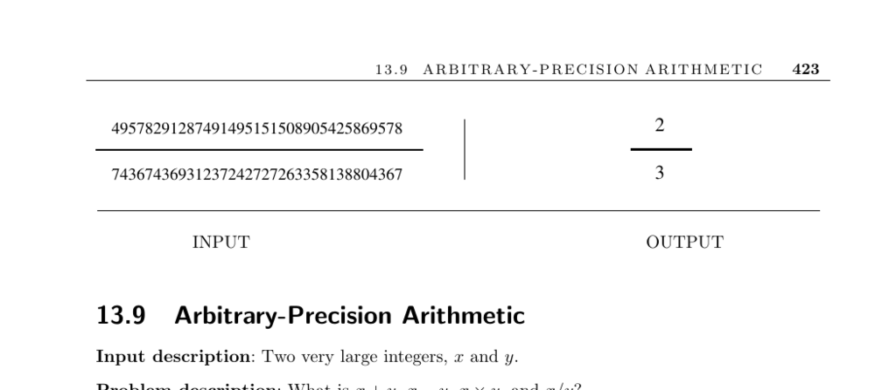

- **13.9 Arbitrary-Precision Arithmetic**
  - **Input and Problem Description**
    - The problem focuses on computing addition, subtraction, multiplication, and division for very large integers.
    - Standard integers are insufficient for very large numbers like national debt or cryptographic keys.
    - Large integers require specialized representations and algorithms beyond 32-bit or 64-bit limits.
  - **Implementation Considerations**
    - Developers must assess whether their application requires arbitrary precision or fixed upper bounds on integer size.
    - Arrays or linked lists can represent integers depending on size constraints.
    - Choosing the arithmetic base impacts efficiency; higher bases reduce digit count but complicate input/output conversion.
    - Low-level optimization such as assembly or bitwise operations can speed up arithmetic.
  - **Basic Arithmetic Algorithms**
    - Addition uses the school method with carries, optimal for its linear time complexity.
    - Subtraction leverages addition of negatives and careful borrow handling, typically subtracting smaller absolute value from larger.
    - Multiplication avoids repeated addition; school method or Karatsuba's O(n^1.59) algorithm is recommended, with FFT-based methods for very large inputs.
    - Division uses long division method requiring multiplication and subtraction, but can be reduced to multiplication.
    - Exponentiation benefits from divide-and-conquer algorithms reducing multiplications to O(log n).
  - **Advanced Techniques and Theorems**
    - Chinese remainder theorem allows representation of large integers via residues modulo coprime integers, enabling modular addition, subtraction, and multiplication.
    - Horner’s rule efficiently evaluates polynomials with linear time complexity instead of O(n²).
  - **Available Implementations**
    - Computer algebra systems like Maple and Mathematica offer built-in arbitrary-precision arithmetic and high-level languages.
    - GNU Multiple Precision Arithmetic Library (GMP) is a leading C/C++ library for embedded applications.
    - Java's BigInteger class supports arbitrary-precision and modular arithmetic.
    - Other specialized packages include ARPREC, MPFUN90, and libraries PARI, LiDIA, NTL, and MIRACL for number theory.
  - **References and Further Reading**
    - Donald Knuth’s *The Art of Computer Programming* for elementary arithmetic algorithms.
    - Sources on Karatsuba and FFT multiplication: [AHU74], [Man89], [SS71].
    - Bernstein’s work on fast arithmetic operations: [Ber04b].
    - Comprehensive texts on modular arithmetic, Euclid’s algorithm, and the Chinese remainder theorem: [CLRS01], [BS96], [Sho05].
