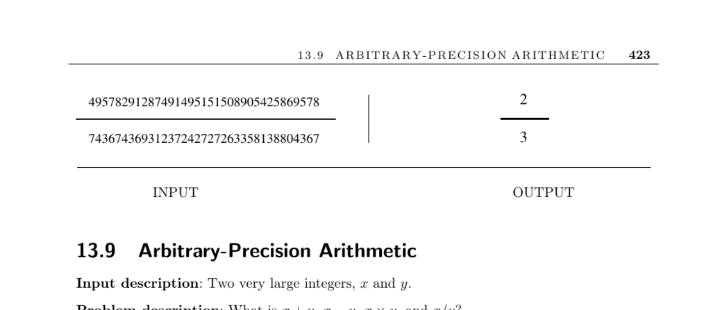

- **Arbitrary-Precision Arithmetic**
  - **Input and Problem Description**
    - The input consists of two very large integers, x and y.
    - The operations to compute are addition, subtraction, multiplication, and division of these integers.
    - Standard hardware supports only fixed precision, insufficient for extremely large numbers such as national debt pennies or cryptographic keys.
  - **Considerations for Arbitrary-Precision Arithmetic**
    - Use computer algebra systems like Maple or Mathematica for problem instances needing large integer computations.
    - Embedded applications should use specialized arbitrary-precision math libraries.
    - Determine whether fixed upper bounds on integer size allow simplifications like fixed-length arrays.
  - **Choosing the Arithmetic Base**
    - Decimal (base-10) is simplest but less efficient than higher bases.
    - Using a base close to the square root of the maximum hardware-supported integer improves performance by reducing digit count.
    - Conversion between base-10 and higher bases is necessary for input and output.
  - **Performance and Implementation Details**
    - Assembly language and bit-level operations can accelerate high-precision arithmetic.
    - Hardware addition is faster than software subroutine calls, influencing design choices.
  - **Algorithms for Basic Arithmetic Operations**
    - Addition uses the school method with carries, running in linear time.
    - Subtraction is handled via addition with sign manipulation to simplify borrowing.
    - Multiplication uses digit-by-digit approach; Karatsuba's O(n^1.59) algorithm is better for large numbers; FFT-based methods are faster for very large inputs.
    - Division uses long division, employing multiplication and subtraction as subroutines; it can be reduced to integer multiplication.
    - Exponentiation employs a divide-and-conquer method requiring O(log n) multiplications.
  - **Chinese Remainder Theorem and Modular Arithmetic**
    - Large numbers can be manipulated using residue systems modulo relatively prime integers.
    - Support exists for addition, subtraction, and multiplication but not division in residue form.
  - **Applications to Polynomial Computations**
    - Algorithms for large integers extend to polynomial arithmetic.
    - Horner's rule optimizes polynomial evaluation from O(n^2) to linear time.
  - **Implementations**
    - Commercial computer algebra systems like Maple, Mathematica, Axiom, and Macsyma provide built-in arbitrary-precision arithmetic.
    - The GMP library offers fast C/C++ arbitrary-precision arithmetic and supports integers, rationals, and floating-point numbers.
    - Java's BigInteger class includes arbitrary-precision operations and additional utilities like modular arithmetic and primality testing.
    - Other libraries include those from Programming Challenges, number theory libraries PARI, LiDIA, NTL, MIRACL, and Fortran-90 packages ARPREC and MPFUN90.
  - **Notes and References**
    - Knuth is the primary reference for basic arithmetic algorithms.
    - Karatsuba and FFT multiplication algorithms have detailed expositions in multiple sources.
    - Reduction of division to multiplication is documented in classical algorithm texts.
    - Chinese remainder theorem and modular arithmetic are explained in algorithmic texts like [CLRS](https://mitpress.mit.edu/books/introduction-algorithms).
    - Euclid's algorithm for GCD is one of the oldest notable algorithms.
  - **Related Problems**
    - Factoring integers and cryptography are closely related areas drawing on arbitrary-precision arithmetic.
