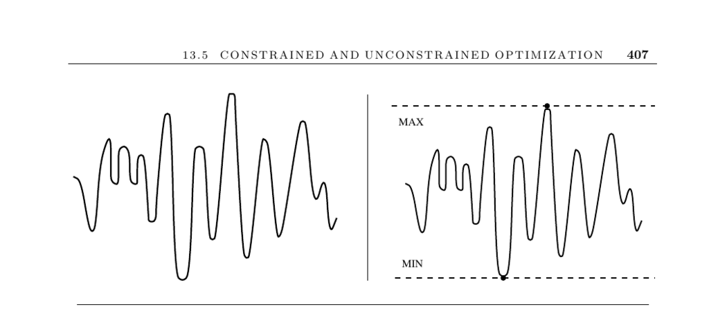

- **Constrained and Unconstrained Optimization**  
  - The section addresses the general problem of optimizing functions to find points that maximize or minimize them.  
  - Optimization is essential in tuning objective functions, such as evaluating stocks using weighted financial data.  
  - Unconstrained problems involve no restrictions on parameter values, while constrained problems impose limitations requiring specialized mathematical programming.  
  - Efficient algorithms for unconstrained optimization use derivatives to locate local optima, with symbolic computation systems aiding analytic solutions.  
  - The section recommends practical considerations including evaluation cost, dimensionality, and function smoothness to guide method selection.  
  - Penalty functions and simulated annealing are discussed as approaches to constrained optimization, particularly for combinatorial structures.  
  - External resources include the [GAMS Guide to Available Mathematical Software](http://gams.nist.gov) and [NEOS Optimization Server](http://www-neos.mcs.anl.gov/).  
- **Factors Influencing Optimization**  
  - **Types of Optimization: Constrained vs. Unconstrained**  
    - Unconstrained optimization allows free parameter selection to maximize the function, while constrained optimization restricts parameter values to legal regions.  
    - Constraints often reflect real-world restrictions, such as minimum viable employee counts in companies.  
    - Constrained optimization typically requires mathematical programming approaches like linear programming (see Section 13.6).  
  - **Function Description and Computation**  
    - Optimization methods depend on whether the function is available as a formula or as a subroutine for evaluation.  
    - Analytic derivatives can be used if the function is given explicitly, enabling local maxima or minima discovery.  
    - When evaluation is expensive (e.g., testing chess board evaluation coefficients through gameplay), the number of function calls must be minimized.  
  - **Dimensionality and Smoothness**  
    - Increasing the number of dimensions complicates global maximization, so dimensionality reduction is often advantageous.  
    - Smooth functions facilitate local optimum discovery by gradient-based methods; non-smooth or random-like functions complicate optimization.  
- **Optimization Methods and Implementations**  
  - **Derivative-Based Methods**  
    - Steepest descent and conjugate gradient algorithms use partial derivatives to find local optima.  
    - Derivatives can be calculated analytically or estimated numerically by differences of nearby function values.  
  - **Constrained Optimization Techniques**  
    - Penalty functions augment unconstrained methods by penalizing constraint violations, often with varying penalty magnitudes during optimization.  
    - Simulated annealing offers a robust heuristic for constrained optimization, especially effective for combinatorial problems.  
  - **Software Resources and Algorithms**  
    - Hans Mittlemann’s [Decision Tree for Optimization Software](http://plato.asu.edu/guide.html) guides users to appropriate codes.  
    - Netlib hosts classic Fortran codes like Algorithm 566, 702, 734, and 744 for unconstrained optimization.  
    - Adaptive Simulated Annealing (ASA) is a popular C implementation available at [ASA-Caltech](http://asa-caltech.sourceforge.net/).  
    - Genetic algorithm packages include JGAP ([JGAP SourceForge](http://jgap.sourceforge.net/)) and GAUL ([GAUL SourceForge](http://gaul.sourceforge.net/)).  
- **Additional Notes and Related Problems**  
  - Steepest-descent methods and unconstrained optimization are covered extensively in numerical methods textbooks such as [Numerical Recipes](http://numerical.recipes/).  
  - Simulated annealing originates from the Metropolis algorithm and was popularized as a modern heuristic by Kirkpatrick et al.  
  - Genetic algorithms have a varied reception but continue to be widely used heuristic approaches.  
  - Related optimization problems include linear programming (page 411) and satisfiability (page 472).
