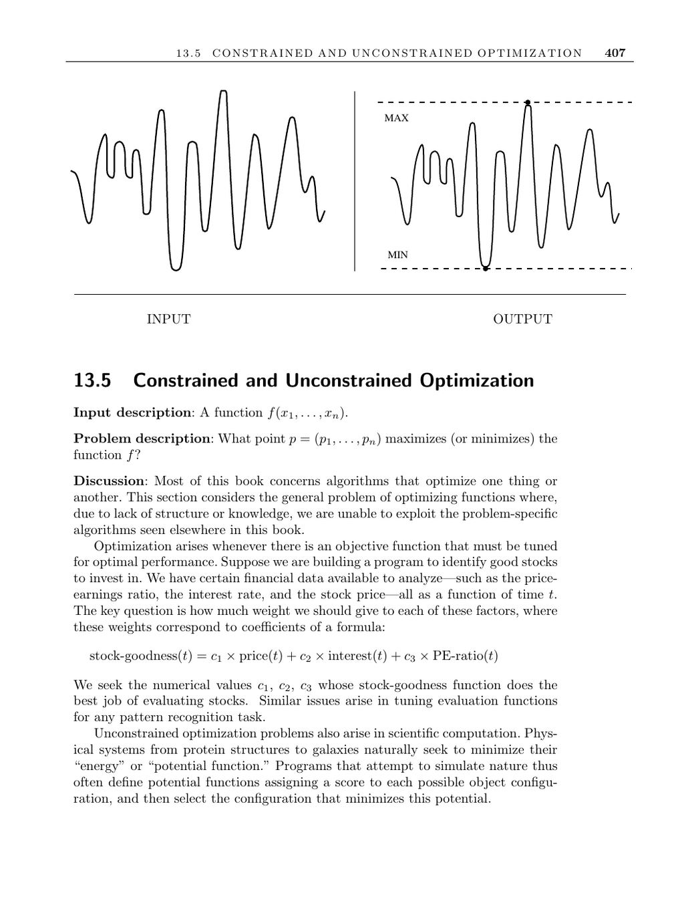

- **Constrained and Unconstrained Optimization**
  - **Problem Definition and Examples**
    - The goal is to find a point \( p = (p_1, \ldots, p_n) \) that maximizes or minimizes a function \( f(x_1, \ldots, x_n) \).
    - Examples include tuning weights for stock evaluation formulas and physical systems minimizing potential energy.
    - Optimization arises across domains where an objective function must be optimized for performance.
  - **Key Considerations for Optimization**
    - Differentiate between constrained and unconstrained optimization based on parameter limitations.
    - Assess whether the function is algebraic with a known formula or a black-box expensive-to-evaluate program.
    - The difficulty increases with the number of dimensions, often necessitating dimensionality reduction.
    - Function smoothness affects the ability to find local optima and influences algorithm choice.
  - **Methods for Unconstrained Optimization**
    - Use derivatives or numerical estimation of derivatives to find local optima.
    - Techniques include steepest descent and conjugate gradient methods.
    - Trying multiple algorithms is advisable, with [Numerical Recipes](http://numerical.recipes/) recommended for reference.
  - **Approaches for Constrained Optimization**
    - Constrained problems often require mathematical programming methods like linear programming.
    - One method adds penalties for constraint violations within unconstrained optimization frameworks.
    - Simulated annealing is a robust method for constrained optimization, especially in combinatorial contexts.
    - Refer to Section 7.5.3 for simulated annealing techniques.
  - **Software and Implementations**
    - Hans Mittelmann’s Decision Tree for Optimization Software at [plato.asu.edu](http://plato.asu.edu/guide.html) provides guidance.
    - NEOS server at [neos.mcs.anl.gov](http://www-neos.mcs.anl.gov/) offers remote solving services.
    - Key ACM algorithms for unconstrained optimization are available on Netlib.
    - Adaptive Simulated Annealing (ASA) and genetic algorithm libraries like JGAP and GAUL support evolutionary methods.
  - **Notes and Related Literature**
    - Steepest-descent methods covered in standard numerical methods books like [PFTV07].
    - Simulated annealing origins trace to Kirkpatrick et al. and the Metropolis algorithm.
    - Genetic algorithms were developed by Holland and are detailed in [LP02, MF00].
    - Related optimization problems include linear programming and satisfiability problems.
